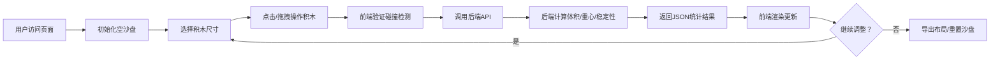

# 积木·平衡大师 产品需求文档 (PRD)

## 1. 产品概述

"积木·平衡大师"是一款面向微缩景观爱好者的在线沙盘布局工具。用户可以通过直观的拖拽操作在10×10虚拟沙盘中放置、移动和删除不同尺寸的积木块，实时获取体积、重心和稳定性评分等关键指标，辅助构思和优化实体微缩景观的整体布局与配重方案。

- 核心目标：提供快速、直观的虚拟布局构思工具，降低实体搭建前的试错成本
- 目标用户：微缩模型爱好者、建筑模型师、场景设计爱好者
- 市场价值：填补微缩景观社区的数字化辅助设计工具空白

## 2. 核心功能

### 2.1 用户角色
| 角色 | 注册方式 | 核心权限 |
|------|---------|---------|
| 普通用户 | 无需注册，直接访问 | 使用全部功能，无限制操作 |

### 2.2 功能模块
1. **主沙盘页面**：10×10俯视网格、积木放置/删除/拖拽、滚轮缩放视图
2. **工具栏面板**：积木尺寸选择（1×1、1×2、2×2）、重置沙盘、导出布局
3. **实时统计面板**：总体积、重心坐标（X/Y）、稳定性评分（0-100分）
4. **确认对话框**：重置沙盘二次确认弹窗

### 2.3 页面详情
| 页面名称 | 模块名称 | 功能描述 |
|-----------|---------|-----------|
| 主沙盘页面 | 俯视网格 | 10×10网格，40px/格，浅灰网格线，米白背景，支持0.5x-2x滚轮缩放，网格缩放时保持清晰无锯齿 |
| 主沙盘页面 | 积木操作 | 点击空格放置积木（1px深蓝边框，淡蓝色填充），点击积木选中（金黄#ffd700外发光6px），再次点击删除，拖拽到相邻空位移动（半透明预览跟随鼠标） |
| 工具栏面板 | 尺寸选择 | 三种尺寸彩色图标（1×1蓝#4a90d9、1×2橙#e67e22、2×2绿#27ae60），点击切换后放置对应尺寸，切换时有GSAP缩放动画（0.3s ease-out） |
| 实时统计面板 | 数据展示 | 放置/删除后自动更新总体积、重心X/Y（精确0.1）、稳定性评分（0-100，越靠近中心分越高），数字淡入淡出动画（30fps+）+ 微量震动 |
| 工具栏面板 | 重置沙盘 | 红色圆角按钮，点击弹出确认对话框，确认后清空所有积木 |
| 工具栏面板 | 导出布局 | 编码为JSON格式，自动下载layout.json文件 |

## 3. 核心流程

用户进入页面 → 初始化为空沙盘 → 选择积木尺寸 → 点击放置积木 → 后端计算统计 → 前端更新统计面板 → 继续调整/移动/删除 → 导出或重置

## 4. 用户界面设计

### 4.1 设计风格
- **主色调**：暖木色 #d0b491 + 米白色 #f9f6ee
- **强调色**：靛蓝 #3b5998（按钮/图标）
- **积木色**：1×1蓝#4a90d9、1×2橙#e67e22、2×2绿#27ae60
- **选中发光**：金黄#ffd700，扩散6px
- **按钮样式**：圆角设计，重置按钮红色
- **布局风格**：极简卡片式，左侧70%沙盘，右侧30%工具/统计
- **字体**：搭配优雅的衬线/无衬线组合，正文清晰，标题有设计感
- **动画**：GSAP平滑过渡（0.3s ease-out），统计数字淡入淡出+微量震动

### 4.2 页面设计总览
| 页面名称 | 模块名称 | UI元素 |
|-----------|---------|--------|
| 主沙盘页面 | 沙盘区域 | 卡片式容器，暖木色边框，米白背景，网格线浅灰半透明，支持滚轮缩放 |
| 主沙盘页面 | 积木元素 | 淡蓝填充# a3c8ff，深蓝1px边框，选中时金黄色外发光6px，拖拽时半透明预览 |
| 工具栏面板 | 尺寸选择器 | 三个彩色方块按钮，选中时缩放动画，图标为对应颜色方块 |
| 实时统计面板 | 数据卡片 | 三项指标分卡片，数值动画更新，字体加粗，标签浅色背景 |
| 工具栏面板 | 操作按钮 | 红色重置按钮，靛蓝导出按钮，圆角设计，悬停微交互 |
| 确认对话框 | 弹窗 | 半透明遮罩，居中卡片，确认/取消按钮 |

### 4.3 响应式设计
- **桌面优先**：≥1024px左侧70%+右侧30%双栏布局
- **平板**：768px-1024px调整比例为60%+40%
- **小屏幕**：<768px工具栏折叠为底部横条，沙盘占满全屏
- **触控优化**：移动端触摸事件支持，触摸目标≥44×44px

### 4.4 性能指标
- **积木操作响应**：≤100ms（放置/删除/拖拽）
- **后端统计计算**：≤50ms
- **首屏加载**：≤2秒
- **渲染帧率**：≥30fps（30个积木同时存在时稳定）
