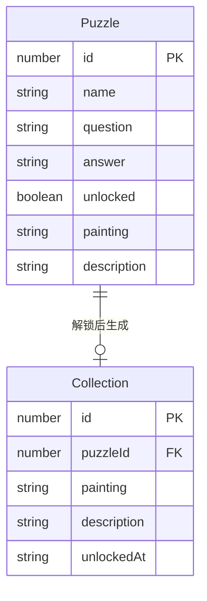

## 1. 架构设计

```mermaid
flowchart TB
    subgraph "前端 (React + Vite)"
        "AreaMap 迷雾地图" --> "PuzzleModal 谜题弹窗"
        "AreaMap 迷雾地图" --> "Collection 个人图鉴"
        "PuzzleModal" --> "Axios API请求"
        "Collection" --> "Axios API请求"
    end
    subgraph "后端 (Express + TypeScript)"
        "Express 服务器(:3001)" --> "puzzle 谜题路由"
        "Express 服务器(:3001)" --> "collection 图鉴路由"
        "puzzle 谜题路由" --> "内存数据存储"
        "collection 图鉴路由" --> "内存数据存储"
    end
    "Axios API请求" --> "Express 服务器(:3001)"
```

## 2. 技术说明

- 前端：React@18 + TypeScript + Vite@5 + Sass + react-router-dom + axios + GSAP
- 初始化工具：Vite
- 后端：Express@4 + TypeScript + ts-node + cors
- 数据库：内存数据存储（数组模拟），无需外部数据库
- 代理配置：Vite开发服务器代理到后端3001端口

## 3. 路由定义

| 路由 | 用途 |
|------|------|
| / | 迷雾森林地图首页 |

## 4. API定义

### 4.1 谜题相关

**GET /api/puzzles**
- 响应：`{ puzzles: Array<{ id: number; name: string; question: string; unlocked: boolean }> }`

**POST /api/puzzles/:id/verify**
- 请求体：`{ answer: string }`
- 响应：`{ correct: boolean; painting: string; description: string }`

### 4.2 图鉴相关

**GET /api/collections**
- 响应：`{ collections: Array<{ id: number; puzzleId: number; painting: string; description: string; unlockedAt: string }> }`

**POST /api/collections**
- 请求体：`{ puzzleId: number; painting: string; description: string }`
- 响应：`{ id: number; puzzleId: number; painting: string; description: string; unlockedAt: string }`

**DELETE /api/collections/:id**
- 响应：`{ success: boolean }`

## 5. 服务器架构

```mermaid
flowchart LR
    "Controller 路由层" --> "Service 业务逻辑"
    "Service 业务逻辑" --> "Repository 数据访问"
    "Repository 数据访问" --> "内存数据存储"
```

## 6. 数据模型

### 6.1 数据模型定义



### 6.2 初始数据

8个谜题数据，涵盖历史典故、成语和冷知识：
1. 谜·壹：破釜沉舟（项羽典故）
2. 谜·贰：卧薪尝胆（越王勾践）
3. 谜·叁：纸上谈兵（赵括典故）
4. 谜·肆：四面楚歌（项羽典故）
5. 谜·伍：围魏救赵（孙膑策略）
6. 谜·陆：完璧归赵（蔺相如）
7. 谜·柒：负荆请罪（廉颇典故）
8. 谜·捌：毛遂自荐（毛遂典故）
