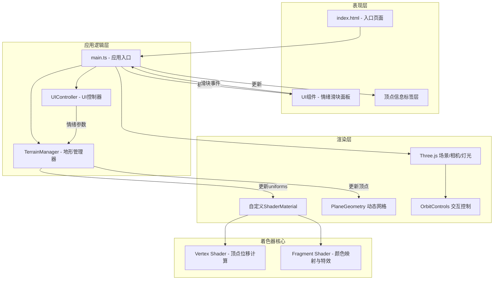

## 1. 架构设计



## 2. 技术描述

### 2.1 技术栈

| 层级 | 技术选型 | 版本 | 用途 |
|------|----------|------|------|
| 构建工具 | Vite | 5.x | 快速开发构建，HMR热更新 |
| 开发语言 | TypeScript | 5.x | 类型安全，ES模块目标 |
| 3D引擎 | Three.js | 0.160.0 | WebGL 3D渲染核心 |
| 类型定义 | @types/three | 0.160.x | Three.js TypeScript类型支持 |
| 动画库 | GSAP | 3.x | 滑块平滑过渡、光晕动画 |

### 2.2 项目初始化方式

直接创建项目文件结构，不使用脚手架模板，以满足用户指定的精确文件结构要求。

### 2.3 数据流向

```
UI滑块拖拽 → UIController派发emotionChange事件 → 
main.ts接收事件 → TerrainManager.updateEmotions() →
更新ShaderMaterial.uniforms.uEmotions →
着色器每帧重新计算顶点位移与颜色 →
Three.js渲染循环更新画面
```

## 3. 模块定义与调用关系

### 3.1 文件结构

```
auto146/
├── package.json              # 项目依赖与脚本
├── vite.config.js            # Vite构建配置
├── tsconfig.json             # TypeScript配置
├── index.html                # HTML入口
└── src/
    ├── main.ts               # 应用入口，协调各模块
    ├── terrain.ts            # TerrainManager地形核心类
    ├── ui.ts                 # UIController UI控制类
    └── shaders.ts            # 着色器代码常量模块
```

### 3.2 模块接口定义

#### main.ts - 主入口模块
```typescript
// 初始化Three.js场景、相机、灯光
// 创建TerrainManager实例
// 创建UIController实例并监听情绪变化
// 管理动画循环(requestAnimationFrame)
// 处理窗口resize事件
```

#### terrain.ts - 地形管理模块
```typescript
interface EmotionVector {
    joy: number;      // 0-100 喜悦
    sadness: number;  // 0-100 悲伤
    tension: number;  // 0-100 紧张
    calm: number;     // 0-100 宁静
}

class TerrainManager {
    constructor(scene: THREE.Scene, resolution: number);
    updateEmotions(emotions: EmotionVector): void;
    update(time: number): void;
    getVertexAtPosition(worldX: number, worldZ: number): VertexInfo | null;
    dispose(): void;
}
```

#### ui.ts - UI控制模块
```typescript
type EmotionKey = 'joy' | 'sadness' | 'tension' | 'calm';

interface SliderConfig {
    key: EmotionKey;
    label: string;
    gradient: string;  // CSS渐变
    min: number;
    max: number;
    default: number;
}

class UIController {
    constructor(container: HTMLElement, isMobile: boolean);
    onEmotionChange(callback: (emotions: EmotionVector) => void): void;
    showVertexLabel(position: {x: number, y: number}, info: VertexInfo): void;
    hideVertexLabel(): void;
    dispose(): void;
}
```

#### shaders.ts - 着色器模块
```typescript
export const vertexShader: string = /* glsl */ `
    // 顶点位移计算
    // 接收 uniform uEmotions (vec4)
    // 接收 uniform uTime (float)
    // 计算四种情绪的叠加位移
    // 喜悦: 圆润山丘隆起
    // 悲伤: 盆地下陷
    // 紧张: 锯齿状尖锐化
    // 宁静: 平滑趋近平坦
`;

export const fragmentShader: string = /* glsl */ `
    // 颜色映射计算
    // 情绪总和阈值判断
    // >200: 彩色流动流线
    // <50: 单调冷灰 + 下降动画
    // 边缘发光效果(相机视角)
`;

export const shaderUniforms = {
    uEmotions: { value: new THREE.Vector4(0, 0, 0, 0) },
    uTime: { value: 0 },
    uBaseColor: { value: new THREE.Color(0x4a5d70) },
    uEdgeGlowIntensity: { value: 0.3 }
};
```

## 4. 关键技术实现

### 4.1 地形网格生成
- 使用 `THREE.PlaneGeometry` 创建 N×N 网格
- 桌面端: 64×64 = 4096 顶点
- 移动端: 32×32 = 1024 顶点
- 每个顶点存储随机基准高度（0.1-0.5范围）

### 4.2 情绪到地形的映射算法
```glsl
// 顶点着色器伪代码
float joyFactor   = uEmotions.x * 0.01;
float sadFactor   = uEmotions.y * 0.01;
float tensionFactor = uEmotions.z * 0.01;
float calmFactor  = uEmotions.w * 0.01;

// 喜悦: 正弦波产生圆润山丘
float joyDisplace = sin(uv.x * 8.0) * sin(uv.y * 8.0) * joyFactor * 2.0;

// 悲伤: 中心凹陷盆地
float sadDisplace = -distance(uv, vec2(0.5)) * sadFactor * 1.5;

// 紧张: 高频噪声产生锯齿
float tensionNoise = snoise(uv * 32.0 + uTime * 0.5) * 0.5 + 0.5;
float tensionDisplace = tensionNoise * tensionFactor * 1.8;

// 宁静: 朝向基准高度平滑
float calmDisplace = (baseHeight - position.z) * calmFactor * 0.1;

// 叠加所有位移
float totalDisplace = joyDisplace + sadDisplace + tensionDisplace + calmDisplace;
position.z = baseHeight + totalDisplace;
```

### 4.3 颜色映射算法
```glsl
// 片元着色器伪代码
float emotionSum = uEmotions.x + uEmotions.y + uEmotions.z + uEmotions.w;

if (emotionSum > 200.0) {
    // 高情绪: 彩色流动流线
    float flow = sin(uv.x * 10.0 + uTime * 0.8) * sin(uv.y * 10.0 + uTime * 0.6);
    vec3 flowColor = mix(joyColor, tensionColor, flow * 0.5 + 0.5);
    finalColor = mix(baseColor, flowColor, 0.6);
} else if (emotionSum < 50.0) {
    // 低情绪: 冷灰色 + 缓慢下降
    vec3 grayColor = vec3(0.3, 0.35, 0.4);
    float descent = uTime * 0.02 * (1.0 - emotionSum / 50.0);
    finalColor = mix(baseColor, grayColor, 0.7);
} else {
    // 正常: 根据情绪混合
    finalColor = mix(joyColor, sadColor, sadFactor);
    finalColor = mix(finalColor, tensionColor, tensionFactor * 0.5);
}

// 边缘发光
float edge = pow(1.0 - abs(dot(normal, viewDir)), 2.0);
finalColor += vec3(0.4, 0.6, 1.0) * edge * uEdgeGlowIntensity;
```

### 4.4 顶点点击检测
- 使用 `THREE.Raycaster` 进行射线检测
- 鼠标坐标归一化到 NDC 空间 (-1 到 1)
- 检测与地形网格的交点
- 找到最近的顶点索引
- 播放 GSAP 光晕动画 + 显示信息标签

## 5. 性能优化策略

1. **着色器计算**: 所有顶点位移在GPU中并行计算，避免CPU瓶颈
2. **网格复用**: 共享PlaneGeometry，仅更新position attribute
3. **uniform更新**: 情绪参数通过uniforms传递，每帧仅更新一次
4. **移动端降质**: 自动检测视口尺寸，移动端使用32×32网格
5. **事件节流**: 滑块事件使用GSAP的tween平滑过渡，避免频繁计算
6. **资源释放**: 场景销毁时正确dispose Geometry和Material

## 6. 性能指标

| 指标 | 目标值 | 监测方式 |
|------|--------|----------|
| 1080p FPS | ≥30 | Chrome DevTools Performance |
| 滑块响应延迟 | ≤50ms | performance.now()打点 |
| 首次加载时间 | ≤3s | Lighthouse |
| 内存占用 | ≤200MB | Chrome Task Manager |
