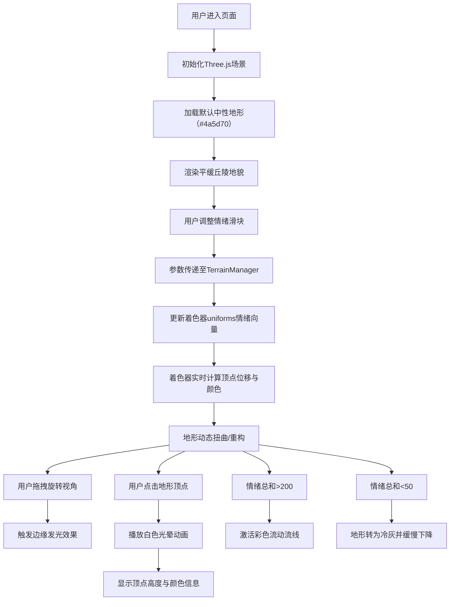

## 1. 产品概述

**情绪·地形仪**是一款面向数据艺术家和创意工作者的交互式3D情感可视化工具。用户通过调整喜悦、悲伤、紧张、宁静四个情绪维度滑块，实时塑造一片动态起伏的彩色地形地貌，将抽象情感转化为具象的视觉艺术。

- **核心价值**：将情感数据转化为独特的3D视觉艺术作品，提供沉浸式的情感表达体验
- **目标用户**：数据艺术家、视觉设计师、艺术爱好者、心理研究者
- **市场定位**：创意工具类Web应用，融合艺术表达与技术创新

## 2. 核心功能

### 2.1 用户角色

| 角色 | 注册方式 | 核心权限 |
|------|----------|----------|
| 访客用户 | 无需注册 | 完整使用所有交互功能，实时预览情感地形效果 |

### 2.2 功能模块

1. **3D地形渲染引擎**：基于Three.js的动态网格地形，支持64x64（桌面端）/ 32x32（移动端）分辨率
2. **情绪参数控制**：喜悦、悲伤、紧张、宁静四个维度的滑块控制，范围0-100
3. **着色器特效系统**：自定义GLSL着色器实现顶点位移、颜色映射、边缘发光、流动流线效果
4. **视角交互系统**：OrbitControls支持旋转、缩放、平移，鼠标拖拽交互流畅
5. **顶点信息系统**：点击顶点显示高度和颜色信息，伴随白色光晕特效
6. **响应式UI面板**：右侧垂直控制面板，移动端自动折叠为底部横条

### 2.3 页面详情

| 页面名称 | 模块名称 | 功能描述 |
|---------|----------|----------|
| 主界面 | 3D场景画布 | 全屏渲染动态地形，支持鼠标交互 |
| 主界面 | 标题区域 | 左上角显示应用名称，半透明无衬线细体 |
| 主界面 | 控制面板 | 右侧垂直排列四个情绪滑块，每个带渐变色彩条和数值显示 |
| 主界面 | 顶点信息标签 | 点击顶点时悬浮显示高度和颜色值，自动跟随3D位置 |

## 3. 核心流程

## 4. 用户界面设计

### 4.1 设计风格

- **主色调**：深蓝灰背景（#1a1a24），中性灰蓝地形基色（#4a5d70）
- **情绪色彩映射**：
  - 喜悦：黄色渐变（#ffd93d → #ff6b35）
  - 悲伤：蓝紫色（#4a6fa5 → #6b5b95）
  - 紧张：锯齿红（#c0392b → #e74c3c）
  - 宁静：半透明冰蓝（#74b9ff → #81ecec）
- **字体**：无衬线细体（font-weight: 300），标题24px，数值标签14px
- **交互风格**：暗黑科技风，半透明玻璃质感UI，平滑过渡动画（gsap ease-out 0.3s）
- **滑块样式**：200px长 × 16px高渐变色条，圆角设计
- **面板样式**：半透明深灰（rgba(30,30,40,0.7)），圆角12px，内边距20px

### 4.2 页面设计概述

| 页面名称 | 模块名称 | UI元素 |
|---------|----------|--------|
| 主界面 | 3D画布 | 居中80%视口，纯黑背景，边缘淡蓝辉光 |
| 主界面 | 标题 | 左上角"情绪·地形仪"，白色半透明（opacity: 0.7），24px细体 |
| 主界面 | 控制面板 | 右侧垂直排列，包含4组滑块+数值标签 |
| 主界面 | 顶点标签 | 白色半透明背景，黑色文字，跟随顶点位置 |

### 4.3 响应式设计

- **桌面端**（>768px）：右侧垂直控制面板，64x64网格分辨率
- **移动端**（≤768px）：控制面板折叠为底部横条，32x32网格分辨率，优化触摸交互
- **性能适配**：移动端自动降低网格密度以保证60fps运行

### 4.4 3D场景设计

- **环境**：纯黑色背景，营造沉浸式暗空间
- **光照**：HemisphereLight（天光）+ DirectionalLight（平行光）+ AmbientLight（环境光），光线柔和突出地形起伏
- **相机**：PerspectiveCamera，fov 60°，初始距离15，视角可自由旋转
- **材质**：自定义ShaderMaterial，双面渲染，支持透明度和边缘发光
- **后处理**：边缘发光通过shader实现，透明度0.3
- **动画系统**：
  - 滑块参数变化时的平滑过渡
  - 情绪阈值触发的流动动画
  - 顶点点击的光晕扩散效果
  - 低情绪值的缓慢沉降动画
- **性能预算**：1080p分辨率下维持30fps+，首次加载<3秒
