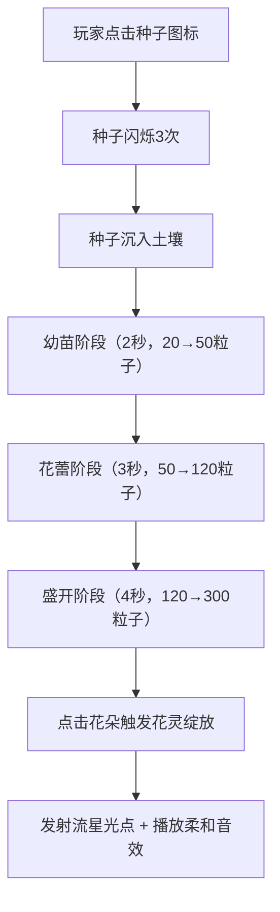
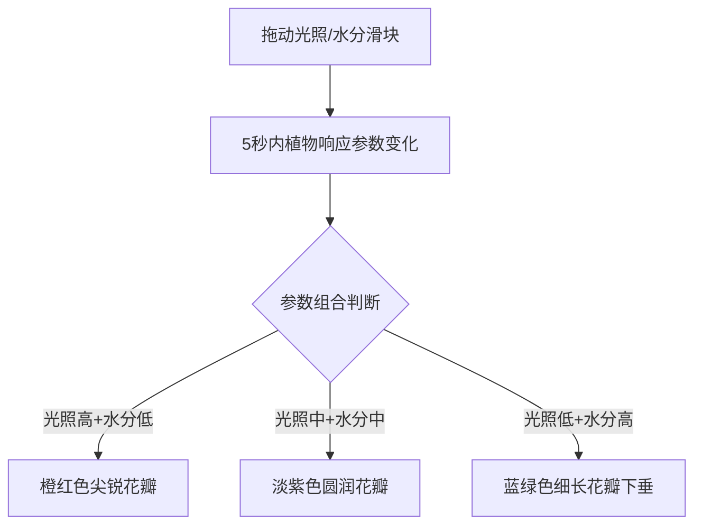
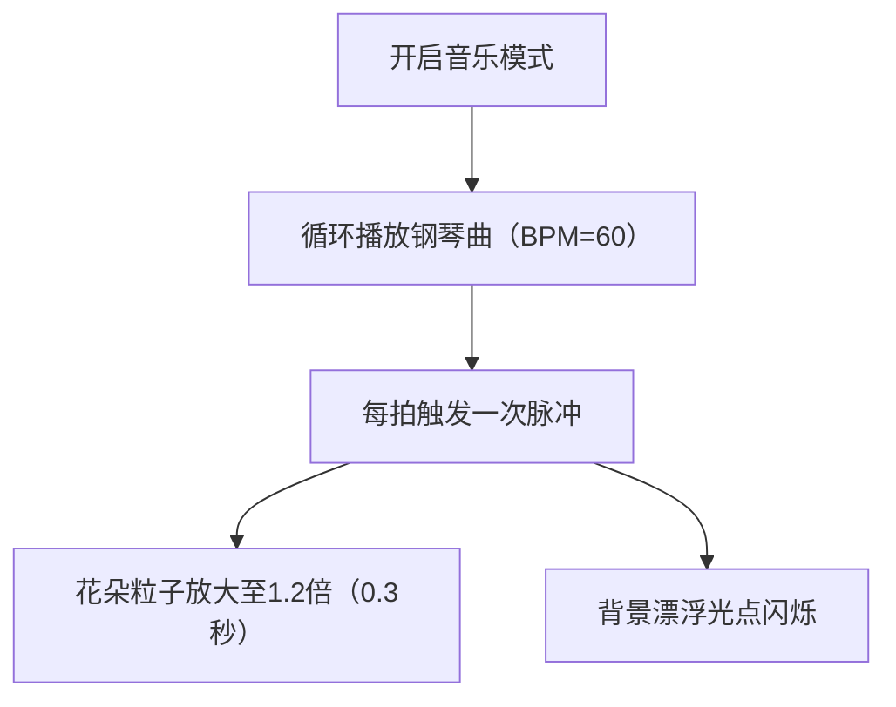

## 1. 产品概述

"光影·花灵"是一款基于Canvas的浏览器端交互式花园培育游戏。玩家通过鼠标在虚拟花盆中播撒种子，根据光照角度和水分控制，培育出不同形态和颜色的发光花卉，最终形成一片随音乐节奏变幻色彩的动态花园。

- 目标用户：城市园艺爱好者、休闲游戏玩家、视觉艺术爱好者
- 产品价值：提供沉浸式的虚拟种植体验，结合光影与音乐创造疗愈性的数字花园

## 2. 核心功能

### 2.1 用户角色

| 角色 | 注册方式 | 核心权限 |
|------|---------|----------|
| 玩家 | 无需注册，直接体验 | 完整的种植、互动、音乐模式体验 |

### 2.2 功能模块

1. **主游戏界面**：虚拟花盆区域、种植操作区、状态显示区
2. **植物生长系统**：种子→幼苗→花蕾→盛开四阶段生长
3. **环境控制系统**：光照强度滑块、水分含量滑块
4. **花灵绽放特效**：点击盛开花朵触发流星光点和柔和音效
5. **音乐节奏模式**：内置缓慢钢琴曲循环播放，粒子随节拍脉动

### 2.3 页面详情

| 页面名称 | 模块名称 | 功能描述 |
|---------|---------|----------|
| 主游戏页 | 顶部标题栏 | 显示游戏名称"光影·花灵" |
| 主游戏页 | 花盆区域 | 中央圆形区域（直径400px），支持种子播种和5株植物同时生长 |
| 主游戏页 | 控制面板 | 光照强度滑块（0-100）、水分含量滑块（0-100） |
| 主游戏页 | 状态显示 | 植物种植位置指示（五角星图标）、滑块数值标签 |
| 主游戏页 | 音乐控制 | 音乐节奏模式开关 |

## 3. 核心流程

### 3.1 种植流程

玩家进入游戏后，点击花盆中央的种子图标播种，种子闪烁3次后沉入土壤，随后植物经历种子→幼苗→花蕾→盛开四个阶段。玩家可通过调整光照和水分滑块，在5秒内改变植物的生长形态和颜色。

### 3.2 环境控制流程

### 3.3 音乐节奏模式

## 4. 用户界面设计

### 4.1 设计风格

- **主色调**：深蓝(#0a0a2e)到墨黑(#000011)垂直渐变背景
- **辅助色**：淡蓝发光边缘、金色种子、多彩花瓣（橙红/淡紫/蓝绿）
- **按钮风格**：圆形滑块按钮，带渐变阴影
- **字体**：sans-serif，白色，14px
- **布局风格**：居中对称布局，花盆居中，控制面板位于上方
- **视觉特效**：发光粒子、光晕、流星特效、节拍脉冲动画

### 4.2 页面设计概述

| 页面名称 | 模块名称 | UI元素 |
|---------|---------|--------|
| 主游戏页 | 背景 | 深蓝到墨黑垂直渐变，50个漂浮光点（3-6px，透明度0.2） |
| 主游戏页 | 花盆底座 | 半透明圆形（直径440px，淡蓝色光晕，透明度0.15） |
| 主游戏页 | 花盆区域 | 中央圆形（直径400px，半透明发光边缘） |
| 主游戏页 | 光照滑块 | 轨道200×6px，深蓝→亮黄渐变，圆形滑块18px |
| 主游戏页 | 水分滑块 | 轨道200×6px，暗褐→天蓝渐变，圆形滑块18px |
| 主游戏页 | 种子图标 | 花盆中央，半透明灰色→金色闪烁 |
| 主游戏页 | 种植位置指示 | 5个五角星图标（亮色/灰色）排列于花盆上方 |

### 4.3 响应性

- 桌面端优先设计，固定画布尺寸1400×900
- 滑块支持鼠标拖拽和点击操作
- 20px内点击有效判定，响应时间<100ms

### 4.4 性能优化

- 帧率：保持60FPS
- 粒子上限：2000个
- 每帧粒子更新：<4ms
