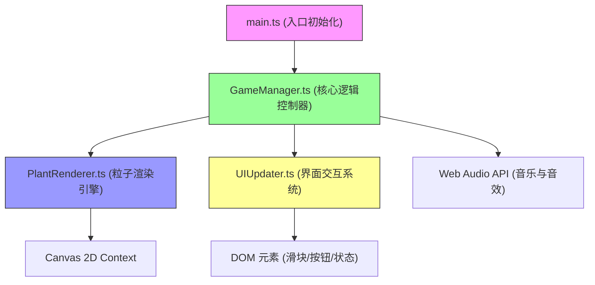

## 1. 架构设计



**模块调用关系与数据流向：**
1. `main.ts` → 创建GameManager实例，绑定画布事件，启动游戏循环
2. `GameManager.ts` → 管理所有游戏状态，调用PlantRenderer渲染粒子，调用UIUpdater更新界面
3. `PlantRenderer.ts` → 接收GameManager的植物状态数据，输出Canvas绘制指令
4. `UIUpdater.ts` → 接收用户输入，回传光照/水分/音乐状态给GameManager

## 2. 技术描述

- **前端框架**：原生 TypeScript (无UI框架)
- **构建工具**：Vite 5.x
- **动画库**：GSAP 3.x (用于平滑过渡动画)
- **渲染引擎**：Canvas 2D Context (粒子系统)
- **音频引擎**：Web Audio API (合成钢琴音色与音效，无需外部音频文件)
- **类型系统**：TypeScript 严格模式 (strict: true)
- **模块规范**：ES Modules (target: ES2020)

## 3. 文件结构

```
项目根目录/
├── package.json          # 项目依赖与启动脚本
├── vite.config.js        # Vite构建配置
├── tsconfig.json         # TypeScript配置(严格模式)
├── index.html            # 入口页面(1400×900画布)
└── src/
    ├── main.ts           # 游戏初始化入口
    ├── GameManager.ts    # 核心逻辑控制器
    ├── PlantRenderer.ts  # 粒子渲染引擎
    └── UIUpdater.ts      # 界面交互系统
```

## 4. 数据模型

### 4.1 核心类型定义

```typescript
// 植物生长阶段
enum GrowthStage {
  SEED = 'seed',        // 种子
  SPROUT = 'sprout',    // 幼苗
  BUD = 'bud',          // 花蕾
  BLOOM = 'bloom'       // 盛开
}

// 花型分类
enum FlowerType {
  ORANGE_SHARP = 'orange_sharp',    // 橙红尖锐
  PURPLE_ROUND = 'purple_round',    // 淡紫圆润
  TEAL_DROOPING = 'teal_drooping'   // 蓝绿下垂
}

// 粒子对象
interface Particle {
  x: number;
  y: number;
  vx: number;
  vy: number;
  size: number;
  baseSize: number;
  color: string;
  alpha: number;
  life: number;
  maxLife: number;
  angle: number;
  angularVelocity: number;
  type: 'petal' | 'leaf' | 'halo' | 'meteor' | 'bg' | 'seed';
}

// 植物对象
interface Plant {
  id: number;
  slotIndex: number;
  x: number;
  y: number;
  stage: GrowthStage;
  stageProgress: number;
  stageDuration: number;
  flowerType: FlowerType;
  particles: Particle[];
  targetFlowerType: FlowerType;
  lightLevel: number;
  waterLevel: number;
  pulseScale: number;
}

// 游戏状态
interface GameState {
  plants: Plant[];
  lightLevel: number;
  waterLevel: number;
  isMusicPlaying: boolean;
  beatTime: number;
  bgParticles: Particle[];
  meteorParticles: Particle[];
}
```

### 4.2 种植位置坐标（花盆内5个预设位置）

```
中心:      (700, 500)
左上:      (620, 420)
右上:      (780, 420)
左下:      (620, 580)
右下:      (780, 580)
```

## 5. 核心算法

### 5.1 花型判定逻辑
```
光照 > 66 且 水分 < 33  → FlowerType.ORANGE_SHARP
光照 33~66 且 水分 33~66 → FlowerType.PURPLE_ROUND
光照 < 33 且 水分 > 66  → FlowerType.TEAL_DROOPING
插值区间内按距离最近原则判定
```

### 5.2 粒子生成策略
- **种子阶段**：1个淡黄色光点，闪烁动画
- **幼苗阶段**：20→50个绿色粒子，亮度0.6，轻微浮动
- **花蕾阶段**：50→120个粒子，出现球形闭合光晕
- **盛开阶段**：120→300个粒子，花瓣向外扩散30px，缓慢旋转

### 5.3 性能约束实现
- 粒子池复用，避免频繁GC
- 每帧限制粒子更新计算<4ms，使用时间切片
- 离屏粒子自动回收
- Canvas使用requestAnimationFrame，锁定60FPS
