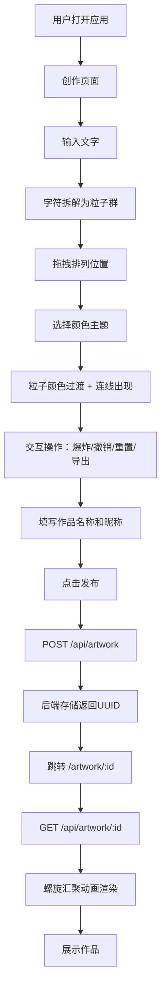

## 1. 产品概述

粒子涂鸦墙（Particle Graffiti Wall）是一个全栈Web应用，让用户在浏览器中创建和分享动态文字粒子涂鸦艺术品。用户输入的文字会被自动拆解为独立的粒子群，配合颜色主题、交互动画和连线效果，将普通手绘文字转化为可交互的数字艺术品。

- 核心问题：普通涂鸦工具无法将手绘文字转化为带有粒子动画的、可交互的数字艺术品
- 目标用户：创意爱好者、数字艺术创作者、社交媒体分享者

## 2. 核心功能

### 2.1 用户角色

| 角色 | 注册方式 | 核心权限 |
|------|----------|----------|
| 创作者 | 无需注册 | 创建粒子涂鸦、选择主题、导出PNG、发布作品 |
| 浏览者 | 无需注册 | 查看已发布的作品、返回创作页 |

### 2.2 功能模块

1. **创作页面**：文字输入画布、粒子交互、颜色主题切换、控制面板、发布表单
2. **公开页面**：作品展示、螺旋汇聚动画、作品信息、404提示

### 2.3 页面详情

| 页面 | 模块 | 功能描述 |
|------|------|----------|
| 创作页面 | 文字输入区 | 输入文字（最多50字），字符拆解为粒子群（每字约100粒子，2-4px白色），支持拖拽字符粒子群 |
| 创作页面 | 粒子画布 | Canvas渲染粒子，拖拽释放后正弦波回归（1.5s ease-out），点击爆炸扩散（150px/1s）后聚拢（2s ease-in-out） |
| 创作页面 | 颜色主题 | 霓虹/极光/水墨三主题，平滑过渡（2s，随机延迟0-0.5s），粒子连线（<80px，0.3透明度，悬停0.7） |
| 创作页面 | 控制面板 | 撤销（3步）、重置（确认对话框）、导出PNG（1920x1080，白色背景） |
| 创作页面 | 发布表单 | 作品名称（20字）、作者昵称（10字），POST到后端获取UUID，跳转公开页 |
| 创作页面 | 状态信息 | 左下角字符数量和粒子总数（12px，半透明背景） |
| 公开页面 | 作品展示 | 根据ID加载作品数据，螺旋轨迹汇聚动画（1s，50%随机偏移），还原粒子状态 |
| 公开页面 | 作品信息 | 作品名称、作者昵称、发布时间（格式：2024年5月15日 14:30） |
| 公开页面 | 404提示 | ID不存在时显示灰色居中文字（24px）和返回首页按钮 |

## 3. 核心流程

用户打开应用 → 在创作页输入文字 → 字符拆解为粒子群 → 拖拽排列位置 → 选择颜色主题 → 粒子颜色平滑过渡+连线出现 → 点击粒子群触发爆炸效果 → 撤销/重置/导出操作 → 填写作品名称和昵称 → 发布 → 后端存储返回UUID → 跳转公开页面 → 粒子螺旋汇聚动画展示 → 其他用户通过链接访问

## 4. 界面设计

### 4.1 设计风格

- 主题：深色赛博朋克风
- 主色：深蓝紫渐变背景（#0a0a2e → #1b1b3a），画布纯黑（#000）
- 强调色：暗青色边框（#1a3a5a），按钮暗紫（#2a2a5a → #4a4a7a hover）
- 字体：系统默认无衬线字体，按钮14px白色，状态12px
- 按钮风格：圆角8px，暗色半透明背景
- 布局：画布居中占主体，控制面板右上角浮动

### 4.2 页面设计概览

| 页面 | 模块 | UI元素 |
|------|------|--------|
| 创作页面 | 画布 | 纯黑背景，90%宽70vh高，1px暗青边框，粒子白色2-4px |
| 创作页面 | 控制面板 | 右上角浮动，圆角8px按钮，半透明暗紫背景 |
| 创作页面 | 输入区 | 画布下方，文字输入框+添加按钮 |
| 创作页面 | 主题选择 | 三个主题按钮，霓虹/极光/水墨 |
| 创作页面 | 发布表单 | 作品名称+作者昵称+发布按钮 |
| 创作页面 | 状态标签 | 左下角，12px白色，半透明黑色背景 |
| 公开页面 | 画布 | 同创作页面画布样式 |
| 公开页面 | 信息区 | 底部居中，作品名称/作者/时间 |

### 4.3 响应式适配

- 桌面优先设计
- 宽度 < 768px：控制面板改为底部弹出（200px高，100%宽），画布调整为100%宽50vh高，粒子和字体按0.7倍缩放

### 4.4 颜色主题定义

- **霓虹**：明亮的青色、品红色、黄色粒子组合
- **极光**：绿色、蓝紫色、青色渐变粒子
- **水墨**：灰白色、浅灰色、深灰色粒子
