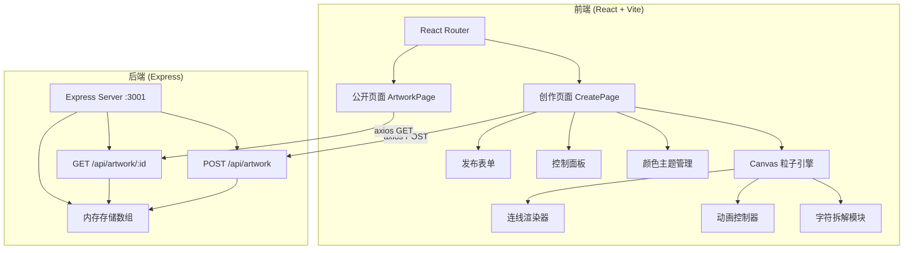
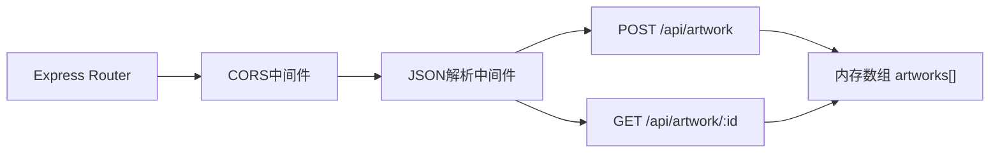

## 1. 架构设计



## 2. 技术说明

- 前端：React@18 + TypeScript + Vite@5 + Canvas 2D API
- 后端：Express@4 + TypeScript + cors@2 + uuid@9
- 状态管理：React useState + useRef（Canvas性能需求）
- 构建工具：Vite@5，代理 /api 到后端3001端口
- 路由：react-router-dom@6
- HTTP客户端：axios

## 3. 路由定义

| 路由 | 用途 |
|------|------|
| / | 创作页面：画布、控制面板、发布表单 |
| /artwork/:id | 公开页面：展示已发布的作品 |

## 4. API定义

### 4.1 TypeScript 类型定义

```typescript
interface ParticleOffset {
  x: number;
  y: number;
}

interface CharParticleGroup {
  char: string;
  x: number;
  y: number;
  particles: ParticleOffset[];
}

interface ArtworkData {
  id: string;
  name: string;
  author: string;
  chars: CharParticleGroup[];
  theme: string;
  createdAt: string;
}

interface CreateArtworkRequest {
  name: string;
  author: string;
  chars: CharParticleGroup[];
  theme: string;
}

interface CreateArtworkResponse {
  id: string;
}
```

### 4.2 请求/响应模式

**POST /api/artwork**
- 请求体：CreateArtworkRequest (JSON)
- 响应体：CreateArtworkResponse (JSON)
- 状态码：201 Created

**GET /api/artwork/:id**
- 路径参数：id (UUID)
- 响应体：ArtworkData (JSON)
- 状态码：200 OK / 404 Not Found

## 5. 服务端架构图



## 6. 粒子引擎架构

### 6.1 核心模块

- **字符拆解**：利用Canvas measureText + fillText采样获取字符像素轮廓，提取轮廓点作为粒子初始位置
- **动画系统**：requestAnimationFrame驱动的动画循环，支持多种动画状态（静止、拖拽、回归、爆炸、聚拢、螺旋汇聚）
- **连线系统**：空间哈希优化近距离粒子检测，80px阈值连线渲染
- **主题系统**：颜色插值器，支持2秒渐变+随机延迟

### 6.2 性能优化策略

- Canvas 2D批量绘制（按颜色分组减少状态切换）
- 空间哈希网格加速连线检测（O(n)而非O(n²)）
- 离屏Canvas预渲染静态元素
- 粒子位置使用Float32Array存储
- 连线仅检测同字符组+邻近字符组的粒子

## 7. 文件结构

```
├── package.json
├── vite.config.js
├── tsconfig.json
├── index.html
├── server/
│   └── index.ts
├── src/
│   ├── main.tsx
│   ├── App.tsx
│   ├── pages/
│   │   ├── CreatePage.tsx
│   │   └── ArtworkPage.tsx
│   ├── utils/
│   │   ├── particleEngine.ts
│   │   ├── themeColors.ts
│   │   └── textToParticles.ts
│   └── components/
│       ├── ControlPanel.tsx
│       ├── PublishForm.tsx
│       └── CanvasRenderer.tsx
```
