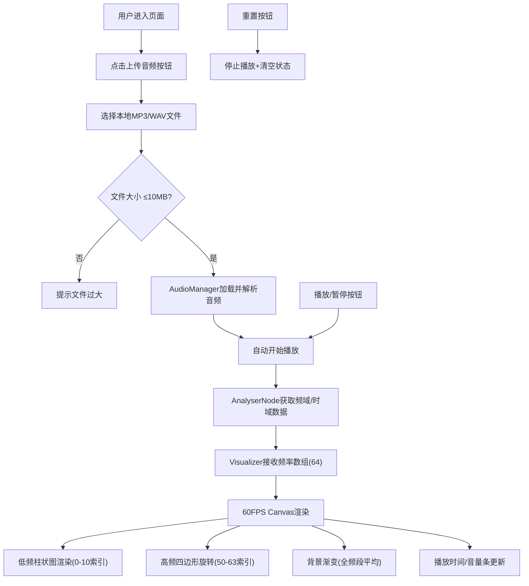

# 声纹·色谱墙 - 产品需求文档 (PRD)

## 1. 产品概述

"声纹·色谱墙"是一款基于浏览器的交互式音频可视化应用，将用户本地音频文件（MP3/WAV）实时转化为动态色彩与几何图形交互墙，让歌曲的节奏、音高和音量以视觉形式流动呈现。目标用户为音乐可视化爱好者、艺术创作者和音乐学习者。产品价值在于提供沉浸式的音画联动体验，使抽象的音频信息变得可视化、可感知。

## 2. 核心功能

### 2.1 用户角色
| 角色 | 注册方式 | 核心权限 |
|------|----------|----------|
| 普通用户 | 无需注册，直接使用 | 上传本地音频文件、播放/暂停控制、查看实时可视化效果 |

### 2.2 功能模块
1. **主页面**：文件上传区、Canvas可视化画布、播放控制栏、信息显示区

### 2.3 页面详情
| 页面名称 | 模块名称 | 功能描述 |
|----------|----------|----------|
| 主页面 | 文件上传区 | 点击选择本地MP3/WAV文件（≤10MB），选中后自动播放 |
| 主页面 | Canvas可视化画布 | 60FPS实时渲染音频可视化动画 |
| 主页面 | 低频柱状图 | 底部12根彩色柱状条，随低频幅值变化高度，带发光光晕 |
| 主页面 | 高频旋转四边形 | Canvas中央8个旋转四边形，旋转速度和颜色随高频幅值变化 |
| 主页面 | 动态背景渐变 | 全频段平均幅值控制背景颜色平滑过渡 |
| 主页面 | 播放控制栏 | 播放/暂停按钮、重置按钮、播放时间显示、音量条 |

## 3. 核心流程

用户进入页面 → 点击"上传音频"按钮 → 选择本地音频文件（MP3/WAV ≤10MB）→ 文件自动加载并开始播放 → Web Audio API实时解析音频 → 60FPS Canvas渲染动态可视化效果（低频柱状图、高频旋转四边形、动态背景渐变）→ 用户可随时播放/暂停或重置 → 页面底部显示播放进度和音量

## 4. 用户界面设计

### 4.1 设计风格
- **主色调**：深色系，背景从 #0d0d0d 到 #1a1a2e 渐变
- **强调色**：青色(#00ffff)、品红(#ff00ff)、深蓝→亮紫渐变柱
- **按钮样式**：圆角胶囊造型上传按钮，圆形播放控制按钮
- **字体**：现代无衬线字体，浅色文字
- **布局风格**：全屏居中，Canvas居中显示，顶部上传区水平置中
- **视觉效果**：发光光晕、荧光描边、平滑渐变过渡

### 4.2 页面设计概述
| 页面名称 | 模块名称 | UI元素 |
|----------|----------|--------|
| 主页面 | 文件上传区 | 虚线边框、圆角12px、内边距30px、半透明黑背景、浅灰文字、悬停0.3s淡入 |
| 主页面 | Canvas画布 | 80%视口宽×70%视口高、1px白灰色边框(#333)、20px内边距、居中 |
| 主页面 | 低频柱状图 | 12根柱条，宽30px，高20-200px，5px间距，深蓝→亮紫渐变，顶部0.4透明度光晕 |
| 主页面 | 高频四边形 | 8个，边长60-120px，2px荧光描边，青色→品红渐变 |
| 主页面 | 动态背景 | 深紫(#1a0033)→暗红(#330011)→墨绿(#003311)，约8秒周期平滑过渡 |
| 主页面 | 播放控制 | 圆形40px直径按钮、播放/暂停图标切换、悬停放大1.1倍、重置按钮 |
| 主页面 | 信息显示 | mm:ss格式播放时间、200px×6px圆角音量条 |

### 4.3 响应式设计
- 桌面优先设计
- 视口宽度 <768px 时：Canvas宽度调整为100%，底部控制栏自动换行

## 5. 性能约束
- 视觉动画帧率稳定 55-60 FPS，密集渲染时不低于 50 FPS
- 音频解析延迟 ≤50ms
- 用户操作响应时间 <100ms
