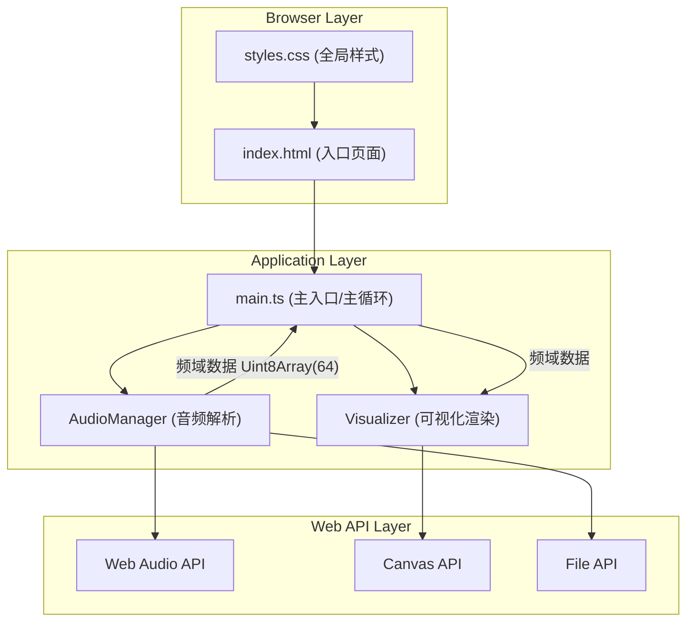

# 声纹·色谱墙 - 技术架构文档

## 1. 架构设计



**数据流向说明**：
1. 用户通过 `index.html` 的文件上传控件选择音频文件
2. `main.ts` 接收文件事件，通知 `AudioManager` 加载解析
3. `AudioManager` 使用 Web Audio API 解码音频，通过 `AnalyserNode` 获取实时频域数据（长度64的Uint8Array）
4. `main.ts` 的主循环（requestAnimationFrame）以60FPS从 `AudioManager` 拉取频域数据
5. `main.ts` 将频域数据传递给 `Visualizer`，驱动 Canvas 渲染
6. `Visualizer` 根据频域数据分别渲染低频柱状图、高频旋转四边形和动态背景渐变

## 2. 技术栈说明

- **前端框架**：TypeScript + Vite（纯原生，无React/Vue）
- **构建工具**：Vite@5
- **语言**：TypeScript@5（严格模式，ES模块目标）
- **音频处理**：Web Audio API（AudioContext, AnalyserNode, AudioBufferSourceNode）
- **图形渲染**：HTML5 Canvas 2D API
- **文件处理**：HTML5 File API
- **样式**：原生CSS（CSS变量，响应式媒体查询）

## 3. 文件结构与调用关系

| 文件路径 | 职责 | 输入 | 输出 | 被谁调用 | 调用谁 |
|----------|------|------|------|----------|--------|
| `package.json` | 项目依赖与脚本配置 | - | - | npm/pnpm | - |
| `vite.config.js` | Vite构建配置，指向index.html | - | - | vite | - |
| `tsconfig.json` | TypeScript编译配置（严格模式，ES模块） | - | - | tsc/vite | - |
| `index.html` | 入口页面，深色渐变背景，DOM结构 | - | DOM节点 | 浏览器 | main.ts, styles.css |
| `src/styles.css` | 全局样式，CSS变量，响应式规则 | - | 样式规则 | index.html | - |
| `src/main.ts` | 应用入口，初始化AudioManager/Visualizer，管理主循环 | 文件选择事件、用户交互事件 | Canvas渲染帧、状态更新 | index.html | audioManager.ts, visualizer.ts |
| `src/audioManager.ts` | 音频加载/播放/暂停，AnalyserNode获取频域数据 | File对象、播放控制指令 | Uint8Array(64)频域数据、播放状态、当前时间 | main.ts | Web Audio API |
| `src/visualizer.ts` | 接收频域数据，在Canvas上绘制动态图形 | Uint8Array(64)频域数据、Canvas上下文 | Canvas绘制指令 | main.ts | Canvas API |

## 4. 核心模块设计

### 4.1 AudioManager 类

```typescript
class AudioManager {
  // 构造函数：创建AudioContext和AnalyserNode
  constructor()

  // 加载音频文件，返回Promise
  async loadAudio(file: File): Promise<void>

  // 开始/继续播放
  play(): void

  // 暂停播放
  pause(): void

  // 停止并重置
  stop(): void

  // 获取实时频域数据（长度64的Uint8Array）
  getFrequencyData(): Uint8Array

  // 获取当前播放时间（秒）
  getCurrentTime(): number

  // 获取音频总时长（秒）
  getDuration(): number

  // 获取当前播放状态
  isPlaying(): boolean

  // 获取平均音量（0-1）
  getAverageVolume(): number
}
```

**关键配置**：
- `AnalyserNode.fftSize = 128` → 输出64个频率bin
- `AnalyserNode.smoothingTimeConstant = 0.8`

### 4.2 Visualizer 类

```typescript
class Visualizer {
  // 构造函数：接收Canvas元素和上下文
  constructor(canvas: HTMLCanvasElement)

  // 主渲染方法，每帧调用
  render(frequencyData: Uint8Array, avgVolume: number): void

  // 清空画布
  clear(): void

  // 调整画布尺寸
  resize(): void

  // 私有：绘制低频柱状图（索引0-10）
  private drawLowFrequencyBars(data: Uint8Array): void

  // 私有：绘制高频旋转四边形（索引50-63）
  private drawHighFrequencyQuads(data: Uint8Array): void

  // 私有：绘制动态背景渐变
  private drawBackgroundGradient(avgVolume: number): void
}
```

### 4.3 main.ts 主循环

```typescript
// 主循环使用 requestAnimationFrame，约60FPS
function animate(): void {
  if (audioManager.isPlaying()) {
    const freqData = audioManager.getFrequencyData()
    const avgVolume = audioManager.getAverageVolume()
    visualizer.render(freqData, avgVolume)
    updateTimeDisplay(audioManager.getCurrentTime())
    updateVolumeBar(avgVolume)
  }
  requestAnimationFrame(animate)
}
```

## 5. 性能优化策略

1. **Canvas渲染优化**：
   - 使用 `requestAnimationFrame` 而非 `setInterval`
   - 合理使用 `clearRect` 局部清除而非全画布重绘
   - 避免在渲染循环中创建新对象

2. **音频处理优化**：
   - AnalyserNode 的 fftSize 设为 128（最小合理值），减少计算量
   - 使用 smoothingTimeConstant 平滑数据跳变

3. **DOM更新优化**：
   - 播放时间显示节流（每200ms更新一次，而非每帧）
   - 减少不必要的DOM查询，缓存元素引用

## 6. 路由定义

本项目为单页应用，无路由。

| 路由 | 用途 |
|------|------|
| / | 主页面（唯一页面） |
