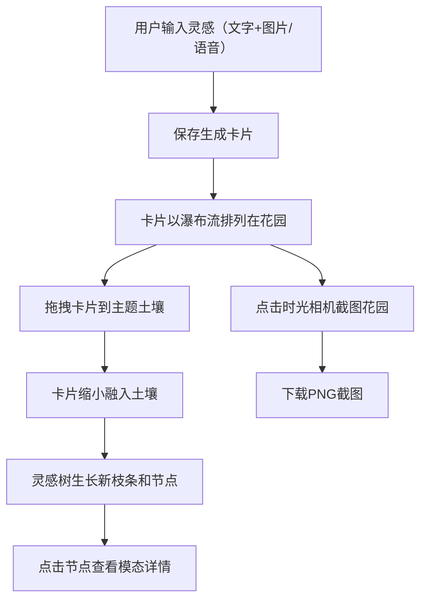

## 1. 产品概述

思维花园（Mind Garden）是一款帮助用户将日常灵感碎片（文字、图片、语音片段）整理成个人思维花园的全栈Web应用，解决灵感记录碎片化、难以按主题关联和视觉化呈现的问题。

- 目标用户：创意工作者、写作者、设计师等需要频繁记录和管理灵感的人群
- 核心价值：通过花园隐喻将碎片化灵感可视化为有机生长的思维树，让灵感的关联与生长一目了然

## 2. 核心功能

### 2.1 用户角色
| 角色 | 注册方式 | 核心权限 |
|------|----------|----------|
| 普通用户 | 无需注册 | 创建、查看、删除灵感卡片，拖拽卡片到土壤，查看灵感树，截图花园 |

### 2.2 功能模块
1. **花园主页**：灵感输入编辑框、瀑布流卡片展示、浮动粒子背景、主题土壤区域
2. **灵感树视图**：粒子构成的二叉树动画、节点交互、模态详情展示
3. **时光相机**：一键截图当前花园状态并下载PNG

### 2.3 页面详情
| 页面名称 | 模块名称 | 功能描述 |
|----------|----------|----------|
| 花园主页 | 灵感输入区 | 编辑框输入灵感文字（最多500字），可附带一张图片或一段语音，语音上传后自动转为文字摘要 |
| 花园主页 | 瀑布流卡片 | 每条灵感生成200x280px虚拟卡片（圆角16px、浅灰背景、2px淡蓝边框、10px偏移阴影），默认瀑布流排列 |
| 花园主页 | 主题土壤区域 | 画布中央圆形区域（直径480px、半透明、旋转星轨粒子背景），接受拖入的卡片 |
| 花园主页 | 灵感树 | 土壤中心粒子二叉树，每张卡片对应一个节点，拖入后生长新枝条（1.5秒ease-out动画） |
| 灵感树视图 | 节点模态框 | 点击节点弹出600x400px毛玻璃模态框，显示灵感全文、图片预览、语音播放按钮，关闭时缩放渐隐0.4秒 |
| 花园主页 | 时光相机 | 右下角48px圆形复古棕按钮，点击截图花园状态（html2canvas），可下载PNG |
| 花园主页 | 导航栏 | 顶部半透明悬浮条，四个图标（花园、土壤、灵感的种子、时光相机），选中发光下划线动画 |

## 3. 核心流程

用户在首页输入灵感文字并可选附带图片或语音，保存后生成一张虚拟卡片以瀑布流排列在花园中。用户可拖拽卡片到中央"主题土壤"区域，拖入后卡片缩小融入土壤，灵感树生长出新枝条和节点。点击灵感树节点弹出模态框查看详情。用户可随时通过"时光相机"截图当前花园状态。

## 4. 用户界面设计

### 4.1 设计风格
- 主色：#f5deb3 小麦色，辅助色：#2e8b57 海洋绿，点缀色：#ff8c00 暗橙
- 按钮：圆角胶囊形，悬停上浮translateY(-4px)和阴影加深（偏移+6px），点击缩减scale(0.95)
- 字体：标题使用 Playfair Display，正文使用 Noto Sans SC
- 布局：花园画布为全屏沉浸式，顶部半透明导航悬浮条
- 图标：lucide-react 图标库
- 动画：粒子浮动、树枝生长、卡片悬停上浮、模态框毛玻璃效果

### 4.2 页面设计概览
| 页面名称 | 模块名称 | UI元素 |
|----------|----------|--------|
| 花园主页 | 花园背景 | 渐变晨光（底部#dcedc1浅绿到顶部#f3e5f5淡紫），80个淡黄浮动粒子（2-6px，缓慢上升淡出） |
| 花园主页 | 导航栏 | 半透明悬浮条，四个图标，选中发光下划线0.3秒展开 |
| 花园主页 | 灵感输入区 | 编辑框+上传按钮，小麦色背景卡片 |
| 花园主页 | 瀑布流卡片 | 200x280px卡片，圆角16px，浅灰背景，2px淡蓝边框，10px偏移阴影 |
| 花园主页 | 主题土壤 | 中央圆形区域480px直径，半透明，旋转星轨粒子 |
| 花园主页 | 灵感树 | 粒子二叉树，白色发光节点6px，金色渐变枝条#ffd700到#ff8c00 |
| 花园主页 | 时光相机按钮 | 右下角48px圆形，复古棕#8B4513背景，快门音效 |
| 灵感树视图 | 节点模态框 | 600x400px，毛玻璃（背景模糊10px），20px圆角，阴影，关闭缩放渐隐0.4秒 |

### 4.3 响应式设计
- 桌面优先设计（768px以上视口显示完整花园）
- 768px以下：自动切换为单列卡片流，导航栏变为底部折叠菜单
- 触摸优化：拖拽操作支持触摸事件

### 4.4 性能要求
- 灵感树粒子动画和拖拽交互帧率不低于40fps
- 截图生成时间不超过1秒
