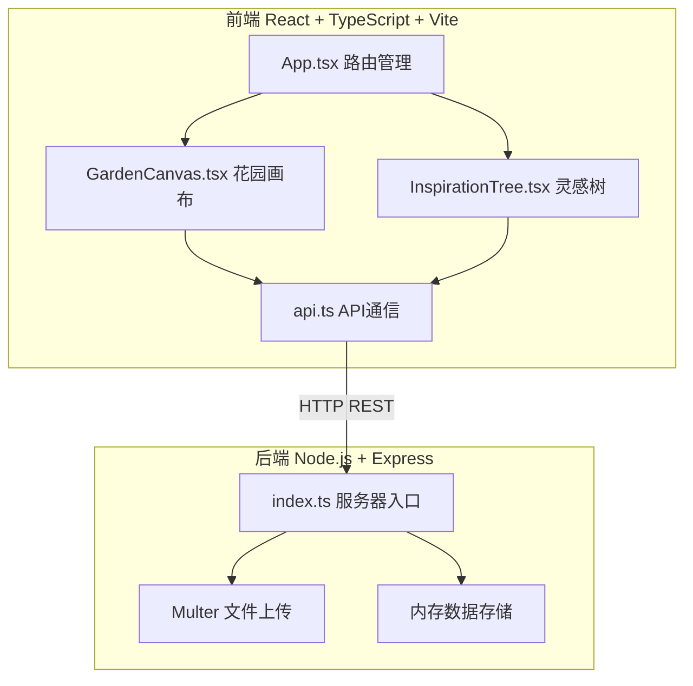
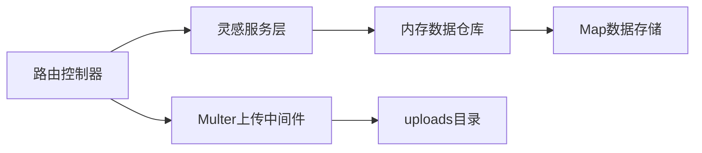
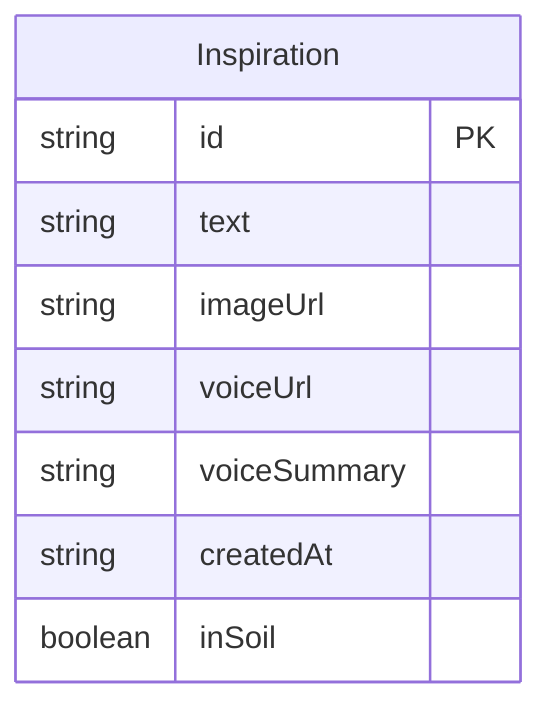

## 1. 架构设计



## 2. 技术说明
- 前端：React@18 + TypeScript + Vite@5 + Tailwind CSS + Zustand + html2canvas
- 初始化工具：vite-init（react-express-ts模板）
- 后端：Express@4 + Multer + CORS
- 数据库：内存存储（Map数据结构，无需数据库）
- 语音转文字：前端Web Speech API（浏览器原生能力）

## 3. 路由定义
| 路由 | 用途 |
|------|------|
| / | 花园主页，包含灵感输入、瀑布流卡片、主题土壤、灵感树 |

## 4. API定义

### TypeScript类型定义

```typescript
interface Inspiration {
  id: string;
  text: string;
  imageUrl?: string;
  voiceUrl?: string;
  voiceSummary?: string;
  createdAt: string;
  inSoil: boolean;
}

interface CreateInspirationRequest {
  text: string;
  imageUrl?: string;
  voiceUrl?: string;
  voiceSummary?: string;
}

interface InspirationResponse {
  success: boolean;
  data?: Inspiration;
  error?: string;
}

interface InspirationsResponse {
  success: boolean;
  data?: Inspiration[];
  error?: string;
}
```

### RESTful端点

| 方法 | 路径 | 请求体 | 响应 | 用途 |
|------|------|--------|------|------|
| POST | /api/inspirations | FormData(text, image?, voice?) | InspirationResponse | 创建灵感（含文件上传） |
| GET | /api/inspirations | - | InspirationsResponse | 获取所有灵感 |
| DELETE | /api/inspirations/:id | - | InspirationResponse | 删除灵感 |
| PUT | /api/inspirations/:id/soil | { inSoil: boolean } | InspirationResponse | 更新灵感土壤状态 |
| GET | /api/uploads/:filename | - | 文件流 | 获取上传的文件 |

## 5. 服务器架构图



## 6. 数据模型

### 6.1 数据模型定义



### 6.2 数据定义

使用内存Map存储，键为灵感id，值为Inspiration对象。上传的文件存储在服务器uploads目录中。
