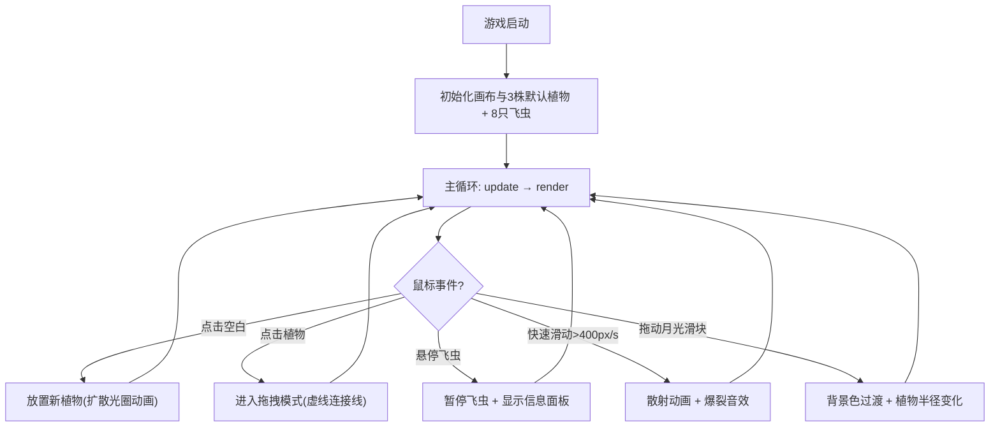

## 1. 产品概述
萤光·羽音阁是一款基于Canvas粒子渲染的交互式飞虫饲养模拟游戏，玩家在深邃夜空栖息地中布置荧光植物、调整月光角度，观察和互动发光飞虫群的行为。目标用户为喜爱治愈系交互体验和幻想生物收藏的玩家。

## 2. 核心功能

### 2.1 功能模块
1. **栖息地主画布**：中央圆形Canvas画布，渲染荧光植物、飞虫群、同心圆网格和所有视觉效果
2. **飞虫交互系统**：悬停查看详情、鼠标快速滑动触发散射
3. **植物摆放系统**：点击放置、拖拽移动、吸引力场
4. **月光控制面板**：滑块调整月光角度，同步影响背景光照和植物发光半径
5. **音效系统**：飞虫正弦波音符、散射爆裂音效

### 2.2 页面详情
| 页面名称 | 模块名称 | 功能描述 |
|----------|----------|----------|
| 主页面 | 栖息地画布 | Canvas渲染飞虫和植物，处理鼠标交互事件，渲染同心圆网格与涟漪效果 |
| 主页面 | 飞虫信息面板 | 悬停飞虫时显示HSL颜色、亮度、音频频率，毛玻璃背景 |
| 主页面 | 月光控制面板 | 右下角滑块0-360度，拖动改变背景色和植物半径 |

## 3. 核心流程

## 4. 用户界面设计

### 4.1 设计风格
- **主色调**：深蓝夜空渐变（#0b0c1a → #1a1b3a），荧光色系点缀
- **边框风格**：10px宽荧光渐变边框（#4a0080 → #d4a0ff），圆角24px
- **字体**：使用 Sci-fi 风格字体，面板文字14px
- **布局风格**：画布居中，占视口80%，控制面板浮于右下角
- **视觉氛围**：科幻童话风，夜间萤火虫沉浸感

### 4.2 页面设计概览
| 页面名称 | 模块名称 | UI元素 |
|----------|----------|--------|
| 主页面 | 栖息地画布 | 圆角Canvas，荧光边框，深色背景，同心圆网格线(#aaddff, 0.15透明度) |
| 主页面 | 飞虫信息面板 | 毛玻璃面板(blur:6px, 透明度0.3, 圆角12px)，HSL/频率数据 |
| 主页面 | 月光滑块 | 范围0-360度，自定义样式滑块 |

### 4.3 响应式
- 桌面优先设计，画布尺寸为视口80%宽高
- 最小支持视口1024x768

## 5. 性能约束
- 视口1400x900下稳定60FPS
- 飞虫上限20只时帧率≥55FPS
- 散射响应延迟<50ms
