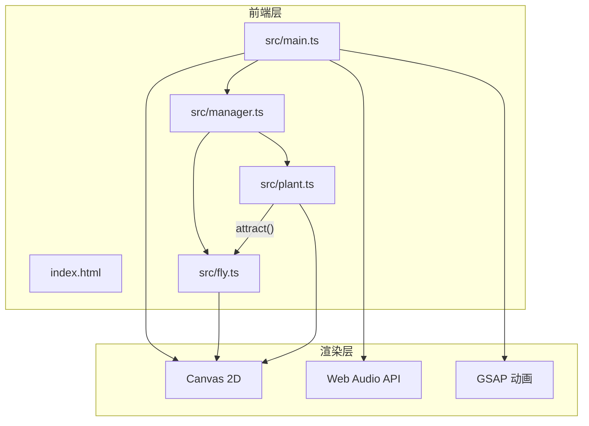

## 1. 架构设计



**数据流向**：鼠标事件 → FlyManager/PlantManager → Fly.update()/Plant.update() → Canvas渲染

## 2. 技术说明
- **前端**：TypeScript + Vite（纯Canvas渲染，无框架）
- **动画库**：GSAP（补间动画、缓动）
- **音频**：Web Audio API（正弦波音符、合成器音效）
- **构建工具**：Vite
- **后端**：无
- **数据库**：无

## 3. 文件结构与调用关系

| 文件 | 职责 | 调用关系 |
|------|------|----------|
| package.json | 依赖管理，启动脚本 | - |
| vite.config.js | 构建配置，指向index.html | - |
| tsconfig.json | TypeScript严格模式，ES模块 | - |
| index.html | 入口页面，深邃夜空背景 | 引用 src/main.ts |
| src/main.ts | 应用入口，初始化Canvas和游戏循环 | 调用 FlyManager, PlantManager |
| src/fly.ts | 飞虫类：坐标、速度、HSL颜色、音频频率、update() | 被 FlyManager 管理，受 Plant.attract() 影响 |
| src/plant.ts | 荧光植物类：位置、发光半径、颜色、attract() | 被 PlantManager 管理，影响 Fly 移动 |
| src/manager.ts | FlyManager + PlantManager：增删、碰撞检测、协调 | 管理 Fly 和 Plant 实例 |

## 4. 核心数据模型

### 4.1 Fly 飞虫
```typescript
interface FlyData {
  x: number; y: number;
  vx: number; vy: number;
  hsl: { h: number; s: number; l: number; a: number };
  frequency: number; // 220-880Hz
  size: number; // 默认6px，悬停10px
  orbitPlantIndex: number; // 环绕的植物索引
  orbitAngle: number;
  orbitSpeed: number; // 0.5-1.5px/帧
  isScattered: boolean;
  scatterTimer: number;
}
```

### 4.2 Plant 荧光植物
```typescript
interface PlantData {
  x: number; y: number;
  color: string;
  glowRadius: number; // 20-80px
  baseGlowRadius: number;
  pulsePhase: number; // 呼吸脉动相位
  size: number; // 16px
  opacity: number; // 0.4
}
```

### 4.3 月光状态
```typescript
interface MoonlightState {
  angle: number; // 0-360度
  hue: number; // 背景色相
  intensity: number; // 0-1, 与角度反比
}
```

## 5. 性能优化策略
- 飞虫上限20只，使用对象池避免GC
- Canvas使用requestAnimationFrame，避免setInterval
- 植物发光使用径向渐变缓存
- 同心圆网格使用离屏Canvas预渲染
- 碰撞检测使用距离平方比较，避免sqrt
