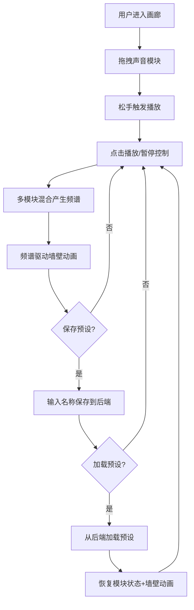

## 1. 产品概述
声境·画廊是一款面向独立音乐制作人和声音艺术爱好者的浏览器端虚拟声音画廊应用。用户可通过拖拽和点击声音模块卡片来实时混合鸟鸣、风声、雨声等自然声音，生成不断变化的氛围音乐，同时画廊墙壁的颜色和几何形状随音频频谱动态变化，创造沉浸式视听体验。

## 2. 核心功能

### 2.1 用户角色
| 角色 | 注册方式 | 核心权限 |
|------|----------|----------|
| 访客 | 无需注册 | 拖拽/点击声音模块、保存/加载预设 |

### 2.2 功能模块
1. **画廊主页**: 声音模块卡片区域 + 画廊墙壁可视化区域 + 预设管理
2. **预设保存**: 模态框输入预设名称，保存当前状态到后端
3. **预设加载**: 下拉菜单加载历史预设

### 2.3 页面详情
| 页面名称 | 模块名称 | 功能描述 |
|----------|----------|----------|
| 画廊主页 | 声音模块区 | 6个声音卡片（雨声、溪流、篝火、鸟鸣、风声、虫鸣），支持拖拽和播放/暂停控制 |
| 画廊主页 | 画廊墙壁 | 右侧20x10三角形网格，根据频谱数据实时渐变颜色和顶点起伏 |
| 画廊主页 | 预设保存按钮 | 右下角圆形按钮，弹出模态框保存当前状态 |
| 画廊主页 | 预设加载菜单 | 左上角下拉菜单，加载历史预设 |

## 3. 核心流程

用户进入画廊主页 → 拖拽声音模块到画布任意位置 → 松手触发播放 → 点击播放/暂停按钮控制单个模块 → 多个模块同时播放产生混合频谱 → 频谱数据驱动墙壁颜色和形状动画 → 保存当前状态为预设 → 加载历史预设恢复状态

## 4. 用户界面设计

### 4.1 设计风格
- 主色调：深灰蓝渐变 #1a1a2e → #16213e
- 辅助色：各模块对应色（雨声#4a90d9、溪流#00bcd4、篝火#ff6b35、鸟鸣#8bc34a、风声#9c27b0、虫鸣#ffc107）
- 频谱色：低频蓝#00d2ff→紫#7a5cff，中频绿#0f0→黄#ff0，高频红#ff4444→橙#ff8800
- 按钮风格：圆形半透明毛玻璃按钮，悬停缩放1.05
- 字体：'Inter', sans-serif
- 布局：左侧40%声音模块区，右侧60%画廊墙壁

### 4.2 页面设计概览
| 页面名称 | 模块名称 | UI元素 |
|----------|----------|--------|
| 画廊主页 | 声音模块卡片 | 120x150px毛玻璃卡片，圆角12px，中央波形图标+播放按钮，边缘脉动光晕 |
| 画廊主页 | 画廊墙壁 | 20x10三角形网格，动态顶点颜色渐变+起伏动画 |
| 画廊主页 | 预设保存模态框 | 居中300x200px，毛玻璃黑底，输入框+保存按钮 |
| 画廊主页 | 预设加载菜单 | 左上角下拉，白色文本，毛玻璃背景 |

### 4.3 响应式适配
- 桌面优先设计
- 屏幕宽度<768px：卡片缩小为90x110px，三角形网格减少到12x8
- 触摸优化：拖拽操作兼容触摸事件

### 4.4 动效设计
- 播放脉动光晕：模块对应色，1.5秒呼吸周期
- 波形跳动：播放时左右5px跳动
- 墙壁顶点起伏：幅度±15px，周期2秒
- 拖拽缩放：150x180px + 10px偏移阴影
- 预设加载过渡：1秒ease-in-out缓动动画
- 悬停效果：scale(1.05) + box-shadow扩散10px
