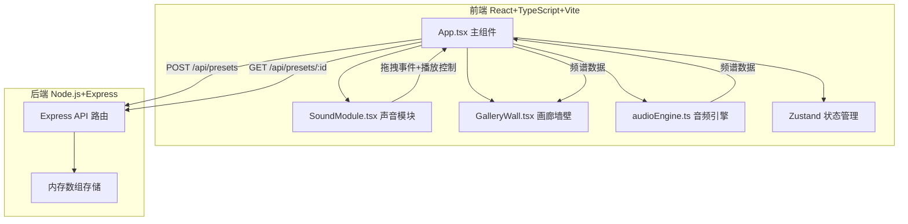
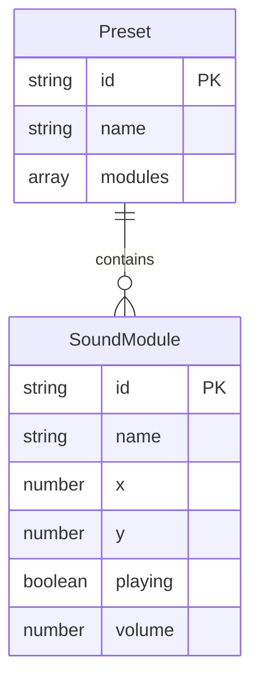

## 1. 架构设计



## 2. 技术说明
- 前端：React@18 + TypeScript + Vite@5 + Tailwind CSS + Zustand
- 初始化工具：vite-init（react-express-ts模板）
- 后端：Express@4 + cors + body-parser + uuid
- 音频：Tone@14（合成器、分析器、Transport调度）
- 动画：GSAP（墙壁顶点动画、过渡动画）
- HTTP客户端：axios

## 3. 路由定义
| 路由 | 用途 |
|------|------|
| / | 画廊主页（声音模块+墙壁可视化+预设管理） |

## 4. API定义

### 4.1 保存预设
```
POST /api/presets
Request Body: {
  name: string
  modules: Array<{
    id: string
    name: string
    x: number
    y: number
    playing: boolean
    volume: number
  }>
}
Response: { id: string, name: string, modules: [...] }
```

### 4.2 获取所有预设列表
```
GET /api/presets
Response: Array<{ id: string, name: string }>
```

### 4.3 加载预设
```
GET /api/presets/:id
Response: { id: string, name: string, modules: [...] }
```

## 5. 服务端架构


## 6. 数据模型

### 6.1 数据模型定义



### 6.2 数据定义
内存数组存储预设，每个预设包含：
- id: uuid生成的唯一标识
- name: 用户输入的预设名称
- modules: 声音模块状态数组，每个模块包含id/name/x/y/playing/volume

## 7. 文件结构与调用关系

```
├── package.json           # 依赖配置，启动脚本 npm run dev
├── vite.config.ts         # 构建配置，代理 /api → localhost:3001
├── tsconfig.json          # TypeScript严格模式配置
├── index.html             # 入口页面，深灰蓝渐变背景
├── src/
│   ├── App.tsx            # 主组件：渲染画廊+音频引擎
│   │                       # 数据流：拖拽→更新模块状态→API保存/加载
│   │                       # 音频状态变化→墙壁颜色与形状动画
│   ├── components/
│   │   ├── SoundModule.tsx # 声音模块卡片
│   │   │                     # 数据流：拖拽位置→App更新坐标
│   │   │                     # 点击播放→Tone.js音频输出
│   │   └── GalleryWall.tsx  # 画廊墙壁
│   │                         # 数据流：App传递频谱[低,中,高]→网格颜色+起伏
│   ├── utils/
│   │   └── audioEngine.ts   # 音频引擎
│   │                           # 数据流：控制信号→合成器→分析器数据→App
│   └── stores/
│       └── galleryStore.ts   # Zustand状态管理
├── server/
│   └── index.js             # Express服务端
│                               # POST /api/presets, GET /api/presets/:id
└── api/                     # 后端代码目录（预留）
```
