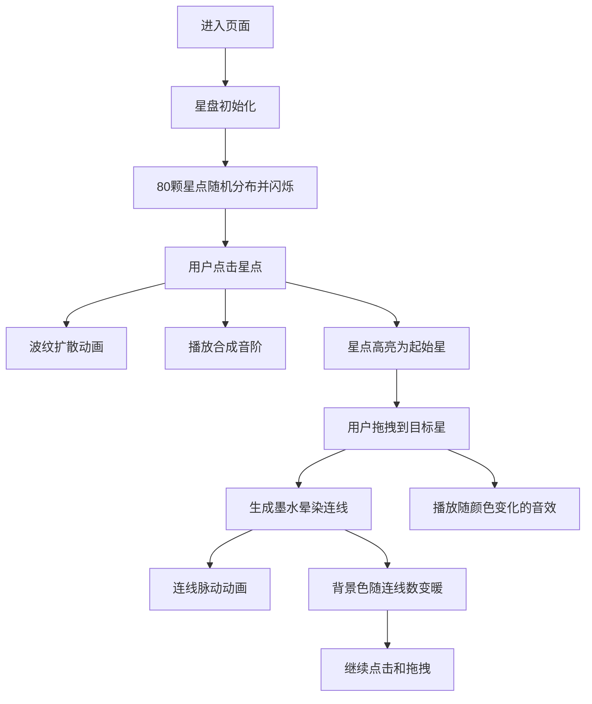

## 1. 产品概述

"影痕·记忆星盘"是一款基于浏览器的交互式艺术体验应用。用户通过鼠标在圆形星盘上点击和拖拽，连接散布的光点来构建一幅不断生长的记忆星图，伴随动态色彩变化和合成音效，创造沉浸式的视觉与听觉双重体验。

- 核心目标：提供一个富有诗意的交互式艺术体验，让用户通过简单的鼠标操作创造独特的视觉记忆图谱
- 目标用户：所有对数字艺术、交互体验和生成式美学感兴趣的用户
- 产品价值：将抽象的"记忆"概念具象化为可交互的视觉星图，每次连接都是一次独特的创作

## 2. 核心特性

### 2.1 功能模块

1. **星盘渲染**：圆形星盘区域，深紫到黑色径向渐变背景，80颗随机分布的闪烁星点
2. **星点交互**：点击星点触发波纹扩散动画、音效播放和高亮状态
3. **连线生成**：拖拽连接两颗星，生成墨水晕染式渐变色线条
4. **背景过渡**：随着连线数量增加，星盘背景从深紫色平滑过渡到暖橙色
5. **音效系统**：基于Web Audio API的合成音阶，随连线颜色变化

### 2.2 详细功能说明

| 模块名称 | 功能描述 |
|---------|---------|
| 星盘背景 | 圆形区域（视口高度60%，最小600px），径向渐变（中心#1a0033，边缘#000011），随连线数增加逐渐过渡到暖橙色 |
| 星点系统 | 80颗星点，直径4-6px，颜色白到淡蓝随机，初始亮度0.3-0.8，脉动闪烁周期2-4秒 |
| 点击交互 | 点击星点：放大到8px，白色波纹扩散（0→60px，0.6秒，透明度0.8→0），播放随机音阶（C4-E5共9音），星点高亮为#ffdd77 |
| 拖拽连线 | 从起始星拖拽到目标星，生成渐变色线条（起始星→目标星颜色，线宽4→2px，圆角端点），墨水晕染动画（2秒从起点到终点显现），完成后半透明（0.6）并每0.5秒脉动（0.5-0.7） |
| 音效合成 | Web Audio API合成正弦波，带轻微颤音，持续0.3秒，频率与连线颜色关联 |

## 3. 核心流程

用户交互主流程：用户进入页面 → 看到中央星盘和闪烁星点 → 点击任意星点（触发波纹、音效、高亮） → 从该星拖拽到另一颗星 → 生成渐变色连线和晕染动画 → 背景随连线数逐渐变暖 → 重复操作构建记忆星图

## 4. 用户界面设计

### 4.1 设计风格

- **主色调**：深紫色系（#1a0033, #000011）→ 暖橙色系渐变过渡
- **辅助色**：白色、淡蓝色（星点）、金色#ffdd77（高亮星）
- **视觉语言**：深邃星空、光晕、波纹、墨水晕染
- **动效风格**：流畅自然，以光晕扩散和渐变色晕染为主要反馈形式
- **布局**：极简全屏，无文字按钮，星盘居中展示

### 4.2 页面设计概览

| 页面名称 | 模块名称 | UI元素 |
|---------|---------|--------|
| 主页面 | 星盘容器 | 全屏黑色背景，居中圆形星盘 |
| 主页面 | 星点层 | 80颗闪烁星点，脉动动画 |
| 主页面 | 连线层 | 渐变色连线，墨水晕染，脉动效果 |
| 主页面 | 效果层 | 点击波纹，光晕反馈 |
| 主页面 | 背景层 | 径向渐变，随连线数平滑过渡 |

### 4.3 响应式设计

- 桌面优先设计，星盘直径基于视口高度的60%计算
- 最小尺寸600px，确保在小屏幕上也有足够交互空间
- 星点大小和连线宽度随星盘整体尺寸等比缩放
- 全屏自适应，所有元素基于Canvas相对坐标定位

### 4.4 性能指标

- 动画帧率稳定60fps
- 鼠标拖拽采样率不低于60次/秒
- 使用requestAnimationFrame驱动所有动画
- Canvas分层渲染优化性能
