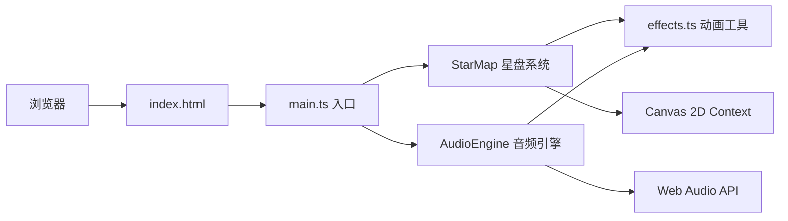

## 1. 架构设计

纯前端单页应用，基于Canvas 2D渲染，无后端依赖。



## 2. 技术选型

- **前端框架**：无（原生TypeScript + Canvas 2D）
- **构建工具**：Vite@5
- **开发语言**：TypeScript@5（严格模式，ES2020目标）
- **音频引擎**：Web Audio API（浏览器原生）
- **渲染引擎**：Canvas 2D Context（浏览器原生）
- **初始化方式**：手动创建项目结构（非React/Vue模板）

## 3. 文件结构

```
auto167/
├── .trae/documents/
│   ├── PRD.md                    # 产品需求文档
│   └── TechnicalArchitecture.md  # 技术架构文档
├── package.json                  # 项目依赖和脚本
├── vite.config.js                # Vite构建配置
├── tsconfig.json                 # TypeScript配置
├── index.html                    # 入口HTML
└── src/
    ├── main.ts                   # 应用入口
    ├── StarMap.ts                # 星盘核心类
    ├── AudioEngine.ts            # 音频引擎类
    └── effects.ts                # 动画工具函数
```

## 4. 模块职责定义

### 4.1 src/effects.ts - 动画工具函数

| 函数/类型 | 描述 |
|----------|------|
| `lerp(a, b, t)` | 线性插值 |
| `easeOutCubic(t)` | 三次缓出函数 |
| `easeInOutQuad(t)` | 二次缓入缓出函数 |
| `hexToRgb(hex)` | 十六进制颜色转RGB |
| `rgbToHex(r, g, b)` | RGB转十六进制颜色 |
| `lerpColor(color1, color2, t)` | 颜色插值 |
| `Ripple` | 波纹效果类（位置、半径、透明度、生命周期） |

### 4.2 src/AudioEngine.ts - 音频引擎

| 方法/属性 | 描述 |
|----------|------|
| `static create(): AudioEngine` | 静态工厂方法，创建并初始化音频引擎 |
| `init()` | 初始化AudioContext |
| `playNote(frequency, duration, type)` | 播放指定频率、时长、波形的音符 |
| `playScaleNote(index)` | 播放指定音阶索引的音符（C4-E5共9音） |
| `NOTE_FREQUENCIES` | 静态音阶频率表 |

### 4.3 src/StarMap.ts - 星盘系统

| 类/方法 | 描述 |
|--------|------|
| `Star` | 星点数据类（位置、半径、颜色、亮度、闪烁相位、周期、高亮状态） |
| `Connection` | 连线数据类（起始星、目标星、创建时间、晕染进度） |
| `StarMap` | 星盘主类 |
| `static create(canvas, audioEngine)` | 静态工厂方法 |
| `resize()` | 调整星盘尺寸（响应视口变化） |
| `render(time)` | 渲染一帧（星点、连线、波纹、背景） |
| `handleClick(x, y)` | 处理点击事件 |
| `handleMouseDown(x, y)` | 处理鼠标按下 |
| `handleMouseMove(x, y)` | 处理鼠标移动 |
| `handleMouseUp(x, y)` | 处理鼠标释放 |

### 4.4 src/main.ts - 应用入口

- 创建Canvas元素并全屏挂载
- 实例化StarMap和AudioEngine
- 注册鼠标/触摸事件监听
- 启动requestAnimationFrame渲染循环
- 监听窗口resize事件

## 5. 核心数据模型

### Star（星点）
```typescript
interface Star {
  x: number;           // 相对圆心的X坐标
  y: number;           // 相对圆心的Y坐标
  radius: number;      // 基础半径
  color: { r: number; g: number; b: number };  // RGB颜色
  baseBrightness: number;  // 基础亮度 0.3-0.8
  flickerPhase: number;    // 闪烁相位偏移
  flickerPeriod: number;   // 闪烁周期 2-4秒
  isHighlighted: boolean;  // 是否高亮
}
```

### Connection（连线）
```typescript
interface Connection {
  starA: Star;
  starB: Star;
  createdAt: number;       // 创建时间戳
  inkDuration: number;     // 墨水晕染时长 2000ms
  pulsePhase: number;      // 脉动相位
}
```

### Ripple（波纹）
```typescript
interface Ripple {
  x: number;
  y: number;
  startTime: number;
  duration: number;        // 600ms
  maxRadius: number;       // 60px
}
```

## 6. 性能优化策略

1. **Canvas渲染**：使用离屏计算，每帧只重绘必要区域
2. **动画驱动**：所有动画统一由requestAnimationFrame驱动，时间戳计算进度
3. **对象池**：星点和连线对象复用，避免频繁GC
4. **颜色缓存**：预计算颜色插值，避免每帧重复计算
5. **渲染分层**：背景、连线、星点、波纹分层处理
6. **事件节流**：鼠标移动事件使用高频率采样但不做多余计算
