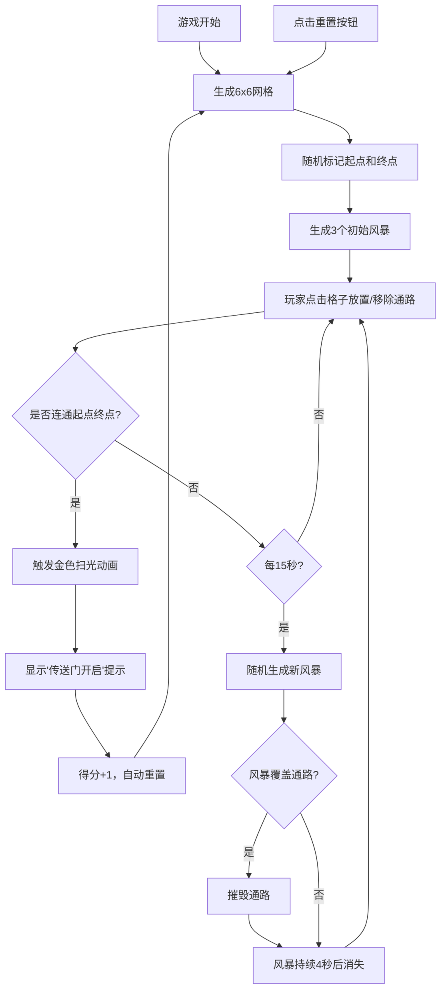

## 1. 产品概述

太空站能量通路解谜游戏 —— 玩家在科幻太空站场景中，通过连接能量节点激活传送门，同时避开随机出现的能量风暴区域。这是一款休闲益智类网页游戏，目标用户为喜欢解谜和策略类游戏的玩家。

- 核心玩法：在 6x6 网格上放置/移除能量通路，连接传送门起点与终点
- 挑战要素：随机生成的能量风暴会摧毁通路，增加游戏难度与策略性
- 市场价值：轻量级网页游戏，易于传播，具有重复可玩性

## 2. 核心功能

### 2.1 功能模块

1. **游戏主界面**：6x6 网格画布、计时器、得分统计、重置按钮
2. **网格交互系统**：点击放置/移除能量通路
3. **通路连通检测**：检测起点到终点的通路是否连通（支持对角线）
4. **能量风暴系统**：定时随机生成风暴，风暴持续 4 秒后消失
5. **传送门系统**：起点和终点标记，连通后触发金色扫光动画
6. **游戏重置机制**：手动重置与通关自动重置

### 2.2 功能详情

| 功能模块 | 子功能 | 功能描述 |
|---------|--------|---------|
| 网格系统 | 6x6 网格生成 | 生成 6 行 6 列的游戏网格 |
| 网格系统 | 格子状态 | 三种状态：空闲（灰蓝色）、通路（亮蓝色渐变动画）、风暴（红色脉冲） |
| 网格系统 | 点击交互 | 点击空闲格子放置通路，点击通路格子移除 |
| 传送门系统 | 起点终点 | 随机选择 4 个角落作为起点和终点（黄色星形图标） |
| 传送门系统 | 连通判定 | 通路需相邻（含对角线），连通后触发金色扫光动画与提示 |
| 风暴系统 | 风暴生成 | 每 15 秒在空闲格子随机生成新风暴 |
| 风暴系统 | 风暴消失 | 风暴持续 4 秒后消失 |
| 风暴系统 | 通路摧毁 | 风暴覆盖通路时，通路被摧毁恢复空闲 |
| 游戏控制 | 重置按钮 | 清除所有通路和风暴，重新生成起点终点与初始风暴 |
| 游戏控制 | 自动重置 | 成功连通传送门后自动重置，得分 +1 |
| 数据统计 | 计时器 | 显示当前局游戏用时（秒） |
| 数据统计 | 得分 | 记录成功连接传送门的次数 |

## 3. 核心流程

### 3.1 游戏主流程

## 4. 用户界面设计

### 4.1 设计风格

- **主题**：深空蓝黑色科幻主题
- **主色调**：深蓝黑色背景 (#0a0e1a)、灰蓝色空闲格子 (#2a3a5a)、亮蓝色通路 (#00d4ff)、红色风暴 (#ff3366)、金色传送门 (#ffd700)
- **按钮风格**：圆角矩形，半透明蓝紫色渐变背景，悬停亮度提升 20%，点击缩放反馈
- **视觉效果**：星际粒子漂浮背景、通路渐变动画、风暴脉冲闪烁、传送门星型光晕旋转
- **字体**：现代无衬线字体，清晰易读

### 4.2 界面布局

| 区域 | 模块 | UI 元素 |
|------|------|---------|
| 顶部 | 控制栏 | 游戏标题、计时器、得分、重置按钮 |
| 中部 | 游戏区域 | 6x6 网格画布（600px 宽度，桌面居中） |
| 底部 | 状态提示 | 传送门开启提示文字 |

### 4.3 响应式设计

- **桌面端**：游戏区域居中显示，宽度 600px，高度自适应
- **移动端**：屏幕宽度小于 700px 时，网格自动等比例缩小，保持可触控操作
- **触控优化**：格子最小尺寸保证触控可点击

### 4.4 动画效果

| 元素 | 动画效果 |
|------|---------|
| 通路放置 | 蓝色到青色渐变填充动画 |
| 通路移除 | 缩小消失过渡动画 |
| 风暴 | 红色脉冲闪烁效果 |
| 传送门 | 缓慢旋转的星型光晕 |
| 连通成功 | 金色扫光动画沿通路移动 |
| 重置 | 所有格子淡入动画重新出现 |
| 背景 | 星际粒子缓慢漂浮 |
| 按钮 | 悬停亮度提升，点击缩放 |

## 5. 性能要求

- 游戏循环帧率稳定 60fps
- 网格更新和风暴生成计算时间 ≤ 2ms
- 画布渲染使用 requestAnimationFrame，避免阻塞主线程
- 动画使用 CSS/Canvas 原生渲染，保证流畅度
