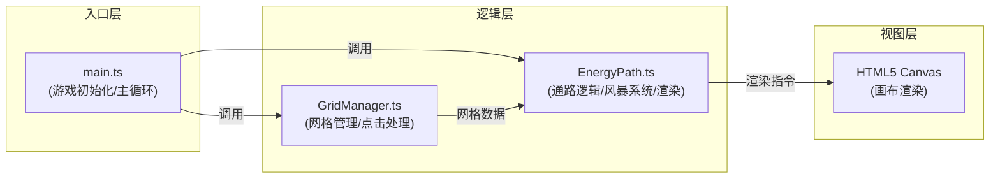
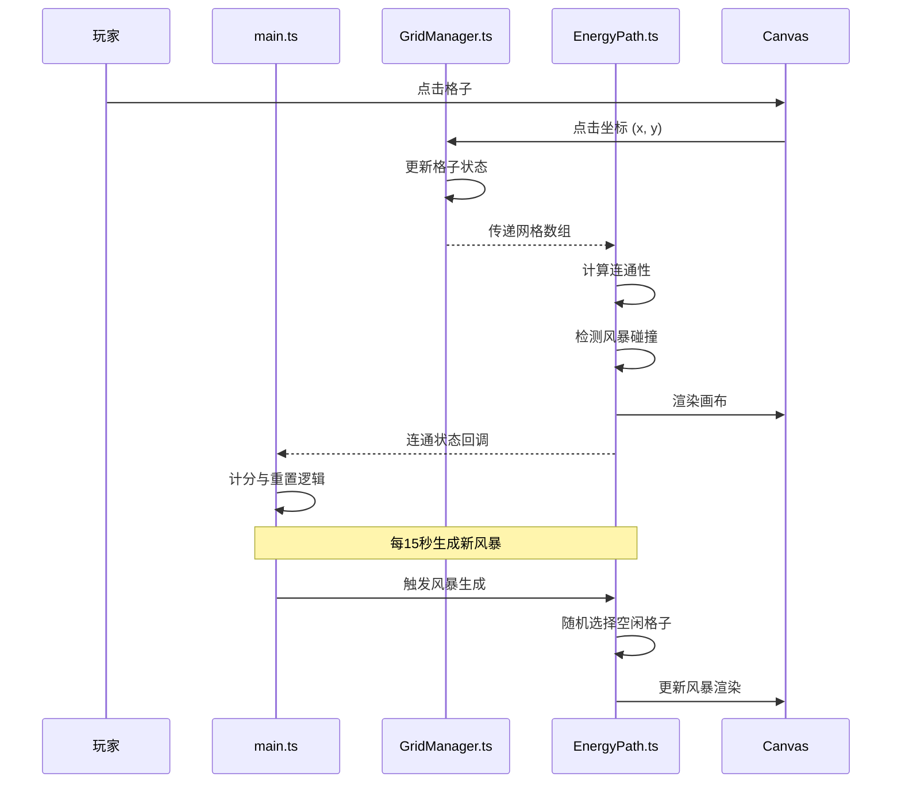

## 1. 架构设计



### 数据流向



## 2. 技术描述

- **前端框架**：原生 TypeScript + HTML5 Canvas（无 UI 框架）
- **构建工具**：Vite 5.x
- **语言**：TypeScript 5.x（严格模式，ES 模块）
- **渲染方式**：Canvas 2D API
- **动画循环**：requestAnimationFrame
- **样式**：原生 CSS

### 技术选型理由

1. **原生 TypeScript**：游戏逻辑相对独立，无需 React/Vue 等 UI 框架的复杂度，减少运行时开销
2. **Canvas 2D**：6x6 网格游戏，Canvas 渲染性能优异，动画控制灵活
3. **Vite**：开发体验好，构建速度快，支持 TypeScript 原生支持
4. **模块化设计**：按职责分离网格管理、通路逻辑、渲染，便于维护

## 3. 文件结构

```
auto17/
├── index.html              # 入口 HTML，包含 Canvas 容器和游戏标题
├── package.json            # 依赖配置与启动脚本
├── tsconfig.json           # TypeScript 配置（严格模式，ES 模块）
├── vite.config.js          # Vite 构建配置
└── src/
    ├── main.ts             # 游戏入口，初始化游戏循环和场景
    ├── GridManager.ts      # 网格管理模块
    └── EnergyPath.ts       # 通路逻辑与渲染模块
```

### 文件职责与调用关系

| 文件 | 职责 | 被调用方 | 调用方 |
|------|------|---------|-------|
| main.ts | 游戏初始化、主循环控制、计时器、得分管理 | GridManager, EnergyPath | index.html |
| GridManager.ts | 网格生成、点击事件处理、状态管理 | 无 | main.ts |
| EnergyPath.ts | 通路连通计算、风暴生成、Canvas 渲染 | GridManager（网格数据） | main.ts |

## 4. 数据模型

### 4.1 格子状态枚举

```typescript
enum CellState {
  IDLE = 0,      // 空闲
  PATH = 1,      // 通路
  STORM = 2,     // 风暴
  START = 3,     // 传送门起点
  END = 4,       // 传送门终点
}
```

### 4.2 格子数据结构

```typescript
interface Cell {
  row: number;
  col: number;
  state: CellState;
  stormEndTime?: number;   // 风暴结束时间戳
  placeAnimation?: number; // 放置动画进度 0-1
  removeAnimation?: number; // 移除动画进度 0-1
}
```

### 4.3 游戏状态

```typescript
interface GameState {
  grid: Cell[][];
  score: number;
  startTime: number;
  isConnected: boolean;
  sweepAnimation: number;   // 金色扫光动画进度
  connectedPath: {row: number, col: number}[];
}
```

## 5. 核心算法

### 5.1 通路连通性检测（BFS）

- **算法**：广度优先搜索 (BFS)
- **连通规则**：相邻包括 8 个方向（横、竖、对角线）
- **时间复杂度**：O(n²)，n=6，实际计算量极小
- **触发时机**：每次网格状态变化后

### 5.2 风暴生成算法

- 在所有空闲格子中随机选择 1 个
- 排除已有风暴和通路的格子
- 风暴持续 4 秒后自动消失
- 每 15 秒生成一个新风暴

### 5.3 渲染循环

- 使用 requestAnimationFrame 驱动
- 每帧更新动画状态（粒子位置、风暴脉冲、扫光进度等）
- 分层渲染：背景粒子 → 格子 → 通路 → 风暴 → 传送门 → 扫光效果

## 6. 性能优化

- **对象池**：粒子对象复用，避免频繁 GC
- **离屏计算**：连通性计算仅在网格变化时执行，不每帧计算
- **局部重绘**：理论上可实现，但 6x6 网格全量渲染性能已足够
- **节流**：风暴生成使用定时器，不占用渲染循环

## 7. 配置说明

### 7.1 package.json

- 依赖：typescript、vite
- 启动脚本：`npm run dev`

### 7.2 tsconfig.json

- 严格模式：`strict: true`
- 模块系统：ESNext
- 目标：ES2020
- 模块解析：Bundler

### 7.3 vite.config.js

- 入口：index.html
- 开发服务器端口：默认 5173
