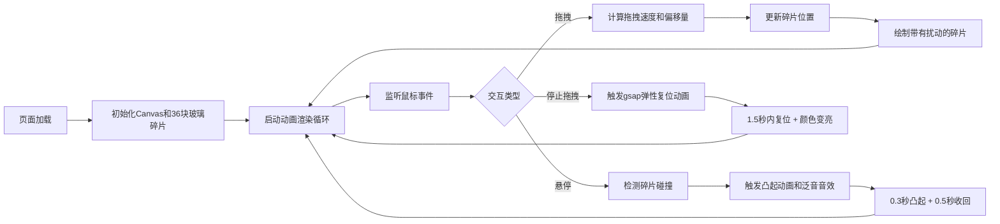

## 1. 产品概述

"织音·璃镜"是一款在浏览器中运行的交互式音乐可视化艺术作品，通过鼠标拖拽和悬停与彩色玻璃碎片互动，产生动态视觉效果和合成音色。

- 核心功能：36块彩色玻璃碎片排列在圆形镜面上，用户通过鼠标拖拽产生物理扰动效果，悬停触发音高和动画
- 目标用户：艺术爱好者、音乐爱好者、追求视觉美感的普通用户
- 产品价值：提供沉浸式的视听交互体验，将视觉艺术与音乐创作融合

## 2. 核心特性

### 2.1 功能模块

1. **主画布**：圆形玻璃拼贴画展示区域，包含36块不规则多边形玻璃碎片
2. **交互系统**：鼠标拖拽扰动、悬停触发、弹性复位动画
3. **音频引擎**：基于Web Audio API的合成音色生成
4. **视觉效果**：碎片凸起、光晕、碎裂动画、星光粒子背景

### 2.2 页面详情

| 页面名称 | 模块名称 | 功能描述 |
|-----------|-------------|---------------------|
| 主页面 | 圆形画布 | 直径占视口高度70%（最小500px），中心向外深蓝到黑色渐变，36块彩色玻璃碎片均匀分布 |
| 主页面 | 拖拽交互 | 鼠标水平/垂直拖拽时，碎片中心产生0-40px随机偏移，拖拽速度决定偏移幅度和动画快慢 |
| 主页面 | 悬停交互 | 鼠标悬停时碎片凸起1.15倍，投影从4px增加到12px，播放对应音高音色 |
| 主页面 | 复位动画 | 拖拽停止后1.5秒内弹性复位（elastic.easeOut），复位时颜色亮度提升30%持续0.3秒 |
| 主页面 | 星光粒子 | 碎片间隙透出2-4个1-2px白点，缓慢闪烁，形成深度层次 |

## 3. 核心流程

## 4. 用户界面设计

### 4.1 设计风格

- **主色调**：中心#0d1b2a到边缘#000000的径向渐变背景
- **玻璃颜色**：红橙黄绿青蓝紫循环渐变分配给36块碎片
- **碎片间隙**：1px暗色间隙，马赛克拼贴效果
- **整体氛围**：夜空中悬浮的彩色玻璃，梦幻、空灵、静谧

### 4.2 页面设计概述

| 页面名称 | 模块名称 | UI元素 |
|-----------|-------------|-------------|
| 主页面 | 圆形画布 | 径向渐变背景、36块不规则多边形玻璃碎片、1px暗色间隙、星光粒子 |
| 主页面 | 碎片悬停 | z轴缩放1.15倍、投影模糊12px、正弦波+泛音音效 |
| 主页面 | 碎片复位 | elastic.easeOut弹性动画、亮度提升30% |
| 主页面 | 星光背景 | 2-4个1-2px白点、缓慢闪烁、仅在交互时透出 |

### 4.3 响应式设计

- **桌面端**：圆形直径占视口高度70%，最小500px
- **移动端**：宽度自动缩小到90%，碎片尺寸等比缩小，数量保持36块
- **触摸优化**：支持touchstart/touchmove/touchend事件，与鼠标事件行为一致

### 4.4 性能要求

- 拖拽交互时帧率稳定在55FPS以上
- 碎片复位动画无卡顿或延迟
- 音频合成无延迟、无爆音
