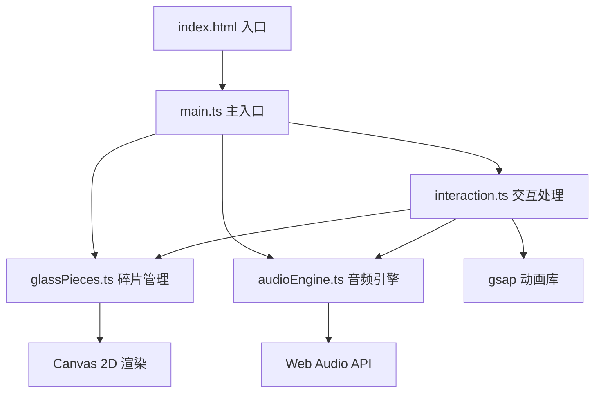

## 1. 架构设计



## 2. 技术描述

- **构建工具**：Vite 5.x
- **开发语言**：TypeScript 5.x（严格模式）
- **动画库**：gsap 3.x（elastic.easeOut缓动）
- **渲染技术**：Canvas 2D API（不使用Three.js）
- **音频技术**：Web Audio API（OscillatorNode + GainNode）
- **模块系统**：ES Modules

## 3. 项目结构

| 文件路径 | 职责说明 |
|----------|----------|
| `package.json` | 项目依赖配置，启动脚本：npm run dev |
| `vite.config.js` | Vite构建配置，指向index.html |
| `tsconfig.json` | TypeScript严格模式配置，ES模块目标 |
| `index.html` | 入口页面，全屏黑色背景 |
| `src/main.ts` | 初始化Canvas、绑定鼠标事件、启动动画循环 |
| `src/glassPieces.ts` | 管理36块玻璃碎片的几何数据、颜色、音高映射，导出绘制/更新逻辑 |
| `src/audioEngine.ts` | 封装Web Audio API，提供playTone(frequency)方法 |
| `src/interaction.ts` | 处理鼠标拖拽、悬停事件，计算偏移量，调用gsap做复位动画 |

## 4. 核心数据模型

### 4.1 GlassPiece 接口

```typescript
interface GlassPiece {
  id: number;
  angle: number;           // 在圆环上的角度 (0-360°)
  centerX: number;         // 原始中心X坐标
  centerY: number;         // 原始中心Y坐标
  offsetX: number;         // 当前偏移X
  offsetY: number;         // 当前偏移Y
  vertices: { x: number; y: number }[];  // 6-8个不规则顶点
  baseColor: string;       // 基础颜色（HSL格式）
  currentColor: string;    // 当前颜色
  brightness: number;      // 亮度系数 (1.0 = 正常, 1.3 = 高亮)
  scale: number;           // z轴缩放系数 (1.0 = 正常, 1.15 = 凸起)
  shadowBlur: number;      // 投影模糊半径 (4px / 12px)
  frequency: number;       // 对应音高频率 (C4 - B6)
  isHovered: boolean;      // 是否被悬停
  isResetting: boolean;    // 是否正在复位
  starParticles: { x: number; y: number; size: number; opacity: number; phase: number }[];  // 星光粒子
}
```

### 4.2 InteractionState 接口

```typescript
interface InteractionState {
  isDragging: boolean;
  lastMouseX: number;
  lastMouseY: number;
  dragVelocityX: number;
  dragVelocityY: number;
  hoveredPieceId: number | null;
}
```

## 5. 核心算法

### 5.1 音高映射算法

将36块碎片按角度映射到C4到B6的音高范围（3个八度，共36个半音）：

```
频率 = 440 * 2^((n - 9) / 12)  // A4 = 440Hz为基准
其中 n = 0-35 对应 C4-B6
```

### 5.2 不规则多边形生成

对于每块碎片，在其扇形区域内生成6-8个顶点：
- 内半径和外半径加入随机扰动（±8%）
- 角度加入随机偏移（±5°）
- 确保顶点按顺时针顺序排列

### 5.3 星光粒子渲染

- 每块碎片后方生成2-4个粒子
- 粒子大小1-2px随机
- 透明度按正弦波缓慢变化（周期2-4秒）
- 仅当碎片偏移时增加可见度

## 6. 性能优化策略

1. **Canvas分层**：背景渐变预渲染到离屏canvas
2. **脏矩形渲染**：仅重绘发生变化的区域
3. **对象池**：复用粒子对象，避免频繁GC
4. **节流处理**：鼠标事件节流到60fps
5. **requestAnimationFrame**：使用系统刷新率同步动画
6. **离屏计算**：顶点变换在内存中计算后再批量绘制
