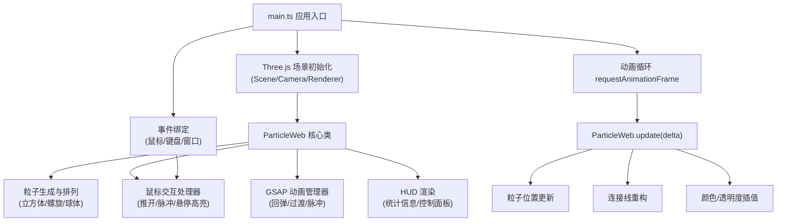

## 1. 架构设计



## 2. 技术描述
- 前端：TypeScript + Three.js@0.160 + Vite + GSAP
- 初始化工具：Vite vanilla-ts 模板
- 后端：无（纯前端 3D 可视化应用）
- 数据库：无

## 3. 项目结构
```
auto172/
├── package.json
├── vite.config.js
├── tsconfig.json
├── index.html
└── src/
    ├── main.ts          # 应用入口：场景/相机/渲染器/事件绑定/动画循环
    └── ParticleWeb.ts   # 核心类：粒子系统管理、交互、动画
```

## 4. 核心类与数据结构

### ParticleWeb 类
```typescript
class ParticleWeb {
  scene: THREE.Scene
  particles: THREE.Points          // 粒子系统
  lines: THREE.LineSegments        // 连接线
  particleData: ParticleData[]     // 每颗粒子的状态数据
  connectionPairs: Uint16Array     // 连接线索引对
  config: WebConfig                // 配置参数
  // ...
  constructor(scene: THREE.Scene, count: number)
  generateCubeLattice(): void      // 生成立方体晶格
  generateSpiral(): void           // 生成螺旋形态
  generateSphere(): void           // 生成球体形态
  switchMorphology(type: MorphologyType): void  // 切换形态（1.5s过渡）
  pushParticles(raycaster: THREE.Raycaster, direction: THREE.Vector2, strength: number): void
  triggerPulse(worldPos: THREE.Vector3): void
  onMouseMove(normalized: THREE.Vector2, camera: THREE.Camera): void
  update(delta: number): void
}

interface ParticleData {
  basePos: THREE.Vector3           // 基础目标位置
  currentPos: THREE.Vector3        // 当前渲染位置
  velocity: THREE.Vector3          // 速度向量
  baseColor: THREE.Color           // 基础颜色
  currentColor: THREE.Color        // 当前颜色
  pulseIntensity: number           // 脉冲波影响强度 0-1
  hoverScale: number               // 悬停放大系数
}

interface WebConfig {
  particleColor: THREE.Color       // 用户自定义粒子颜色
  pushAmplitude: number            // 推开最大偏移 (30-120px)
  rotationSpeed: number            // 自转速度
}

type MorphologyType = 'cube' | 'spiral' | 'sphere'
```

## 5. 关键技术决策
- **粒子渲染**：使用 THREE.Points + BufferGeometry，单 Draw Call，性能最优
- **连接线**：使用 THREE.LineSegments + BufferGeometry，动态更新 position attribute
- **连接判定**：距离阈值法（每颗粒子仅连接最近的 3-5 个邻居，控制总连线 ≤ 8000）
- **鼠标拾取**：THREE.Raycaster 高效检测，只对粒子 Points 做 raycast
- **形态过渡**：GSAP 对每颗粒子的 basePos 做 to 动画，使用 Cubic Bezier 缓动
- **脉冲波**：每帧更新粒子到波源中心的距离，计算 pulseIntensity 并驱动颜色/线宽
- **性能优化**：
  - 使用 Float32Array 批量更新 BufferGeometry
  - 连接线按需增量更新而非全量重建
  - Raycaster 设置 far 距离限制检测范围
