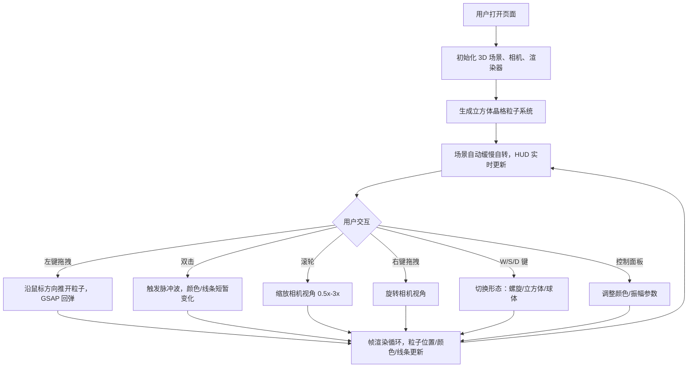

## 1. 产品概述
3D 粒子蛛网交互可视化应用 —— 通过鼠标拖拽和手势操作，在浏览器中实时编织和摧毁动态粒子蛛网，粒子像被风吹动一样流动并形成复杂几何图案。

- 主要目的：提供一个既能自由操控粒子拓扑结构、又能实时响应鼠标交互并产生有机运动效果的粒子系统创意工具
- 目标用户：创意设计师、视觉艺术家、交互设计爱好者

## 2. 核心特性

### 2.1 功能模块
1. **3D 粒子系统渲染**：约 3000 颗粒子构成基础立方体晶格，粒子间半透明细线连接形成网状结构
2. **鼠标交互系统**：左键拖拽推开粒子、右键旋转相机、滚轮缩放视角、双击触发脉冲波
3. **形态切换系统**：键盘 W/S/D 键切换立方体 / 螺旋 / 球体三种排列形态，带 1.5s 过渡动画
4. **实时控制面板**：左下角显示粒子数/帧率/连接线数，右下角色环和振幅滑块
5. **动画反馈系统**：所有交互均有 GSAP 动画，粒子回弹、脉冲波扩散、颜色渐变等

### 2.2 页面详情
| 页面名称 | 模块名称 | 功能描述 |
|-----------|-------------|---------------------|
| 主场景 | 3D 粒子网格 | 深空色背景，3000 颗粒子，发光圆点+连接线，整体缓慢自转 |
| 主场景 | 鼠标交互 | 左键拖拽推开粒子，右键旋转相机，滚轮缩放，双击脉冲波 |
| 主场景 | 形态切换 | W/S/D 键切换螺旋/立方体/球体，1.5s GSAP 过渡 |
| 主场景 | HUD 面板 | 左下角实时统计，右下角颜色与振幅控制面板 |

## 3. 核心流程
用户打开页面 → 深空背景与立方体晶格粒子系统呈现并缓慢自转 → 用户鼠标悬停粒子高亮 → 左键拖拽推开粒子产生凹陷/凸起蛛网曲面 → 双击触发脉冲波向外扩散 → 按 W/S/D 键切换不同几何形态 → 通过右下角面板调整颜色和振幅 → 滚轮缩放、右键旋转视角探索场景

## 4. 用户界面设计

### 4.1 设计风格
- 主色调：深空色 #0b0e1a 到黑色 #000000 径向渐变背景
- 粒子色：默认淡青色 #88ccff，脉冲波亮橙色 #ff8833
- 连接线：半透明细线（透明度 0.15），宽度 1px
- 字体：系统等宽字体，12px，白色半透明
- 风格关键词：深空科幻、有机流动、交互反馈、极简 HUD

### 4.2 页面设计概述
| 页面名称 | 模块名称 | UI 元素 |
|-----------|-------------|-------------|
| 主场景 | 粒子系统 | 发光圆点（直径 2px，悬停 4px+白色光圈）、半透明连接线 |
| 主场景 | HUD 左下角 | 粒子数 / FPS / 连接线数，12px 白色半透明 |
| 主场景 | 控制面板右下角 | 半透明黑底 rgba(0,0,0,0.4)、圆角 8px、色环滑块 + 振幅滑块、12px 亮色圆形滑块柄（直径 12px） |

### 4.3 响应式
- 页面填满整个浏览器视口，无滚动条
- 3D 场景自动适配窗口大小变化
- 桌面端优先，鼠标交互为主

### 4.4 3D 场景指引
- **环境**：纯深空背景，径向渐变从 #0b0e1a 到 #000000
- **光照**：粒子自发光材质，无需场景光源，利用 AdditiveBlending 获得发光效果
- **相机**：PerspectiveCamera，初始距离约 800px，可旋转可缩放（0.5x-3x）
- **构图**：粒子网格居中，HUD 贴边不遮挡主体
- **交互动画**：全部使用 GSAP，缓出效果，时长 0.4s-1.5s
- **性能预算**：粒子 ≤ 4000，连接线 ≤ 8000，稳定 60FPS
