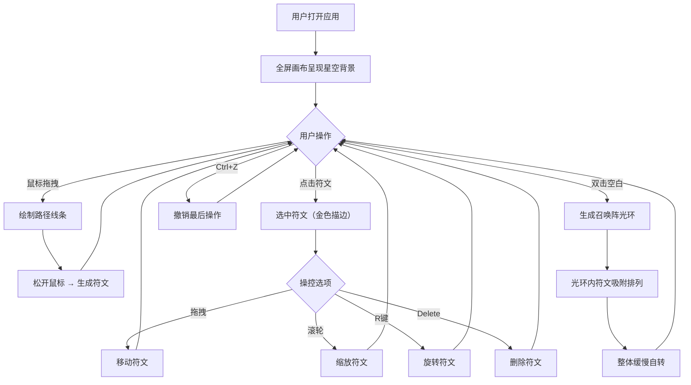

# 灵绘·符语 - 产品需求文档

## 1. 产品概述
灵绘·符语是一款浏览器端交互式魔法符文绘制与排列应用，用户通过手绘线条创造独特的发光动态符文，并在画布上自由排列组合形成魔法阵图案。
- 目标用户：奇幻文学爱好者、创意设计者
- 核心价值：提供沉浸式的魔法符文创作体验，将手绘即时转化为动态视觉艺术

## 2. 核心功能

### 2.1 功能模块
1. **符文绘制画布**：全屏Canvas画布，支持手绘、选中、移动、旋转、缩放符文
2. **召唤阵模式**：双击生成圆形光环，自动吸附排列符文

### 2.2 功能详情

| 模块 | 功能 | 描述 |
|------|------|------|
| 符文绘制 | 手绘路径 | 按住鼠标拖拽绘制任意闭合或开放路径，松开后转化为符文（≥5个控制点） |
| 符文绘制 | 魔法色分配 | 每枚符文随机分配6种预设魔法色之一 |
| 符文操控 | 选中 | 点击选中符文，金色描边3px高亮 |
| 符文操控 | 移动 | 拖拽移动选中符文 |
| 符文操控 | 缩放 | 滚轮缩放0.5-2.0，步长0.1 |
| 符文操控 | 旋转 | R键旋转15度 |
| 魔法阵 | 连接线 | 距离<80px的符文间自动生成半透明淡紫色连接线 |
| 魔法阵 | 光点动画 | 连接线上4px光点匀速移动，周期2秒 |
| 召唤阵 | 光环生成 | 双击生成直径300px淡金色圆形光环 |
| 召唤阵 | 自动吸附 | 光环内符文吸附到边缘均匀排列，朝向圆心 |
| 召唤阵 | 自转 | 整体以0.01 rad/s角速度自转 |
| 操作管理 | 删除 | Delete键删除选中符文 |
| 操作管理 | 撤销 | Ctrl+Z撤销最后一次添加或移动 |
| 操作管理 | 清除 | 清除按钮重置所有符文 |

## 3. 核心流程

## 4. 界面设计

### 4.1 设计风格
- 主色调：深紫黑色（#0a001a → #1a0033 径向渐变）
- 符文色：6种魔法色（#00ffcc、#ff66aa、#aaccff、#ffcc00、#66ff99、#cc66ff）
- 连接线色：淡紫色（透明度0.4）
- 光环色：淡金色
- 字体：优雅的无衬线字体
- 布局：全屏画布，底部固定操作提示栏

### 4.2 页面设计

| 区域 | 元素 | 设计说明 |
|------|------|----------|
| 画布背景 | 径向渐变 | 中心#0a001a，边缘#1a0033 |
| 画布背景 | 星点 | 约50颗1-2px白色闪烁点，周期2-4秒 |
| 符文渲染 | 发光线条 | 2px宽，外发光8px模糊，透明度0.6 |
| 符文渲染 | 白色核心线 | 0.5px宽，增强立体感 |
| 符文渲染 | 脉动动画 | 1.5秒正弦波，缩放1.0-1.05，透明度0.8-1.0 |
| 选中效果 | 金色描边 | 3px宽金色外圈 |
| 连接线 | 淡紫色线条 | 2px宽，透明度0.4，流动光点4px |
| 光环 | 淡金色圆形 | 直径300px |
| 底部提示栏 | 操作提示 | 半透明深色背景，高40px，左侧"选中符文数：X"，右侧操作说明 |

### 4.3 响应式适配
- 画布尺寸跟随视口变化重绘
- 符文位置按比例缩放
- 桌面优先设计

### 4.4 动画规范
- 所有交互操作（移动、旋转、缩放、吸附）均有0.3秒缓动过渡（gsap）
- 符文脉动：1.5秒正弦波周期
- 连接线光点：2秒匀速移动周期
- 召唤阵自转：0.01 rad/s

## 5. 性能约束
- 帧率稳定在55FPS以上（最多30枚符文+连接线动画）
- 绘制和交互响应时间≤16ms
