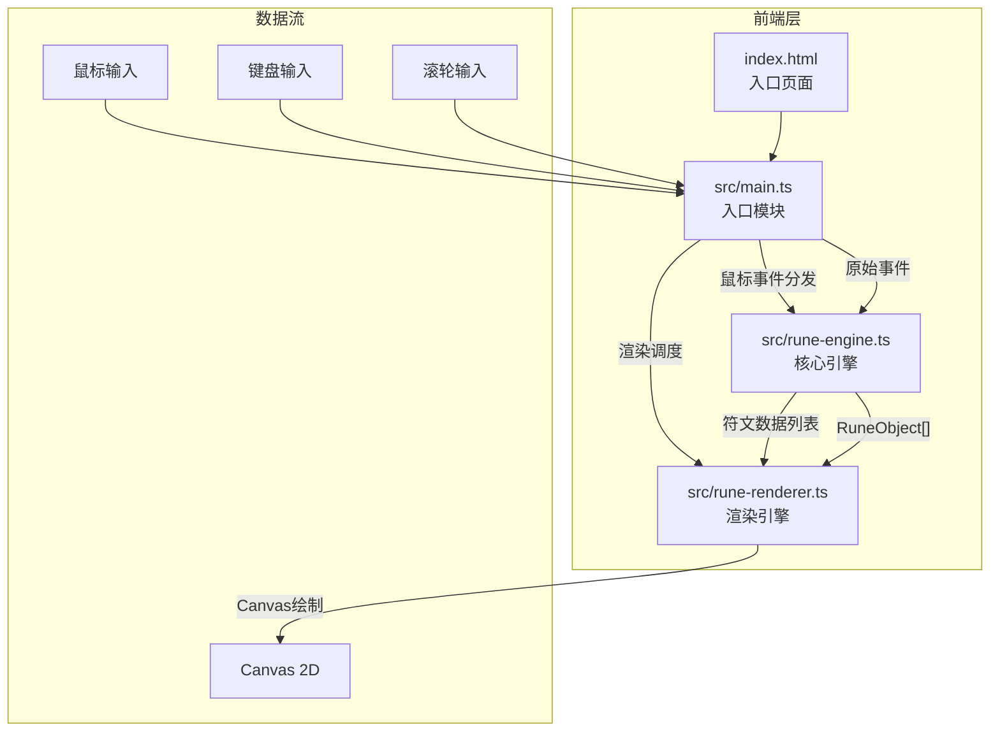

# 灵绘·符语 - 技术架构文档

## 1. 架构设计



### 数据流向
1. 用户输入（鼠标/键盘/滚轮）→ `main.ts` 事件监听
2. `main.ts` 将事件分发给 `rune-engine.ts` 处理业务逻辑
3. `rune-engine.ts` 输出符文对象列表（`RuneObject[]`）
4. `main.ts` 将符文数据传给 `rune-renderer.ts` 进行Canvas渲染
5. `rune-renderer.ts` 负责所有视觉绘制（发光线条、光晕、脉动、连接线、光点）

## 2. 技术说明
- 前端框架：纯 TypeScript + Canvas 2D（无React/Vue）
- 构建工具：Vite
- 动画库：gsap（用于缓动过渡动画）
- 模块系统：ES模块
- 无后端，纯前端应用

## 3. 模块职责与接口定义

### 3.1 src/main.ts - 入口模块
**职责**：初始化Canvas、绑定事件、主循环调度

```typescript
// 核心接口
interface AppContext {
  canvas: HTMLCanvasElement;
  ctx: CanvasRenderingContext2D;
  engine: RuneEngine;
  renderer: RuneRenderer;
}
```

**调用关系**：
- 初始化 Canvas 和 ResizeObserver
- 监听 mousedown/mousemove/mouseup/dblclick/wheel/keydown 事件
- 调用 `RuneEngine` 方法处理业务逻辑
- 调用 `RuneRenderer` 方法进行渲染
- requestAnimationFrame 驱动主循环

### 3.2 src/rune-engine.ts - 核心引擎
**职责**：解析手绘线条、管理符文数据、物理状态计算、操作历史

```typescript
interface Point { x: number; y: number; }

interface RuneObject {
  id: string;
  controlPoints: Point[];
  color: string;
  position: Point;
  rotation: number;
  scale: number;
  pulsePhase: number;
  selected: boolean;
  inCircle: boolean;
  circleAngle: number;
}

interface HistoryEntry {
  type: 'add' | 'move';
  runeId: string;
  prevPosition?: Point;
}

class RuneEngine {
  runes: RuneObject[];
  history: HistoryEntry[];
  circles: CircleObject[];

  addRune(points: Point[]): RuneObject;
  removeRune(id: string): void;
  moveRune(id: string, x: number, y: number): void;
  rotateRune(id: string, angle: number): void;
  scaleRune(id: string, delta: number): void;
  selectRune(x: number, y: number): RuneObject | null;
  undo(): void;
  addCircle(x: number, y: number): void;
  clearAll(): void;
  getConnections(): Connection[];
  update(deltaTime: number): void;
}
```

### 3.3 src/rune-renderer.ts - 渲染引擎
**职责**：Canvas 2D绘制、发光效果、脉动动画、连接线与光点

```typescript
interface RenderContext {
  canvas: HTMLCanvasElement;
  ctx: CanvasRenderingContext2D;
  time: number;
}

class RuneRenderer {
  renderBackground(ctx: CanvasRenderingContext2D, width: number, height: number, time: number): void;
  renderRune(ctx: CanvasRenderingContext2D, rune: RuneObject, time: number): void;
  renderSelection(ctx: CanvasRenderingContext2D, rune: RuneObject): void;
  renderConnections(ctx: CanvasRenderingContext2D, connections: Connection[], time: number): void;
  renderCircle(ctx: CanvasRenderingContext2D, circle: CircleObject, time: number): void;
  renderUI(ctx: CanvasRenderingContext2D, selectedCount: number, width: number, height: number): void;
  renderDrawingPath(ctx: CanvasRenderingContext2D, points: Point[]): void;
}
```

## 4. 关键算法

### 4.1 路径转符文
- 采集鼠标轨迹点 → Douglas-Peucker算法简化 → 保证≥5个控制点
- 计算路径包围盒中心作为符文初始位置
- 随机分配魔法色

### 4.2 连接线检测
- 遍历所有符文对，计算中心距离
- 距离 < 80px 则生成连接

### 4.3 召唤阵吸附
- 计算光环内所有符文
- 按角度均匀分配到光环边缘
- 使用gsap动画平滑过渡

### 4.4 脉动动画
- 正弦波函数：`scale = 1.0 + 0.05 * sin(time * 2π / 1.5)`
- 透明度：`alpha = 0.8 + 0.2 * sin(time * 2π / 1.5)`

## 5. 文件结构

```
├── package.json
├── vite.config.js
├── tsconfig.json
├── index.html
└── src/
    ├── main.ts
    ├── rune-engine.ts
    └── rune-renderer.ts
```

### 调用关系
```
index.html → 加载 src/main.ts
src/main.ts → import RuneEngine from rune-engine.ts
src/main.ts → import RuneRenderer from rune-renderer.ts
src/main.ts → 事件 → RuneEngine.addRune/moveRune/... 
src/main.ts → RuneEngine.runes → RuneRenderer.renderRune/...
```
