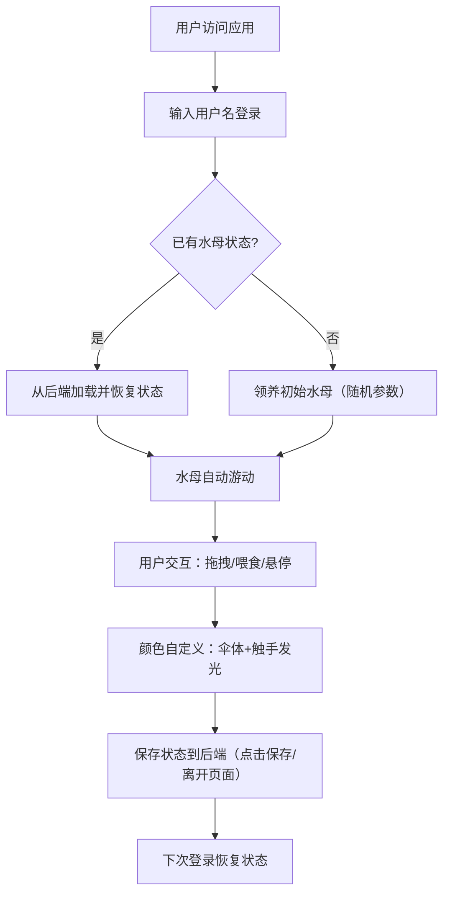

## 1. 产品概述

流光水母是一款沉浸式虚拟宠物养成Web应用，让用户在深海主题的浏览器环境中领养、互动和管理专属的半透明发光水母。解决用户无法在线上获得可自定义外观、实时行为反馈的沉浸式虚拟宠物体验的痛点。

- 核心价值：提供治愈系的深海养成体验，支持高度自定义外观与丰富的互动反馈
- 目标用户：喜欢虚拟宠物、追求视觉美感和沉浸式体验的互联网用户

## 2. 核心功能

### 2.1 用户角色

| 角色 | 注册方式 | 核心权限 |
|------|---------|---------|
| 普通用户 | 用户名注册登录 | 领养水母、自定义外观、互动喂食、状态保存/加载 |

### 2.2 功能模块

1. **主页面**：深海背景画布、水母游动区域、底部沙地、用户面板
2. **水母互动模块**：Canvas绘制水母（伞体+触手+粒子）、拖拽关节、点击喂食、悬停互动
3. **控制面板模块**：心情值显示、大小显示、颜色选择器（12色环）、发光颜色选择、保存按钮
4. **后端服务模块**：用户会话管理、水母状态持久化（内存存储）

### 2.3 页面详情

| 页面名称 | 模块名称 | 功能描述 |
|---------|---------|---------|
| 主页面 | 用户登录区 | 用户名输入框、登录/注册按钮（自动创建账户） |
| 主页面 | 水母画布区 | Canvas渲染半透明水母，占页面75%高度，支持拖拽触手关节 |
| 主页面 | 控制面板区 | 心情值进度条、喂食次数、色盘弹出、触手发光色选择、保存按钮 |
| 主页面 | 沙地区域 | 底部25%区域（宽屏扩展20%），沙地纹理+噪声点 |

## 3. 核心流程

用户首次访问 → 输入用户名登录 → 系统自动领养初始水母（随机大小30-50px，8-12条触手） → 水母自动游动 → 用户可拖拽触手关节调整姿态（松开后0.5秒bounce复位） → 点击水母喂食（身体膨胀+彩色粒子飞向伞口+每5次增大5%） → 悬停水母（心情上升翻倍+朝鼠标游动+上下浮动动画） → 通过色盘自定义伞体渐变颜色（1.5秒过渡）和触手发光颜色（逐次变色，间隔0.2秒） → 点击保存按钮/离开页面时后端保存状态 → 再次登录自动恢复水母位置、大小、心情、颜色配置

## 4. 用户界面设计

### 4.1 设计风格

- **主色调**：深海蓝渐变（#0b1d3a → #020a1a），沙地色 #2a3a2a
- **强调色**：用户自定义水母颜色（12色环选择），触手发光色单独设置
- **按钮样式**：半透明白底圆角（背景 rgba(255,255,255,0.1)，hover 变 rgba(255,255,255,0.25)），所有交互 transition: all 0.3s ease
- **色盘样式**：圆形弹出式12色环，点击中心收起
- **字体**：现代无衬线字体，深海主题下确保可读性，标题加粗，正文轻盈
- **图标**：使用发光粒子效果模拟深海微光，触手末端微光粒子
- **氛围**：径向渐变发光（伞体中心白色透明→边缘用户颜色低透明），整体静谧治愈

### 4.2 页面设计概览

| 页面名称 | 模块名称 | UI元素 |
|---------|---------|--------|
| 主页面 | 登录区 | 顶部悬浮卡片，用户名输入+登录按钮，半透明白底 |
| 主页面 | 水母画布 | Canvas全屏覆盖75%高度，深蓝渐变背景，无滚动条 |
| 主页面 | 沙地 | Canvas底部区域，#2a3a2a 背景 + 细小噪声点纹理 |
| 主页面 | 控制面板 | 右侧悬浮卡片，心情进度条、喂食计数、颜色选择按钮、保存按钮 |
| 主页面 | 色盘弹窗 | 12色圆形排列，选中色高亮，伞体/触手模式切换 |

### 4.3 响应式设计

- 桌面优先，宽屏（≥1440px）时沙地区域高度扩展20%
- 画布使用百分比布局，自动适配窗口大小
- 控制面板在窄屏时移至底部横向排列
- 移动端触控支持拖拽和点击

### 4.4 动画与性能

- 水母游动速度 0.5-2px/s 随机，方向每5秒微调
- 拖拽关节高亮圆点，松开后0.5秒弹性动画（bounce）复位
- 喂食：伞体1.2倍膨胀0.3秒 + 6个彩色粒子飞向伞口
- 悬停：上下浮动幅度10px，周期2秒，心情值上升速度翻倍
- 颜色切换：伞体渐变1.5秒过渡，触手关节逐次变色间隔0.2秒
- 性能目标：动画帧率≥45fps，拖拽响应<50ms，API响应<200ms
