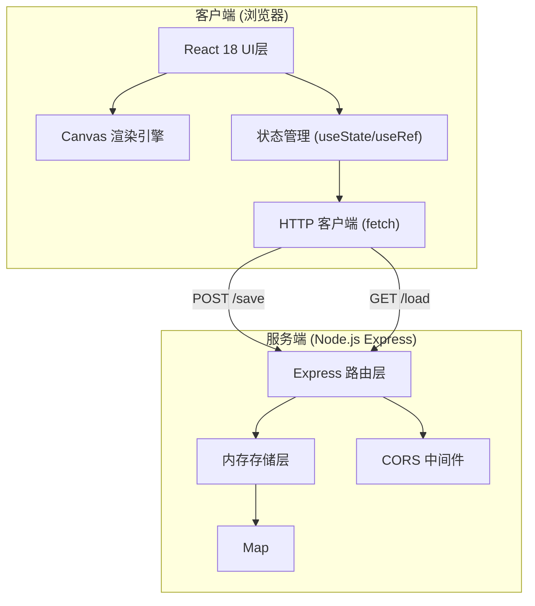
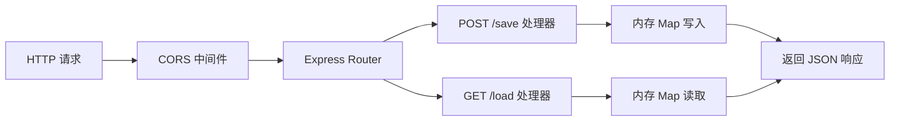
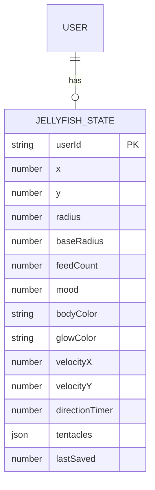

## 1. 架构设计



## 2. 技术说明

- **前端框架**：React 18 + TypeScript + Vite 5
- **渲染层**：HTML5 Canvas 2D API（高性能绘制水母伞体、触手、粒子、光影）
- **后端框架**：Express 4 + TypeScript
- **数据存储**：内存 Map（无需数据库，用户ID映射水母状态JSON）
- **跨域处理**：cors 中间件
- **状态同步**：页面卸载/点击保存时 POST 到后端，登录时 GET 恢复
- **构建工具**：Vite 5，配置代理 /api → Express 服务器

## 3. 路由定义

| 路由 | 方法 | 用途 |
|------|------|------|
| / | GET | 前端入口 (Vite 提供) |
| /api/save | POST | 保存当前用户水母状态 |
| /api/load | GET | 根据用户ID加载水母状态 |

## 4. API 定义

### 4.1 类型定义

```typescript
interface TentacleJoint {
  x: number;
  y: number;
  baseX: number;
  baseY: number;
}

interface Tentacle {
  joints: TentacleJoint[];
}

interface JellyfishState {
  userId: string;
  x: number;
  y: number;
  radius: number;
  baseRadius: number;
  feedCount: number;
  mood: number;
  bodyColor: string;
  glowColor: string;
  velocityX: number;
  velocityY: number;
  directionTimer: number;
  tentacles: Tentacle[];
  lastSaved: number;
}

interface SaveRequest {
  userId: string;
  state: JellyfishState;
}

interface LoadResponse {
  success: boolean;
  state?: JellyfishState;
  message?: string;
}
```

### 4.2 POST /api/save

**请求体**：
```json
{
  "userId": "string",
  "state": { /* JellyfishState */ }
}
```

**响应** (200)：
```json
{
  "success": true,
  "message": "保存成功"
}
```

### 4.3 GET /api/load?userId=xxx

**响应** (200)：
```json
{
  "success": true,
  "state": { /* JellyfishState 或 undefined 表示新用户 */ }
}
```

## 5. 服务端架构图



## 6. 数据模型

### 6.1 数据模型定义



### 6.2 内存存储结构

使用 Node.js `Map<string, JellyfishState>` 实现：

```typescript
const storage = new Map<string, JellyfishState>();

// 写入
storage.set(userId, state);

// 读取
const state = storage.get(userId);
```

## 7. 项目文件结构

```
auto175/
├── package.json          # 前后端统一依赖 + 启动脚本
├── vite.config.js        # Vite + React + API 代理
├── tsconfig.json         # TypeScript 严格模式
├── index.html            # 入口 HTML（深蓝渐变背景）
├── src/
│   ├── App.tsx           # 主组件（会话+状态+UI编排）
│   ├── components/
│   │   ├── Jellyfish.tsx # Canvas 水母渲染 + 交互引擎
│   │   └── Controls.tsx  # 控制面板 + 色盘 + 状态显示
├── server/
│   └── index.ts          # Express 服务器 + 内存存储 API
```

## 8. 性能保障措施

- **Canvas 渲染优化**：使用 requestAnimationFrame 驱动动画循环，脏矩形局部重绘
- **离屏计算**：触手物理、粒子运动在内存中计算后一次性绘制
- **防抖节流**：mousemove 事件节流到 60fps，拖拽操作使用 Pointer Events
- **动画性能**：所有过渡使用 transform/opacity，避免重排
- **API 性能**：内存存储，无磁盘IO，目标响应 < 200ms
- **帧率监控**：使用 performance.now() 监控，目标稳定 ≥ 45fps
