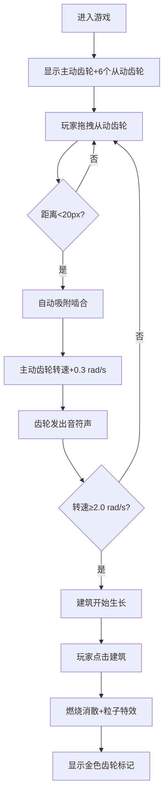

## 1. 产品概述
幻音·齿轮城是一款基于浏览器的创意互动游戏，玩家通过拖拽和啮合齿轮模块来构建一座动态的机械音乐城市。每个齿轮的转速和咬合会触发合成音效与建筑生长动画，创造出视觉与听觉交融的沉浸式体验。
- 核心价值：将机械美学、音乐合成与城市建造融合为一体的互动艺术体验
- 目标用户：喜欢创意互动、机械美学和音乐合成的休闲玩家

## 2. 核心功能

### 2.1 用户角色
本产品为单用户休闲游戏，无需用户注册或角色区分。

### 2.2 功能模块
1. **齿轮交互模块**：主动/从动齿轮绘制、拖拽、啮合检测、吸附、转速计算
2. **城市建筑模块**：建筑生成、生长动画、燃烧消散效果、粒子特效、金色齿轮标记
3. **音频合成模块**：持续音符生成、音高随转速变化、齿轮啮合和声效果
4. **状态面板模块**：实时显示转速、啮合数量、建筑数量

### 2.3 页面详情
| 页面名称 | 模块名称 | 功能描述 |
|-----------|-------------|---------------------|
| 主游戏页面 | 齿轮系统 | 中央主动齿轮(80px, 8齿) + 6个从动齿轮(50-60px, 6齿)，支持拖拽、吸附啮合、高亮显示 |
| 主游戏页面 | 建筑系统 | 齿轮转速达阈值后自动生长建筑，点击建筑触发燃烧消散与粒子特效 |
| 主游戏页面 | 音频系统 | Web Audio API生成正弦/锯齿波，主动齿轮音高随转速变化，从动齿轮按齿数定音高 |
| 主游戏页面 | 状态面板 | 左上角实时显示主动齿轮转速、啮合数量、建筑数量 |

## 3. 核心流程
玩家进入游戏后，看到中央主动齿轮和周围6个从动齿轮。玩家拖拽从动齿轮到主动齿轮附近（距离<20px），齿轮自动吸附并啮合转动，主动齿轮转速叠加增加。当转速达到2.0 rad/s时，城市开始生长建筑。每个齿轮转动时发出持续音符，啮合时形成和声。玩家点击建筑触发燃烧消散效果，留下金色齿轮标记。

## 4. 用户界面设计

### 4.1 设计风格
- **主色调**：深色工业风背景 #1a1a2e
- **强调色**：铁灰色 #4a4a4a（主动齿轮）、铜色渐变 #b87333→#8b5a2b（从动齿轮）、亮蓝色 #00bfff（建筑顶部）、橙红色 #ff6600（燃烧效果）、淡金色 #ffd700（标记）
- **字体**：像素风格字体，白色 #ffffff
- **视觉效果**：金属质感渐变高光、径向模糊拖尾、圆形光晕、粒子特效

### 4.2 页面设计概述
| 页面名称 | 模块名称 | UI元素 |
|-----------|-------------|-------------|
| 主游戏页面 | 背景 | #1a1a2e深色工业风背景，布满微小齿轮纹理线条 |
| 主游戏页面 | 齿轮 | 金属渐变高光、转动时径向模糊拖尾（半径2px，透明度0.2）、拖拽时淡黄色光晕放大1.2倍 |
| 主游戏页面 | 建筑 | 底部灰色#555渐变到顶部亮蓝色#00bfff，生长时底部淡蓝色光晕（直径30px，透明度0.3），1.5秒拉伸生长动画 |
| 主游戏页面 | 状态面板 | 半透明灰黑色rgba(0,0,0,0.7)背景，白色像素字体，左上角固定位置 |
| 主游戏页面 | 工具提示 | 淡黄色鼠标悬停提示，显示齿轮齿数和转速 |

### 4.3 响应性
- 桌面端优先设计，Canvas自适应窗口大小
- 鼠标拖拽交互，无移动端触摸优化要求

### 4.4 2D Canvas场景指引
- **背景**：深色工业风，重复绘制微齿轮纹理作为水印
- **光照**：从上方向下照射的光源效果，齿轮顶部高光
- **动画**：60fps流畅渲染，requestAnimationFrame驱动
- **粒子系统**：建筑消散时8-12个橙红色粒子飞散
