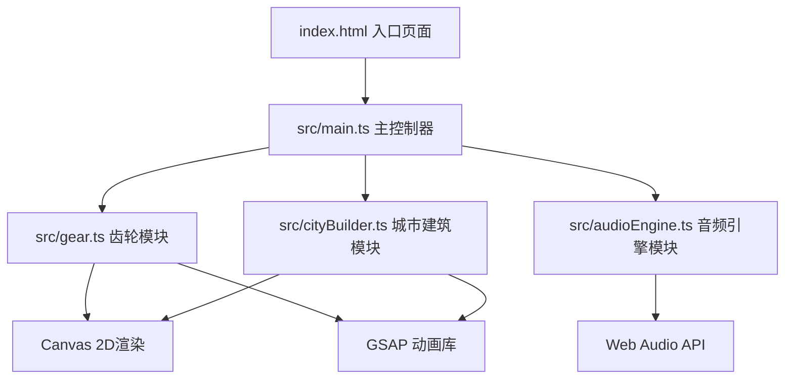

## 1. 架构设计



## 2. 技术描述
- **前端框架**：TypeScript + Vite 构建工具链
- **渲染引擎**：HTML5 Canvas 2D API
- **音频引擎**：Web Audio API + Tone.js@14.7.77
- **动画库**：GSAP (GreenSock Animation Platform)
- **初始化工具**：Vite 原生初始化
- **后端**：无，纯前端单页应用
- **数据库**：无，状态存储在内存中

## 3. 目录结构
```
auto176/
├── package.json
├── vite.config.js
├── tsconfig.json
├── index.html
└── src/
    ├── main.ts          # 入口文件，初始化舞台、音频上下文，协调模块通信
    ├── gear.ts          # 齿轮模块类，绘制、转速控制、咬合检测
    ├── cityBuilder.ts   # 城市建筑生成，建筑生长与粒子特效
    └── audioEngine.ts   # 音频引擎，合成音效与音高音量控制
```

## 4. 核心模块设计

### 4.1 Gear 类 (src/gear.ts)
```typescript
class Gear {
  x: number;
  y: number;
  radius: number;
  teeth: number;
  isDriver: boolean;
  isDragging: boolean;
  isEngaged: boolean;
  rotation: number;
  angularVelocity: number;
  engagedTo: Gear | null;
  
  draw(ctx: CanvasRenderingContext2D): void;
  update(deltaTime: number): void;
  containsPoint(px: number, py: number): boolean;
  checkEngagement(target: Gear): boolean;
  snapToEngage(target: Gear): void;
}
```

### 4.2 AudioEngine 类 (src/audioEngine.ts)
```typescript
class AudioEngine {
  audioContext: AudioContext;
  
  init(): Promise<void>;
  createGearVoice(gear: Gear): void;
  updateGearPitch(gear: Gear): void;
  stopGearVoice(gear: Gear): void;
  playEngageSound(): void;
  playBuildSound(): void;
  playBurnSound(): void;
}
```

### 4.3 CityBuilder 类 (src/cityBuilder.ts)
```typescript
class Building {
  x: number;
  y: number;
  width: number;
  targetHeight: number;
  currentHeight: number;
  opacity: number;
  swayOffset: number;
  isBurning: boolean;
  burnProgress: number;
  
  draw(ctx: CanvasRenderingContext2D): void;
  update(deltaTime: number): void;
  containsPoint(px: number, py: number): boolean;
  startBurning(): void;
}

class CityBuilder {
  buildings: Building[];
  particles: Particle[];
  markers: GoldenMarker[];
  
  spawnBuilding(centerX: number, centerY: number): void;
  clickBuilding(px: number, py: number): boolean;
  draw(ctx: CanvasRenderingContext2D): void;
  update(deltaTime: number): void;
}
```

### 4.4 Main 主控制器 (src/main.ts)
- 初始化 Canvas 和 AudioContext
- 创建主动齿轮和6个从动齿轮
- 管理鼠标事件（拖拽、点击、悬停）
- 协调齿轮、建筑、音频模块间通信
- 实时状态面板更新
- requestAnimationFrame 主循环

## 5. 性能优化
- 使用 requestAnimationFrame 驱动渲染循环，目标60FPS
- Canvas 分层绘制（背景静态纹理单独预渲染）
- 齿轮拖尾效果使用半透明叠加而非模糊滤镜
- 音频节点池复用，避免频繁创建销毁
- 粒子对象池复用，限制最大粒子数量
