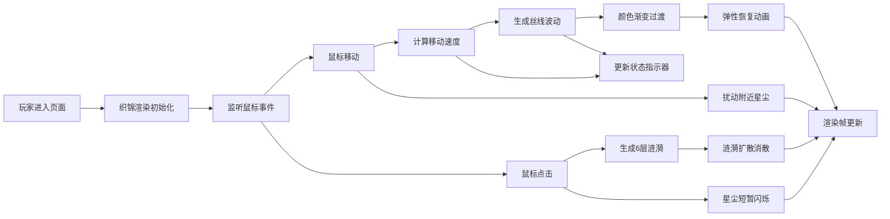

## 1. 产品概述
织星·潮汐毯是一款沉浸式浏览器交互艺术装置，玩家通过鼠标在一块发光织锦上编织彩色丝线波浪，点击绽放涟漪，共同构筑流动变幻的星空图案。

- 核心价值：提供治愈系的创造性交互体验，让用户在简单的鼠标操作中创造独一无二的视觉艺术
- 目标用户：喜爱数字艺术、沉浸式体验、放松解压的互联网用户

## 2. 核心功能

### 2.1 功能模块

| 模块名称 | 功能描述 |
|---------|---------|
| 织锦画布 | 深蓝色渐变背景、细密织纹纹理、木质边框装饰 |
| 丝线波动物理 | 鼠标拖拽生成彩色丝线波动，弯曲幅度随速度变化，弹性恢复动画 |
| 涟漪粒子系统 | 点击生成6层彩色涟漪，向外扩散消散 |
| 星尘粒子系统 | 30片漂浮星尘，受鼠标扰动和点击闪烁 |
| 状态指示器 | 实时显示丝线颜色值和鼠标移动速度 |
| 交互反馈 | 木框悬停发光、动画缓动效果 |

### 2.2 页面详情

| 页面名称 | 模块名称 | 功能描述 |
|---------|---------|---------|
| 主页面 | 织锦画布 | 居中长方形Canvas，占视口70%宽60%高，最小600x400px |
| 主页面 | 丝线系统 | 数百条经纬交织丝线，拖拽时产生波浪形变 |
| 主页面 | 涟漪系统 | 点击产生6层彩色圆环涟漪 |
| 主页面 | 星尘系统 | 30片漂浮发光星尘 |
| 主页面 | 状态指示器 | 底部显示当前颜色和速度 |

## 3. 核心流程

## 4. 用户界面设计

### 4.1 设计风格
- **主色调**：深炭灰色背景 #1a1a2e，深蓝色渐变织锦 #0a0a2e → #1a0a3e
- **点缀色**：8种色系（珊瑚红#ff7f7f、春芽绿#7ecf7e、湖光蓝#5fa8d3、薰衣草紫#b39ddb、金盏黄#ffd54f、晚霞橙#ffb74d、樱花粉#f48fb1、薄荷青#80cbc4）
- **丝线渐变**：#ff6b6b → #ffd93d → #6bcb77 → #4d96ff
- **装饰色**：深棕色木框 #3e2723，淡蓝色光晕 #88ccff，金色星尘 #ffe082
- **字体**：等宽字体 monospace 14px 白色
- **动效**：ease-out / elastic-out 缓动，30fps+ 流畅动画

### 4.2 页面设计

| 区域 | UI元素 | 设计细节 |
|-----|--------|---------|
| 整体背景 | 深炭灰色纯色 | #1a1a2e，全屏覆盖 |
| 织锦画布 | 居中长方形 | 70%视口宽 × 60%视口高，最小600x400px，4px向下偏移、12px模糊黑色阴影 |
| 织锦背景 | 深蓝渐变 | 顶部#0a0a2e到底部#1a0a3e |
| 织纹网格 | 细密线条 | 6px间距，浅灰色，透明度0.1 |
| 木框边框 | 四周装饰 | 12px宽，深棕色#3e2723，内凹阴影 |
| 经纬丝线 | 数百条交织 | 彩色发光，拖拽产生波浪 |
| 涟漪效果 | 6层圆环 | 半透明，向外扩散 |
| 星尘粒子 | 30片漂浮 | 3-6px直径，金色，缓慢漂移 |
| 状态指示器 | 底部居中 | 半透明黑圆角矩形，宽160px高32px，圆角8px |

### 4.3 交互设计

| 交互 | 视觉反馈 |
|-----|---------|
| 鼠标悬停木框 | 外侧2px淡蓝色光晕#88ccff，透明度0.3 |
| 鼠标拖拽 | 丝线弯曲（慢速5px/快速25px），颜色沿路径渐变，恢复时间（慢速0.3s/快速1.5s）带弹跳动画 |
| 鼠标点击 | 6层彩色涟漪爆炸式扩散，持续2秒 |
| 拖拽经过星尘 | 80px半径内星尘被推开，最近推开50px |
| 点击星尘 | 透明度瞬间升至1，0.3秒后恢复 |
| 状态更新 | 实时显示最近丝线颜色（十六进制）和速度（px/s，保留1位小数） |

### 4.4 性能要求
- 帧率稳定30fps以上
- 800x600分辨率下无卡顿
- 实时响应鼠标拖拽和点击交互
