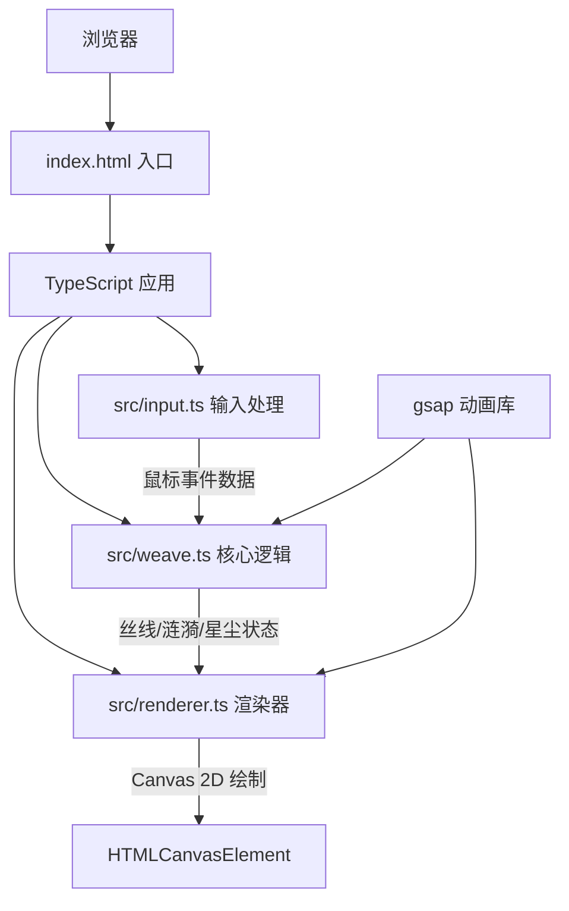

## 1. 架构设计



## 2. 技术描述

- **前端框架**：无框架，原生 TypeScript + Canvas 2D API
- **构建工具**：Vite 5.x
- **动画库**：gsap 3.x（用于弹性动画、缓动效果）
- **开发语言**：TypeScript 5.x（严格模式，ES模块）
- **渲染引擎**：HTML5 Canvas 2D

## 3. 文件结构

| 文件路径 | 职责描述 |
|---------|---------|
| `package.json` | 项目依赖和脚本配置（typescript、vite、gsap） |
| `vite.config.js` | Vite构建配置，指向index.html |
| `tsconfig.json` | TypeScript严格模式配置，ES模块目标 |
| `index.html` | 入口页面，深色主题，全屏背景，挂毯居中 |
| `src/weave.ts` | 核心逻辑：丝线波动物理、涟漪粒子系统、星尘扰动 |
| `src/renderer.ts` | 渲染器：Canvas绘制、动画循环、帧率管理 |
| `src/input.ts` | 输入处理：鼠标事件监听、速度计算、点击检测 |
| `src/main.ts` | 应用入口，初始化并连接各模块 |

## 4. 核心数据结构

### 4.1 丝线 (Thread)
```typescript
interface ThreadPoint {
  x: number;           // 原始X坐标
  y: number;           // 原始Y坐标
  offsetX: number;     // 当前X偏移量
  offsetY: number;     // 当前Y偏移量
  baseOffsetX: number; // 基础X偏移（用于动画）
  baseOffsetY: number; // 基础Y偏移（用于动画）
  color: string;       // 丝线颜色
}

interface Thread {
  points: ThreadPoint[];
  isHorizontal: boolean;
  baseColor: string;
}
```

### 4.2 涟漪 (Ripple)
```typescript
interface Ripple {
  x: number;
  y: number;
  startTime: number;
  duration: number;    // 2000ms
  colors: string[];    // 6层颜色
  maxRadius: number;   // 48px
  speed: number;       // 150px/s
}
```

### 4.3 星尘 (Stardust)
```typescript
interface Stardust {
  x: number;
  y: number;
  baseX: number;
  baseY: number;
  size: number;        // 3-6px
  opacity: number;     // 0.4-0.8
  driftSpeed: number;  // 0.5-1.5px/s
  driftAngle: number;  // 方向弧度
  isFlashing: boolean;
  flashEndTime: number;
}
```

### 4.4 交互数据 (InteractionData)
```typescript
interface InteractionData {
  mouseX: number;
  mouseY: number;
  prevMouseX: number;
  prevMouseY: number;
  velocity: number;    // px/s
  isDragging: boolean;
  clickX: number | null;
  clickY: number | null;
  nearestColor: string;
}
```

## 5. 模块接口定义

### 5.1 Input 模块
```typescript
class InputHandler {
  constructor(canvas: HTMLCanvasElement);
  onInteraction(callback: (data: InteractionData) => void): void;
  getVelocity(): number;
  getNearestColor(x: number, y: number): string;
}
```

### 5.2 Weave 模块
```typescript
class WeaveSystem {
  constructor(width: number, height: number);
  update(deltaTime: number, interaction: InteractionData): void;
  getThreads(): Thread[];
  getRipples(): Ripple[];
  getStardust(): Stardust[];
  resize(width: number, height: number): void;
}
```

### 5.3 Renderer 模块
```typescript
class Renderer {
  constructor(canvas: HTMLCanvasElement);
  render(weave: WeaveSystem, interaction: InteractionData): void;
  startLoop(): void;
  stopLoop(): void;
  setFPS(fps: number): void;
}
```

## 6. 动画与缓动配置

| 动画类型 | 缓动函数 | 持续时间 |
|---------|---------|---------|
| 丝线慢速恢复 | bounce.out | 0.3s |
| 丝线快速恢复 | bounce.out | 1.5s |
| 涟漪扩散 | power1.out | 2.0s |
| 星尘闪烁 | power2.out | 0.3s |
| 星尘推开 | power2.out | 0.5s |
| 木框发光 | power1.inOut | 0.2s |

## 7. 性能优化策略

1. **对象池模式**：涟漪对象复用，避免频繁GC
2. **离屏缓存**：织纹网格预渲染到离屏Canvas
3. **帧率控制**：requestAnimationFrame 配合时间差计算
4. **区域更新**：仅更新鼠标附近丝线点的偏移量
5. **粒子限制**：涟漪最多同时存在20个，超出自动回收最早的
