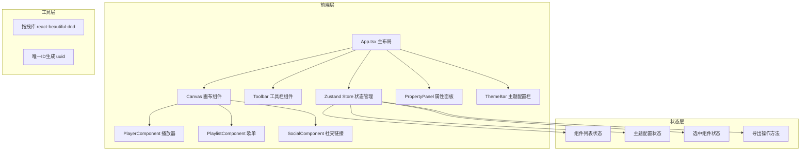

## 1. 架构设计



## 2. 技术描述

- **前端框架**：React@18 + TypeScript
- **构建工具**：Vite
- **状态管理**：Zustand
- **拖拽库**：react-beautiful-dnd
- **ID 生成**：uuid
- **样式方案**：CSS Modules + CSS 变量（主题切换）
- **初始化工具**：vite-init

## 3. 文件结构

```
src/
├── main.tsx              # 应用入口
├── App.tsx               # 主布局组件
├── store/
│   └── useAppStore.ts    # Zustand 全局状态
├── components/
│   ├── Toolbar.tsx       # 左侧工具栏
│   ├── Canvas.tsx        # 中间画布
│   ├── PropertyPanel.tsx # 右侧属性面板
│   ├── ThemeBar.tsx      # 顶部主题栏
│   ├── Modal.tsx         # 编辑模态框
│   ├── Toast.tsx         # Toast提示
│   └── canvas/
│       ├── PlayerComponent.tsx    # 播放器组件
│       ├── PlaylistComponent.tsx  # 歌单组件
│       └── SocialComponent.tsx    # 社交链接组件
├── types/
│   └── index.ts          # 类型定义
└── utils/
    ├── themes.ts         # 主题配置
    └── export.ts         # 导出工具函数
```

## 4. 数据模型

### 4.1 组件类型定义

```typescript
type ComponentType = 'player' | 'playlist' | 'social';

interface BaseComponent {
  id: string;
  type: ComponentType;
  position: number;
}

interface PlayerComponent extends BaseComponent {
  type: 'player';
  coverImage: string;
  backgroundColor: string;
  playMode: 'loop' | 'single' | 'shuffle';
  audioUrl: string;
  audioType: 'upload' | 'url';
}

interface Song {
  id: string;
  title: string;
  artist: string;
  duration: string;
  cover: string;
  tagColor: string;
}

interface PlaylistComponent extends BaseComponent {
  type: 'playlist';
  songs: Song[];
}

interface SocialLink {
  id: string;
  platform: 'spotify' | 'instagram' | 'youtube' | 'twitter' | 'tiktok';
  url: string;
}

interface SocialComponent extends BaseComponent {
  type: 'social';
  links: SocialLink[];
  iconStyle: 'rounded' | 'circle' | 'borderless';
}

type CanvasComponent = PlayerComponent | PlaylistComponent | SocialComponent;
```

### 4.2 主题类型定义

```typescript
interface Theme {
  id: string;
  name: string;
  background: string;
  primary: string;
  secondary: string;
  text: string;
  textSecondary: string;
  cardBg: string;
  shadow: string;
  fontFamily: string;
}
```

## 5. 状态管理设计

Zustand Store 包含以下状态和方法：

| 状态 | 类型 | 说明 |
|------|------|------|
| components | CanvasComponent[] | 画布上的组件列表 |
| selectedId | string \| null | 当前选中的组件ID |
| theme | Theme | 当前主题配置 |
| customPrimaryColor | string | 用户自定义主色 |

| 方法 | 参数 | 返回值 | 说明 |
|------|------|--------|------|
| addComponent | type: ComponentType | void | 添加新组件到画布 |
| removeComponent | id: string | void | 删除组件 |
| updateComponent | id: string, data: Partial<CanvasComponent> | void | 更新组件属性 |
| reorderComponents | startIndex: number, endIndex: number | void | 重新排序组件 |
| setSelectedId | id: string \| null | void | 设置选中组件 |
| setTheme | themeId: string | void | 切换预设主题 |
| setCustomColor | color: string | void | 设置自定义主色 |
| exportJSON | void | string | 导出JSON配置 |
| generateHTML | void | string | 生成嵌入HTML代码 |

## 6. 性能指标

- **首屏渲染**：< 1.5s（含所有组件初始化）
- **拖拽流畅度**：60fps
- **导出响应**：< 200ms（JSON导出和代码复制）
- **主题切换**：平滑过渡 0.6s

## 7. 运行方式

```bash
npm install
npm run dev
```
