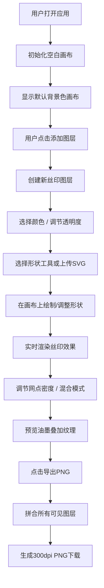

## 1. 产品概述

层染·丝印工坊是一款运行在浏览器中的交互式数字丝网印刷模拟工具，让平面设计师通过分层叠加颜色和图案，生成具有独特套色纹理的艺术作品。

- 核心价值：在数字环境中还原传统丝网印刷的工艺美感，降低创作门槛
- 目标用户：平面设计师、插画师、艺术爱好者
- 市场定位：轻量级创意工具，填补数字丝印模拟领域的空白

## 2. 核心功能

### 2.1 用户角色
| 角色 | 注册方式 | 核心权限 |
|------|---------|----------|
| 访客用户 | 无需注册 | 使用全部创作功能、导出作品 |

### 2.2 功能模块
1. **画布系统**：800×600px画布，背景色自定义，缩放与重置视角
2. **图层管理**：增删图层、拖拽排序、透明度调节、混合模式切换
3. **形状绘制**：矩形、圆形、多边形基础形状，支持缩放/旋转/移动
4. **丝印效果**：半色调网点、油墨颗粒纹理、CMYK减色混合
5. **导出功能**：300dpi PNG导出，自动拼合可见图层

### 2.3 页面详情
| 页面名称 | 模块名称 | 功能描述 |
|---------|---------|----------|
| 主工作区 | 画布区域 | 75%宽度画布，实时预览丝印效果，支持缩放与平移 |
| 主工作区 | 顶部工具栏 | 缩放滑块、重置视角按钮 |
| 主工作区 | 图层面板 | 300px固定宽度侧边栏，图层列表卡片、拖拽排序 |
| 主工作区 | 属性编辑区 | 色环选择器、透明度滑块、混合模式选择、网点密度调节 |
| 主工作区 | 操作按钮区 | 添加图层按钮（涟漪动画）、导出按钮（加载动画） |

## 3. 核心流程

用户操作流程简述：用户进入应用后看到空白画布，通过右侧面板添加丝印图层，为每个图层选择颜色、透明度和混合模式，然后绘制或上传形状。系统实时渲染半色调网点和油墨叠加效果。用户可添加多个图层并调整顺序，最终导出高分辨率PNG作品。

## 4. 用户界面设计

### 4.1 设计风格
- **设计基调**：极简工业风，温暖质感
- **主色调**：暖灰调（#f5f0e1 仿纸背景、#3a3a3a 深灰操作元素）
- **点缀色**：木质色（#c4a882），用于面板底部纹理装饰
- **字体**：系统无衬线字体，清晰易读，保持工业感
- **按钮风格**：
  - 添加按钮：圆形（直径40px），深灰背景，悬停变亮，点击涟漪扩散
  - 导出按钮：圆角矩形，深灰背景，点击显示加载状态
- **卡片风格**：圆角图层卡片，背景色对应图层颜色，1px深灰边框
- **动效风格**：0.3秒CSS过渡，流畅自然

### 4.2 页面设计概览
| 页面名称 | 模块名称 | UI元素 |
|---------|---------|--------|
| 主工作区 | 画布区域 | 800×600px画布，居中显示，仿纸质感背景 |
| 主工作区 | 顶部工具栏 | 40px高度半透明条，缩放滑块、圆形重置按钮 |
| 主工作区 | 图层列表面板 | 圆角卡片列表，拖拽时半透明阴影跟随 |
| 主工作区 | 色环选择器 | 直径160px圆形渐变盘，交互时光晕反馈 |
| 主工作区 | 透明度滑块 | 渐变轨道（左透明右实色），圆形滑块 |
| 主工作区 | 底部操作区 | 木质纹理底，圆形添加按钮 + 导出按钮 |

### 4.3 响应式
- 桌面端优先设计，固定侧边栏300px宽度
- 画布区域自适应剩余空间
- 不考虑移动端适配

### 4.4 交互细节
- 图层卡片拖拽：卡片跟随鼠标移动，半透明阴影效果
- 色环交互：点击/拖动选择颜色，光晕扩散反馈
- 形状操作：拖拽移动、边角缩放、旋转手柄实时显示角度
- 按钮反馈：悬停过渡0.3s，点击涟漪动画0.4s
- 导出反馈："导出中..."加载动画0.6s后触发下载
