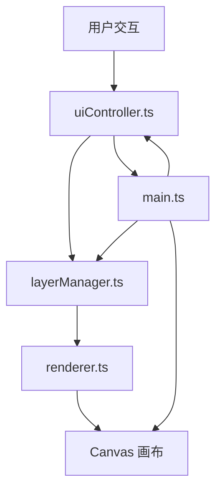
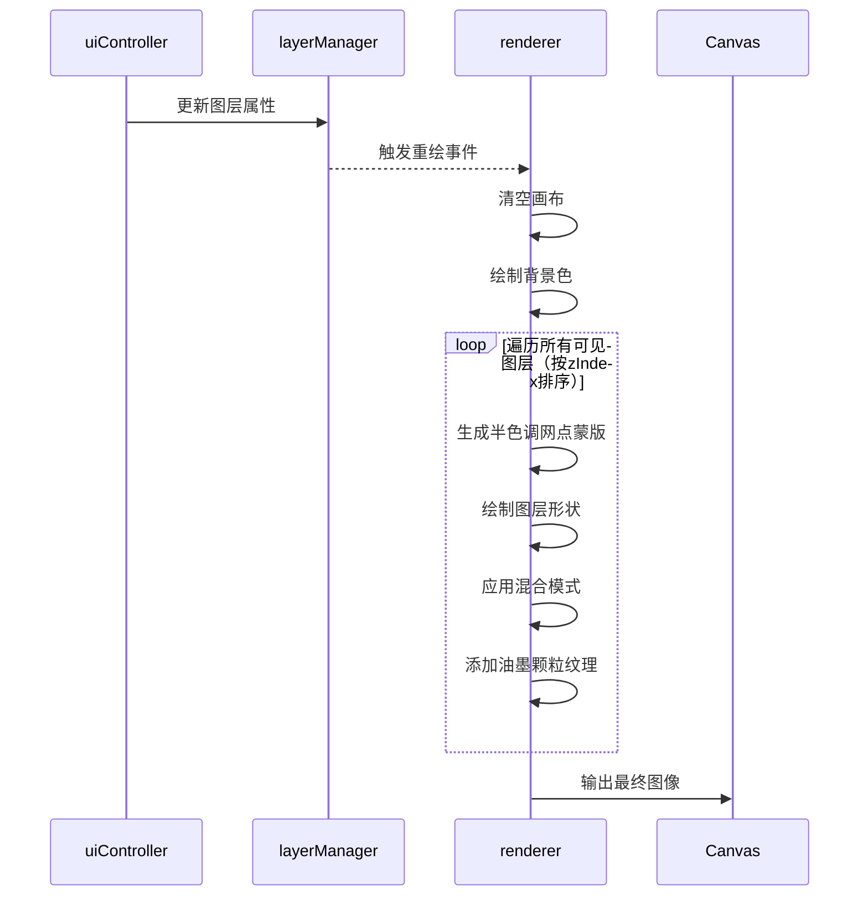

## 1. 架构设计



数据流向说明：
- 用户通过UI界面交互 → uiController捕获事件 → 调用layerManager接口
- layerManager更新图层数据 → 触发renderer重绘
- renderer读取所有图层数据 → 计算丝印效果 → 绘制到Canvas
- main.ts作为入口，协调各模块初始化与通信

## 2. 技术选型

- **前端框架**：原生 TypeScript + Vite（无UI框架，Canvas驱动）
- **构建工具**：Vite 5.x
- **语言**：TypeScript 5.x（严格模式）
- **动画库**：GSAP 3.x（用于UI动效和过渡动画）
- **渲染技术**：HTML5 Canvas 2D API
- **模块系统**：ES Modules

## 3. 文件结构

```
层染·丝印工坊/
├── package.json          # 项目依赖与脚本
├── vite.config.js        # Vite构建配置
├── tsconfig.json         # TypeScript配置
├── index.html            # 入口HTML页面
└── src/
    ├── main.ts           # 应用入口，初始化与协调
    ├── layerManager.ts   # 图层管理模块
    ├── renderer.ts       # 渲染引擎模块
    ├── uiController.ts   # UI控制模块
    └── types/
        └── index.ts      # 类型定义
```

### 模块职责与调用关系

| 模块 | 职责 | 被谁调用 | 调用谁 |
|------|------|---------|--------|
| main.ts | 应用入口，Canvas初始化，事件分发，模块协调 | - | layerManager, renderer, uiController |
| layerManager.ts | 图层增删、排序、透明度、混合模式管理 | main.ts, uiController | - |
| renderer.ts | 半色调网点、油墨叠加、纹理渲染 | main.ts, layerManager（间接） | - |
| uiController.ts | 侧边栏UI事件处理，色环、滑块、拖拽 | main.ts | layerManager |

## 4. 核心数据模型

### 4.1 图层数据结构 (Layer)

```typescript
interface Layer {
  id: string;
  name: string;
  color: string;          // 图层颜色，hex格式
  opacity: number;        // 透明度 0-1
  blendMode: 'normal' | 'multiply' | 'screen';
  halftoneDensity: number; // 半色调网点密度 10-60 lpi
  visible: boolean;
  shapes: Shape[];        // 图层内的形状列表
  zIndex: number;         // 图层层级
}
```

### 4.2 形状数据结构 (Shape)

```typescript
interface Shape {
  id: string;
  type: 'rectangle' | 'circle' | 'polygon' | 'svg';
  x: number;              // 位置X
  y: number;              // 位置Y
  width: number;          // 宽度
  height: number;         // 高度
  rotation: number;       // 旋转角度（弧度）
  scaleX: number;         // 水平缩放
  scaleY: number;         // 垂直缩放
  points?: Point[];       // 多边形顶点
  svgPath?: string;       // SVG路径数据
}

interface Point {
  x: number;
  y: number;
}
```

### 4.3 画布状态

```typescript
interface CanvasState {
  width: number;          // 画布宽度 800px
  height: number;         // 画布高度 600px
  backgroundColor: string;// 背景色
  zoom: number;           // 缩放比例 0.5-2
  offsetX: number;        // 视口偏移X
  offsetY: number;        // 视口偏移Y
}
```

## 5. 渲染流程



### 渲染算法说明

1. **半色调网点生成**：
   - 使用圆形网点，按网点密度计算间距
   - 网点大小根据颜色亮度动态调整
   - 采用有序抖动算法保证网点排列规则

2. **油墨叠加混合**：
   - 正常模式：标准透明度混合
   - 正片叠底：模拟油墨叠印加深效果
   - 滤色模式：模拟浅色油墨叠加

3. **颗粒纹理**：
   - 重叠区域生成随机噪点
   - 噪点密度与图层透明度、混合模式相关
   - 使用预生成噪点贴图提升性能

## 6. 性能优化策略

1. **离屏Canvas缓存**：每个图层使用独立离屏Canvas，属性未变化时直接复用
2. **脏区域重绘**：仅重绘受影响的图层区域
3. **requestAnimationFrame**：所有动画和重绘通过RAF调度
4. **网点预计算**：常用密度的半色调图案预生成缓存
5. **图层上限**：最多20个图层，保证流畅体验
6. **缩略图缓存**：图层列表缩略图缓存，避免重复渲染

## 7. 导出流程

1. 收集所有可见图层数据
2. 创建高分辨率离屏Canvas（300dpi对应尺寸）
3. 按正常渲染流程逐图层绘制
4. 调用canvas.toDataURL('image/png')生成图片
5. 创建下载链接并触发自动下载
