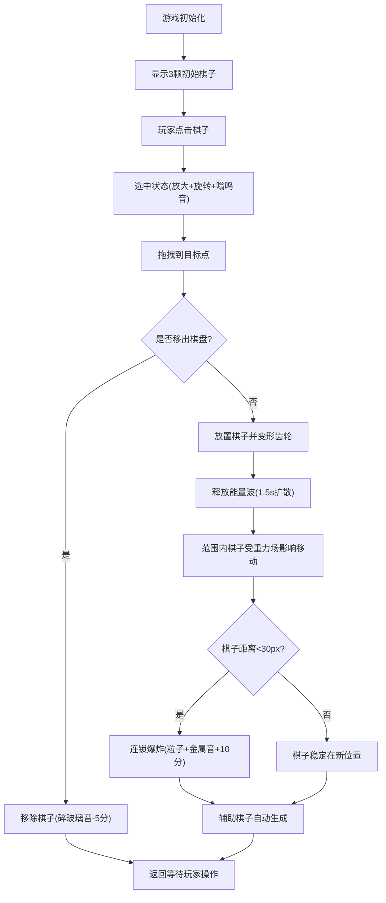

## 1. 产品概述

"星骸·械动棋"是一款深空科幻风格的浏览器策略游戏，玩家通过拖拽和点击在圆形星盘棋盘上放置和移动机械棋子，利用棋子激活时产生的能量波改变重力场，触发连锁反应与合成音效。

- 目标用户：喜爱策略游戏、视觉设计和音乐体验的休闲玩家
- 产品价值：将棋盘策略与视觉、听觉反馈深度融合，带来沉浸式的星际机械棋局体验

## 2. 核心功能

### 2.1 功能模块

1. **游戏主界面**：星盘棋盘渲染、机械棋子、星空背景、记分板、状态栏
2. **棋子交互系统**：点击选中、拖拽移动、放置变形、残影效果
3. **能量波与重力场系统**：脉冲能量波扩散、重力场影响棋子位移
4. **连锁反应系统**：棋子碰撞爆炸、粒子碎片效果、辅助棋子自动生成
5. **音效合成系统**：机械变形音、能量波音、金属撞击音、碎玻璃音效
6. **计分系统**：连锁加分、移除减分、数字缩放动画

### 2.2 页面详情

| 页面名称 | 模块名称 | 功能描述 |
|-----------|-------------|---------------------|
| 游戏主页 | 星盘棋盘 | 19x19经纬网格、圆形星盘、网格交叉点星光 |
| 游戏主页 | 棋子渲染 | 六边形棋子、金色描边、阴影、齿轮变形、选中动画 |
| 游戏主页 | 粒子效果 | 爆炸碎片、能量波扩散、残影、光晕泛光 |
| 游戏主页 | 星空背景 | 深空径向渐变、30颗缓慢闪烁星星 |
| 游戏主页 | HUD界面 | 左上角记分板、右上角棋子计数、底部状态提示栏 |
| 游戏主页 | 交互系统 | 点击选中、拖拽移动、放置触发、移除判定 |

## 3. 核心流程

玩家操作流程：
1. 游戏初始化，星盘上生成3颗初始棋子（中心、左上、右下）
2. 玩家点击棋子选中（放大旋转+嗡鸣音）
3. 玩家拖拽棋子到目标网格交叉点（跟随鼠标+残影）
4. 棋子放置后变形为齿轮状，释放能量波
5. 能量波影响范围内棋子，改变重力场使棋子向波心靠拢
6. 若两棋子距离小于30px触发连锁反应（爆炸+粒子+金属撞击音+加分）
7. 系统自动在空白交叉点生成辅助棋子（最多12颗）
8. 若棋子被拖出棋盘范围则移除（碎玻璃音+减分）

## 4. 用户界面设计

### 4.1 设计风格

- **主色调**：深空黑 `#000011`、深蓝 `#0a0e1a`、星盘边缘 `#010005`
- **棋子色板**：橙 `#ff6b35`、青蓝 `#00b4d8`、红 `#e63946`、黄绿 `#a7c957`、辅助灰 `#888899`
- **强调色**：金色描边 `#ffd700`、能量波脉冲色、状态色（白/金/红）
- **字体**：等宽科幻感字体，文字清晰可辨
- **动画风格**：GSAP缓动easeOutCubic，所有交互平滑过渡
- **整体风格**：深空科幻、机械精密、粒子光效、沉浸式

### 4.2 页面设计概述

| 页面名称 | 模块名称 | UI元素 |
|-----------|-------------|-------------|
| 游戏主页 | 星盘棋盘 | 圆形径向渐变背景、19x19半透明白色经纬网格线、交叉点弱星光(2px,0.3α) |
| 游戏主页 | 棋子 | 六边形(外接圆20px)、金色描边(2px)、阴影(120%尺寸0.2α偏移2px)、变形锯齿(8px) |
| 游戏主页 | 能量波 | 脉冲圆形波、最大半径200px、1.5s扩散、颜色继承棋子主色、透明度0.6→0 |
| 游戏主页 | 选中效果 | 放大1.2倍+旋转15度、0.3s动画、C2低沉嗡鸣音 |
| 游戏主页 | 残影 | 半透明放置位置残影、0.5s内消失 |
| 游戏主页 | 爆炸粒子 | 20碎片、大小3-8px随机、混合两棋子色、0.8s飞散消失 |
| 游戏主页 | 记分板 | 左上角、缩放动画(1.2倍→原尺寸0.2s)、连锁+10/移除-5 |
| 游戏主页 | 计数板 | 右上角、当前棋子数/最多12 |
| 游戏主页 | 状态栏 | 底部、状态文字颜色随状态变化(白/黄/红) |
| 游戏主页 | 星空背景 | 30颗闪烁星(1-3px,0.1-0.5α,2-4s周期) |

### 4.3 响应式设计

- **桌面端**：棋盘直径=视口高度70%，最小600px
- **移动端**（视口宽度<768px）：棋盘直径=视口宽度90%，最小350px
- **触摸优化**：拖拽区域放大、点击判定区域扩展

### 4.4 视觉动效

- **棋盘网格增亮**：棋子移动和能量波时透明度0.2→0.5
- **光晕泛光**：能量波扩散时棋盘边缘径向渐变白色(0.1α)
- **GSAP缓动**：所有动画使用easeOutCubic
- **帧率目标**：核心循环60FPS，粒子≤200时≥55FPS
