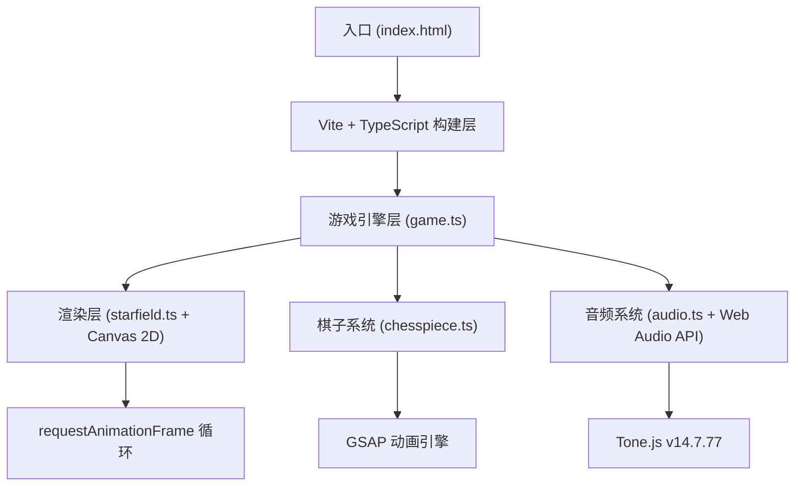

## 1. 架构设计



## 2. 技术说明

- **前端框架**：原生 TypeScript (无框架) + Vite
- **构建工具**：Vite (vite.config.js + tsconfig.json 严格模式)
- **渲染引擎**：Canvas 2D API (requestAnimationFrame 驱动 60FPS)
- **动画引擎**：GSAP (所有补间动画，easeOutCubic 缓动)
- **音频引擎**：Tone.js v14.7.77 + 原生 Web Audio API 合成
- **样式方案**：内联 CSS (index.html `<style>` 标签)

## 3. 文件结构

| 文件路径 | 职责 |
|----------|------|
| `package.json` | 依赖声明 (typescript, vite, gsap, tone@14.7.77) 与启动脚本 |
| `vite.config.js` | Vite 构建配置，入口指向 index.html |
| `tsconfig.json` | TypeScript 严格模式配置，ES 模块目标 |
| `index.html` | 入口页面，深空背景 #000011，视口占满无滚动条 |
| `src/audio.ts` | 音效合成：机械变形、能量波、移动、爆炸、碎玻璃 |
| `src/starfield.ts` | 星盘背景渲染：星空闪烁、棋盘网格、交叉点星光 |
| `src/chesspiece.ts` | 棋子类：六边形绘制、齿轮变形、选中动画、音效触发 |
| `src/game.ts` | 核心循环：棋盘管理、棋子放置移动、重力场、连锁反应、HUD |

## 4. 模块设计

### 4.1 AudioManager (src/audio.ts)

```typescript
class AudioManager {
  // C2 低沉嗡鸣音 - 选中
  playHum(): void
  // C6 急促金属撞击音 - 连锁爆炸
  playMetalImpact(): void
  // D7 高频破碎音 - 移除棋子
  playGlassBreak(): void
  // 机械变形音 - 齿轮变形
  playTransform(): void
  // 能量波音 - 能量波释放
  playEnergyWave(): void
  // 棋子移动音
  playMove(): void
}
```

### 4.2 Starfield (src/starfield.ts)

```typescript
class Starfield {
  // 30颗背景星星
  stars: Star[]
  // 棋盘圆心与半径
  centerX: number
  centerY: number
  radius: number
  // 网格增亮系数 (0.2~0.5)
  gridBrightness: number
  // 光晕强度 (0~0.1)
  glowIntensity: number

  update(dt: number): void
  render(ctx: CanvasRenderingContext2D): void
  // 坐标转棋盘网格交叉点
  getGridIntersections(): Point[]
  // 屏幕坐标转棋盘坐标
  screenToBoard(x: number, y: number): Point
  // 判定点是否在棋盘内
  isInBoard(x: number, y: number, margin: number = 0): boolean
  // 响应式调整棋盘尺寸
  resize(viewportWidth: number, viewportHeight: number): void
}

interface Star {
  x: number
  y: number
  size: number
  baseAlpha: number
  phase: number
  period: number
}
```

### 4.3 ChessPiece (src/chesspiece.ts)

```typescript
class ChessPiece {
  // 棋盘坐标
  x: number
  y: number
  // 棋子主色
  color: string
  // 是否为辅助棋子
  isHelper: boolean
  // 选中状态
  isSelected: boolean
  // 变形进度 (0~1)
  transformProgress: number
  // 旋转角度
  rotation: number
  // 缩放系数
  scale: number
  // 是否正在被拖拽
  isDragging: boolean
  // 拖拽屏幕偏移
  dragOffsetX: number
  dragOffsetY: number
  // 移动速度向量 (重力场)
  vx: number
  vy: number
  // 唯一标识
  id: number

  // 选中动画 + 音效
  select(): void
  deselect(): void
  // 变形齿轮动画
  triggerTransform(): void
  // 渲染
  render(ctx: CanvasRenderingContext2D): void
  // 命中测试
  hitTest(screenX: number, screenY: number): boolean
  // 更新重力场移动
  update(dt: number): void
}
```

### 4.4 Game (src/game.ts)

```typescript
class Game {
  canvas: HTMLCanvasElement
  ctx: CanvasRenderingContext2D
  starfield: Starfield
  audio: AudioManager
  pieces: ChessPiece[]
  particles: Particle[]
  energyWaves: EnergyWave[]
  afterimages: Afterimage[]
  score: number
  maxPieces: number = 12
  // 游戏状态: 'placing' | 'moving' | 'chaining'
  state: GameState
  selectedPiece: ChessPiece | null
  lastTime: number

  start(): void
  update(dt: number): void
  render(): void
  loop(): void
  // 事件处理
  handleMouseDown(x: number, y: number): void
  handleMouseMove(x: number, y: number): void
  handleMouseUp(x: number, y: number): void
  // 放置棋子 + 能量波
  placePiece(piece: ChessPiece, gridX: number, gridY: number): void
  // 释放能量波
  spawnEnergyWave(piece: ChessPiece): void
  // 连锁爆炸检测
  checkCollisions(): void
  // 爆炸粒子
  spawnExplosion(p1: ChessPiece, p2: ChessPiece): void
  // 生成辅助棋子
  spawnHelperIfNeeded(): void
  // 移除棋子
  removePiece(piece: ChessPiece): void
  // HUD渲染
  renderHUD(ctx: CanvasRenderingContext2D): void
}

interface Particle {
  x: number; y: number; vx: number; vy: number
  size: number; color: string
  life: number; maxLife: number
}

interface EnergyWave {
  x: number; y: number; color: string
  radius: number; maxRadius: number = 200
  alpha: number; age: number; duration: number = 1500
}

interface Afterimage {
  x: number; y: number; color: string
  alpha: number; age: number; duration: number = 500
  transformProgress: number; rotation: number
}

type GameState = 'placing' | 'moving' | 'chaining'
```

## 5. 数据模型

### 5.1 棋子颜色池

```typescript
const PIECE_COLORS = ['#ff6b35', '#00b4d8', '#e63946', '#a7c957']
const HELPER_COLOR = '#888899'
const GOLD_STROKE = '#ffd700'
```

### 5.2 初始棋子位置（棋盘坐标比例）

```typescript
const INITIAL_POSITIONS = [
  { bx: 0.50, by: 0.50 }, // 中心
  { bx: 0.22, by: 0.22 }, // 左上
  { bx: 0.78, by: 0.78 }, // 右下
]
```

### 5.3 常量参数

| 常量 | 值 | 说明 |
|------|----|------|
| PIECE_RADIUS | 20 | 六边形外接圆半径 (px) |
| GEAR_TEETH_LENGTH | 8 | 齿轮锯齿长度 (px) |
| MAX_WAVE_RADIUS | 200 | 能量波最大半径 (px) |
| WAVE_DURATION | 1500 | 能量波扩散时长 (ms) |
| GRAVITY_SPEED | 50 | 重力场吸引速度 (px/s) |
| GRAVITY_DURATION | 1000 | 重力场作用时长 (ms) |
| COLLISION_DIST | 30 | 触发连锁的最小距离 (px) |
| EXPLOSION_PARTICLES | 20 | 爆炸碎片数量 |
| AFTERIMAGE_DURATION | 500 | 残影持续时间 (ms) |
| REMOVE_MARGIN | 30 | 移出棋盘的额外判定范围 |
| MAX_PIECES | 12 | 棋盘最大棋子数 |
| CHAIN_SCORE | 10 | 连锁反应加分 |
| REMOVE_SCORE | -5 | 移除棋子减分 |

## 6. 性能保障

- **渲染循环**：`requestAnimationFrame` 单一循环驱动，`dt` 时间步进
- **粒子上限**：全局粒子池 ≤ 200 个，超过即复用最早的
- **Canvas 优化**：避免频繁的 `save/restore`，批量绘制同类元素
- **计算优化**：距离判定使用距离平方比较，避免开方
- **GSAP 管理**：所有 tween 注册到 timeline，组件销毁时统一 kill
