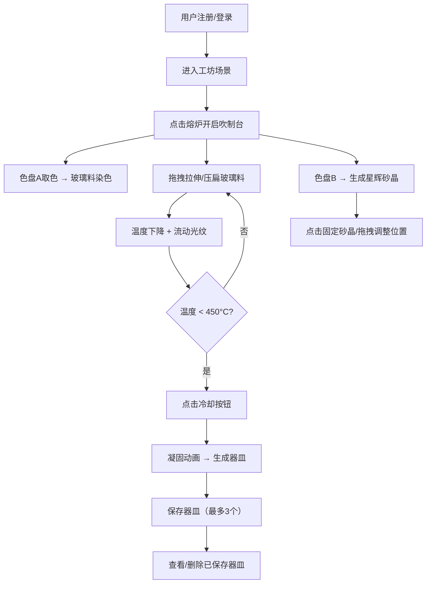

## 1. 产品概述

星砂·熔光工坊是一款沉浸式虚拟玻璃器皿吹制工坊Web应用，让用户在浏览器中体验从熔融到成型的完整玻璃吹制工艺。通过精细的交互设计（拖拽拉伸/压扁、色盘取色、砂晶装饰）和高质量的视觉反馈（脉动光效、流动光纹、星辉砂晶游走），每一次创作都如同在星空中凝出一颗发光砂晶。

- 目标用户：对手工艺、创意设计感兴趣的线上用户
- 核心价值：将传统玻璃吹制工艺数字化，提供沉浸式、可自定义的创作体验

## 2. 核心功能

### 2.1 用户角色

| 角色 | 注册方式 | 核心权限 |
|------|----------|----------|
| 普通用户 | 邮箱注册/登录 | 吹制创作、器皿保存（最多3个）、器皿查看与删除 |

### 2.2 功能模块

1. **工坊页面**：圆形熔炉场景、吹制台、仪表盘、色盘交互
2. **登录/注册页面**：用户认证入口

### 2.3 页面详情

| 页面名称 | 模块名称 | 功能描述 |
|----------|----------|----------|
| 工坊页面 | 熔炉场景 | 俯视视角圆形工坊，中央石英熔炉带脉动光效，点击进入吹制台 |
| 工坊页面 | 吹制台 | 直径400px圆形工作区，球形玻璃料悬浮，支持拖拽拉伸/压扁 |
| 工坊页面 | 仪表盘 | 温度值、旋转速度、色盘A（熔融色）、色盘B（星辉色）、冷却按钮 |
| 工坊页面 | 砂晶系统 | 随机生成2-5颗星辉砂晶，可固定、拖拽重定位，带光尾效果 |
| 工坊页面 | 凝固流程 | 温度<450°C时可冷却凝固，保留砂晶与形状，保存为器皿 |
| 登录/注册页面 | 认证表单 | 邮箱+密码注册/登录，认证状态切换 |

## 3. 核心流程

## 4. 用户界面设计

### 4.1 设计风格

- 主背景色 #1a0f0a，辅色 #3e2723，强调色 #ff6b35（温度高亮）和 #66ccff（冷却高亮）
- 圆形中心聚焦式布局，吹制台占据视口65%
- 字体：数字显示使用等宽字体，UI文字使用无衬线字体
- 按钮：圆形按钮，带渐变背景和图标
- 动画：0.1-0.3秒过渡动画（ease-out），requestAnimationFrame驱动连续动画

### 4.2 页面设计概览

| 页面名称 | 模块名称 | UI元素 |
|----------|----------|--------|
| 工坊页面 | 熔炉场景 | 径向渐变背景#2c1810→#0e0a08，半透明石英熔炉，橙红脉动光效 |
| 工坊页面 | 吹制台 | 400px圆形深灰工作区，银灰描边，球形玻璃料悬浮 |
| 工坊页面 | 仪表盘 | 半透明浮动面板，温度/转速/色盘A/色盘B/冷却按钮 |
| 工坊页面 | 砂晶 | 正六边形砂晶，金色描边闪烁，半透明光尾 |
| 工坊页面 | 凝固动画 | 半透明→实体，颜色加深20%，冰裂纹纹理 |
| 登录/注册页面 | 表单 | 暗色主题卡片，输入框，提交按钮 |

### 4.3 响应式适配

- 桌面优先设计
- 视口宽度 < 768px 时：仪表盘缩为半透明浮动条，吹制台边缘间距调整为10px
- 触摸优化：拖拽操作兼容touch事件

### 4.4 性能要求

- 所有动画60fps流畅运行（Canvas离屏渲染 + 对象池）
- 单次吹制操作响应时间 < 16ms
- 砂晶数量上限10颗
- PixiJS Graphics + ParticleContainer性能优化
