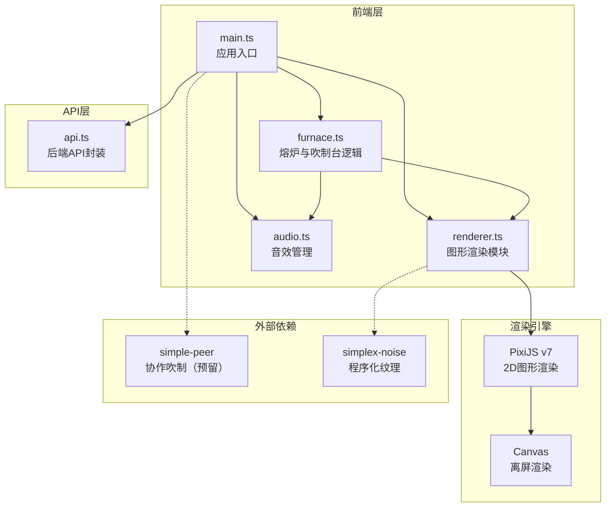
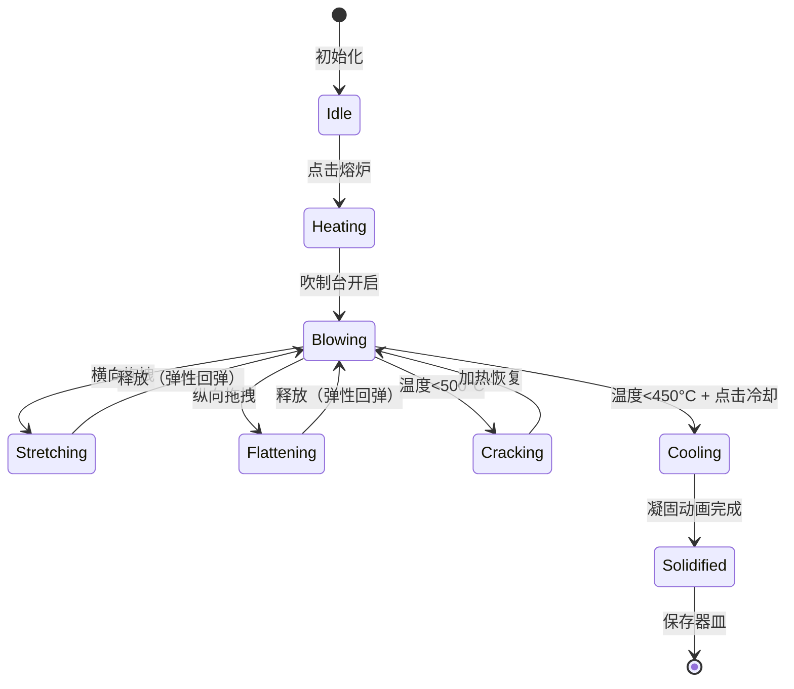

## 1. 架构设计



## 2. 技术说明

- 前端：TypeScript + Vite + PixiJS@7
- 初始化工具：Vite
- 后端：无独立后端，api.ts使用localStorage模拟数据持久化
- 数据库：localStorage（模拟用户与器皿数据存储）
- 音频：Web Audio API（合成音效，无需外部音频文件）

## 3. 路由定义

| 路由 | 用途 |
|------|------|
| / | 工坊主页面（包含登录态判断，未登录显示认证面板） |

## 4. API定义

```typescript
interface User {
  id: string;
  email: string;
  password: string;
}

interface Vessel {
  id: string;
  userId: string;
  shape: { stretchRatio: number; flatRatio: number };
  colorA: string;
  colorB: string;
  crystals: CrystalData[];
  createdAt: number;
}

interface CrystalData {
  x: number;
  y: number;
  size: number;
  color: string;
  opacity: number;
  fixed: boolean;
}

// api.ts 导出函数
function register(email: string, password: string): Promise<User>
function login(email: string, password: string): Promise<User>
function saveVessel(vessel: Omit<Vessel, 'id' | 'userId' | 'createdAt'>): Promise<Vessel>
function loadVessels(): Promise<Vessel[]>
function deleteVessel(id: string): Promise<void>
```

## 5. 文件结构

```
├── package.json
├── vite.config.js
├── tsconfig.json
├── index.html
└── src/
    ├── main.ts        # 应用入口：初始化PixiJS，启动工坊场景，管理认证状态
    ├── furnace.ts     # 熔炉与吹制台逻辑：玻璃料状态机，交互与形变，砂晶管理
    ├── renderer.ts    # 图形渲染模块：所有视觉元素绘制，PixiJS优化
    ├── audio.ts       # 音效管理：Web Audio API合成音效
    └── api.ts         # 后端API封装：用户认证，器皿存取
```

## 6. 核心数据模型

### 6.1 玻璃料状态机



### 6.2 关键数据结构

| 数据 | 类型 | 说明 |
|------|------|------|
| temperature | number | 当前温度（800→400°C） |
| stretchRatio | number | 拉伸比例（1:1→3:1） |
| flatRatio | number | 压扁比例（1:1→2:1） |
| colorA | string | 色盘A取色 |
| colorB | string | 色盘B取色 |
| crystals | CrystalState[] | 砂晶数组（上限10） |
| rotationSpeed | number | 旋转速度（rpm） |
| isSolidified | boolean | 是否已凝固 |

### 6.3 性能优化策略

- Canvas离屏渲染：砂晶光尾和裂纹纹理预渲染到离屏Canvas
- 对象池：ParticleContainer管理砂晶粒子，避免频繁GC
- requestAnimationFrame：所有动画统一由RAF驱动
- 事件节流：鼠标移动事件16ms节流，保证帧率稳定
