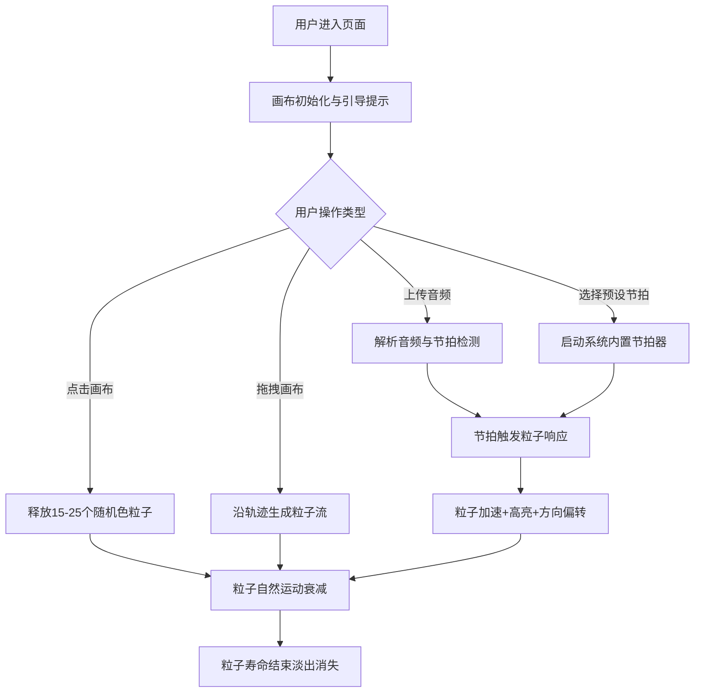

## 1. 产品概述

流辉·律动画板是一款在浏览器中运行的交互式光线粒子绘画工具，面向数字绘画爱好者，允许用户通过点击和拖拽在画布上释放发光粒子，粒子会跟随音乐节拍舞动，形成充满活力的动态视觉作品。

- **主要用途**：创意粒子绘画、音乐可视化、动态艺术创作
- **目标用户**：数字绘画爱好者、视觉艺术家、音乐可视化创作者
- **产品价值**：将音乐与视觉艺术融合，提供沉浸式的创作体验

## 2. 核心功能

### 2.1 功能模块
1. **画布系统**：全屏画布，支持点击释放粒子、拖拽生成粒子流
2. **粒子系统**：1200粒子上限，生命周期管理，节拍响应运动
3. **音频系统**：支持WAV/MP3上传，5种预设节拍，低频节拍检测
4. **控制面板**：音频上传、预设节拍、音量/粒子参数调节

### 2.2 页面详情
| 页面名称 | 模块名称 | 功能描述 |
|-----------|-------------|---------------------|
| 主画布页 | 全屏Canvas | 黑色背景#0d0d1a，点击释放15-25个彩色发光粒子，拖拽生成粒子流 |
| 主画布页 | 控制面板 | 右下角半透明磨砂玻璃面板，音频上传、5种节拍预设、三个滑块控制 |
| 主画布页 | 引导文字 | 底部靠左悬浮引导，渐变消失效果 |

## 3. 核心流程

用户打开应用 → 显示全屏画布与引导文字 → 鼠标点击/拖拽生成粒子 → 上传音频或选择预设节拍 → 粒子跟随节拍加速变色 → 通过控制面板调整参数 → 持续创作动态视觉作品

## 4. 用户界面设计

### 4.1 设计风格
- **主色调**：深紫蓝#1a1a2e背景，画布#0d0d1a，控制面板#2a2a4e
- **12色调色板**：深红#e63946、橙#f4a261、金#e9c46a、绿#2a9d8f、蓝#457b9d、紫#9b5de5、青#00b4d8、粉#f72585、青绿#4cc9f0、琥珀#ffb703、靛蓝#3a0ca3、洋红#d00000
- **按钮风格**：磨砂玻璃质感，圆角设计，悬浮变亮0.2s，点击缩放0.95反弹
- **字体**：现代无衬线字体，引导文字16px白色半透明
- **布局**：全屏画布 + 右下角悬浮控制面板（移动端改为顶部水平）
- **动效**：面板淡入淡出0.3s，1秒无操作自动隐藏，粒子光晕扩散效果

### 4.2 页面设计概述
| 页面名称 | 模块名称 | UI元素 |
|-----------|-------------|-------------|
| 主画布页 | Canvas画布 | 全屏#0d0d1a黑色背景，发光粒子渲染，光晕扩散 |
| 主画布页 | 控制面板 | #2a2a4e背景0.85透明度，12px圆角，磨砂玻璃效果，方形上传按钮，5个圆形节拍按钮#6c63ff，三个参数滑块 |
| 主画布页 | 引导文字 | 底部靠左悬浮，白色#ffffff，透明度0.5，渐变消失 |

### 4.3 响应式设计
- 桌面端（≥768px）：控制面板固定右下角，垂直堆叠布局
- 移动端（<768px）：控制面板缩小尺寸，改为顶部水平布局
- 触摸优化：支持触屏点击和拖拽手势

### 4.4 性能约束
- 粒子上限：1200个，超出时清除最老粒子
- 帧率目标：≥55fps，使用requestAnimationFrame
- 降级策略：帧率<45fps时粒子生成密度降为50%
