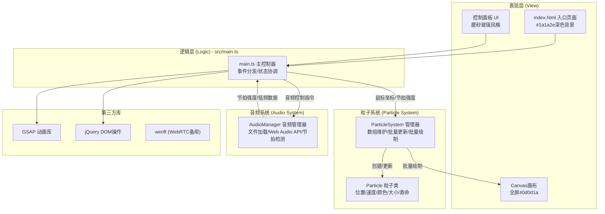
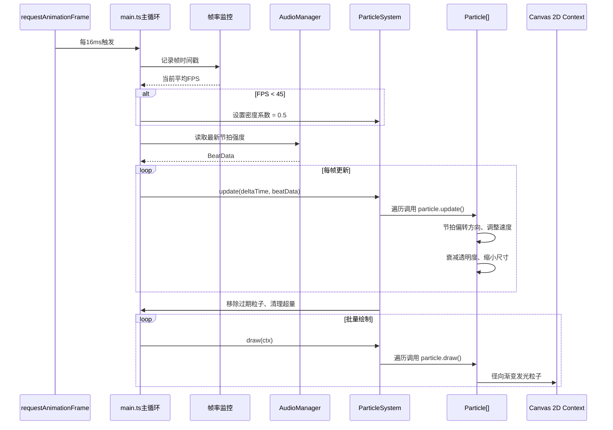

## 1. 架构设计



**调用关系与数据流向：**
1. `main.ts` ← `index.html`：接收DOM事件、Canvas上下文
2. `main.ts` → `ParticleSystem`：传入鼠标坐标、节拍强度，调用 update/draw
3. `ParticleSystem` → `Particle`：创建实例、调用 update/draw
4. `main.ts` ↔ `AudioManager`：上传音频/选择节拍，接收节拍强度回调
5. 数据单向流动：AudioManager → (节拍强度) → main.ts → (参数) → ParticleSystem → Particle → Canvas绘制

## 2. 技术描述

- **前端框架**：原生 TypeScript 5.x + ES Modules（无需React，Canvas直接操作更高效）
- **构建工具**：Vite 5.x（指向 index.html，HMR热更新）
- **类型系统**：TypeScript 严格模式（strict: true），target ES2020
- **动画库**：GSAP 3.x（面板淡入淡出、按钮微交互、高亮出效果）
- **DOM辅助**：jQuery 3.7.x（DOM查询、事件绑定）
- **音频处理**：Web Audio API（AudioContext + AnalyserNode + 低频能量检测）
- **其他**：werift（预留依赖，可选WebRTC功能）

## 3. 文件结构与职责

| 文件路径 | 职责说明 | 对外接口 |
|-----------|----------|----------|
| `/package.json` | 依赖声明：typescript/vite/gsap/werift/jquery，启动脚本 `npm run dev` | - |
| `/vite.config.js` | Vite构建配置，root指向当前目录，入口 index.html | - |
| `/tsconfig.json` | 严格模式，target ES2020，module ESNext，outDir dist | - |
| `/index.html` | 入口HTML，#1a1a2e背景，全屏Canvas，控制面板DOM，引入 src/main.ts | - |
| `src/particle.ts` | Particle粒子类，属性+update+draw，节拍影响加速度/透明度 | `class Particle { constructor, update(), draw(ctx, beatIntensity) }` |
| `src/particleSystem.ts` | ParticleSystem管理器，粒子数组维护，生成/更新/清除/绘制，1200上限 | `class ParticleSystem { addParticles(), addStream(), update(), draw(), clearOldest() }` |
| `src/audioManager.ts` | AudioManager音频管理器，文件加载，节拍检测，预设节拍，回调推送节拍强度 | `class AudioManager { loadFile(), startPresetBeat(), setVolume(), onBeat(callback) }` |
| `src/main.ts` | 入口主文件，Canvas初始化，鼠标/触摸事件监听，音频回调处理，UI面板控制，主循环requestAnimationFrame，帧率监控与降级 | IIFE启动，全局协调 |

## 4. 核心数据结构定义

```typescript
// Particle 属性
interface ParticleData {
  x: number;           // 位置X
  y: number;           // 位置Y
  vx: number;          // 速度X
  vy: number;          // 速度Y
  baseSpeed: number;   // 基础速度
  color: string;       // 颜色HEX
  hslColor: { h: number; s: number; l: number }; // HSL便于亮度调整
  size: number;        // 初始大小
  currentSize: number; // 当前大小
  life: number;        // 总寿命(秒)
  age: number;         // 当前年龄(秒)
  alpha: number;       // 当前透明度
  isBeatHighlight: boolean; // 是否处于节拍高亮
  beatHighlightTime: number; // 高亮剩余时间
  rotation: number;    // 方向角度
}

// 节拍回调数据
interface BeatData {
  intensity: number;     // 0-1 节拍强度
  isKick: boolean;       // 是否为强拍
  lowFreqEnergy: number; // 低频能量值
  timestamp: number;     // 时间戳
}

// 控制面板配置
interface ControlConfig {
  volume: number;        // 0-100
  particleSize: number;  // 5-20 px
  particleDensity: number; // 10-50
  activePreset: BeatPreset | null;
}

// 预设节拍类型
type BeatPreset = '4/4' | '3/4' | 'electronic' | 'jazz' | 'hiphop';
```

## 5. 主循环与性能机制



**性能保障机制：**
- 粒子硬上限 1200 个，FIFO淘汰策略
- Canvas 2D 径向渐变实现发光效果（非阴影 blur，性能更高）
- requestAnimationFrame 驱动，deltaTime 时间步长
- 帧率滑窗采样（最近 30 帧），低于 45fps 触发密度降级
- 粒子批量绘制合并路径（非必须可逐粒子独立渲染保证视觉）

## 6. 12色调色板常量定义

```typescript
const COLOR_PALETTE = [
  '#e63946', // 深红
  '#f4a261', // 橙
  '#e9c46a', // 金
  '#2a9d8f', // 绿
  '#457b9d', // 蓝
  '#9b5de5', // 紫
  '#00b4d8', // 青
  '#f72585', // 粉
  '#4cc9f0', // 青绿
  '#ffb703', // 琥珀
  '#3a0ca3', // 靛蓝
  '#d00000'  // 洋红
];
```
