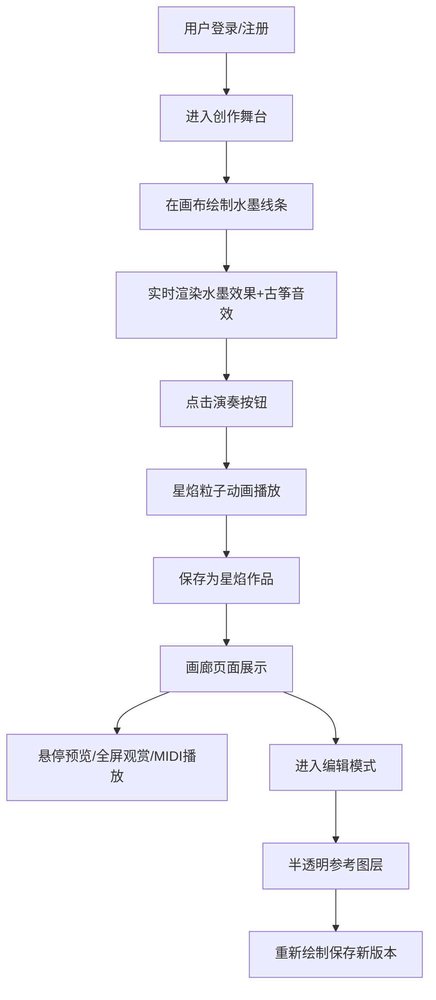

## 1. 产品概述

星焰·水墨音乐会是一款沉浸式线上艺术创作应用，让用户能够在虚拟古风舞台上通过绘制水墨画来创作独特的音乐演出。解决了用户在线上无法获得沉浸式、可自主编排的动态水墨画音乐演出体验的问题。

- 核心价值：将传统水墨画艺术与音乐创作结合，提供独特的沉浸式艺术创作体验
- 目标用户：艺术爱好者、音乐创作者、追求新鲜体验的年轻用户

## 2. 核心功能

### 2.1 用户角色

| 角色 | 注册方式 | 核心权限 |
|------|----------|----------|
| 普通用户 | 用户名密码注册登录 | 创作水墨画、演奏星焰动画、保存作品、查看画廊、编辑历史版本、管理个人乐谱库 |

### 2.2 功能模块

1. **登录注册页面**：卷轴展开动画过渡，用户身份验证
2. **创作舞台页面**：圆形古风舞台、宣纸背景、卷轴画布、水墨绘制、古筝音效、星焰粒子演奏
3. **画廊页面**：横向卷轴展示、缩略图预览、星焰动画预览、全屏观赏、MIDI播放
4. **个人乐谱库**：MIDI序列记录、同步播放、版本管理

### 2.3 页面详情

| 页面名称 | 模块名称 | 功能描述 |
|---------|----------|----------|
| 登录注册 | 身份验证 | 用户名密码登录/注册，卷轴展开动画，表单验证 |
| 创作舞台 | 舞台画布 | 圆形古风舞台（视口高度60%，最小500px），宣纸纹理背景，卷轴画布（400x500px） |
| 创作舞台 | 水墨绘制 | 鼠标拖拽绘制，水墨晕染效果，笔触粗细随速度变化，毛笔光标 |
| 创作舞台 | 古筝音效 | 笔触速度映射音高C4-F5，实时拨弦音效 |
| 创作舞台 | 星焰演奏 | 墨迹转化为发光粒子沿路径流动，粒子分解消散效果，持续5秒 |
| 创作舞台 | 作品保存 | 保存水墨画为星焰作品，记录墨迹数据和MIDI序列 |
| 创作舞台 | 版本编辑 | 半透明灰色参考图层，重新绘制保存新版本，版本回退 |
| 画廊 | 作品展示 | 横向卷轴布局，缩略图120px，悬停放大1.2倍，星焰预览动画 |
| 画廊 | 全屏观赏 | 点击作品进入全屏模式，播放星焰动画和MIDI音乐 |
| 画廊 | MIDI播放 | 同步播放笔触生成的MIDI序列，Tone.js合成音源，50ms内误差 |

## 3. 核心流程

用户注册登录后进入创作舞台，在卷轴画布上用鼠标绘制水墨线条，系统实时渲染水墨晕染效果并同步播放古筝音效。绘制完成后点击"演奏"按钮，墨迹转化为星焰粒子沿路径流动并产生消散效果。用户可将作品保存至画廊，在画廊中可预览、全屏观赏、播放MIDI音乐，也可进入编辑模式在原有作品基础上创作新版本。

## 4. 用户界面设计

### 4.1 设计风格

- **主色调**：米白#f5e6c8、墨黑#2c2c2c、朱红#c62828、金色#8b6914
- **整体风格**：仿古水墨风格，东方美学，典雅精致
- **按钮样式**：圆角木纹按钮，悬停时金黄色微光脉冲（范围扩大5px，0.3秒）
- **字体**：选用具有古典韵味的中文字体，标题加粗，正文优雅
- **布局风格**：单页应用，顶部半透明飘浮导航栏，底部圆角木纹控制面板
- **视觉效果**：宣纸纹理、水墨晕染、星焰粒子发光

### 4.2 页面设计概述

| 页面名称 | 模块名称 | UI元素 |
|---------|----------|--------|
| 登录注册 | 卷轴展开 | 从中心向两侧展开动画（0.8秒，ease-out），仿古卷轴背景，登录表单居中 |
| 创作舞台 | 导航栏 | 半透明墨黑背景（0.1透明度），飘浮效果，导航菜单 |
| 创作舞台 | 舞台区域 | 圆形舞台，宣纸纹理背景（#f5e6c8，0.3透明度纤维纹路），卷轴画布（2px仿古铜色描边#8b6914） |
| 创作舞台 | 控制面板 | 底部圆角木纹面板，包含绘制、清除、演奏、保存、版本控制按钮和参数滑块 |
| 创作舞台 | 画布交互 | 毛笔光标，笔触路径粗细变化（慢3px/快1px），实时水墨晕染 |
| 画廊 | 横向卷轴 | 作品缩略图（120px），悬停放大1.2倍，3秒星焰预览动画 |
| 画廊 | 进入动画 | 作品卡片从底部上移30px渐显（0.6秒，ease-out） |
| 画廊 | 全屏模式 | 黑色背景，作品居中，星焰动画+MIDI播放控制 |

### 4.3 响应式

- 桌面优先设计，移动端自适应
- 视口宽度<768px时：舞台缩放至80%，画布下方出现滑动式控件面板
- 触摸优化：支持触摸绘制，增大按钮点击区域

### 4.4 动画与交互

- **页面过渡**：登录注册卷轴展开（0.8秒，ease-out）
- **画廊入场**：卡片从底部上移30px渐显（0.6秒，ease-out）
- **按钮悬停**：金黄色微光脉冲，范围扩大5px（0.3秒）
- **水墨晕染**：墨迹边缘半透明扩散，透明度1.0渐变至0.3
- **星焰粒子**：沿路径流动（20-40px/秒），逐渐分解为小光点飘散消失
- **星焰消散**：持续5秒后重置
- **性能要求**：交互帧率≥55FPS，粒子动画帧率≥48FPS
