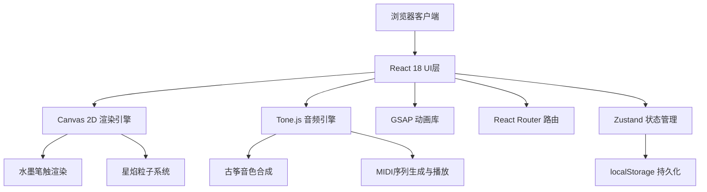
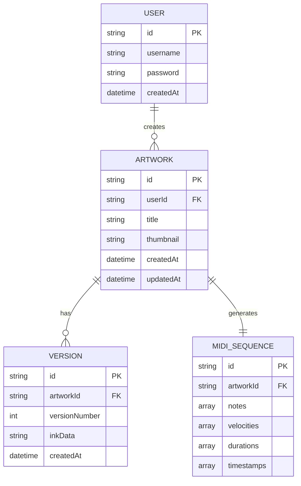

## 1. 架构设计



## 2. 技术描述

- **前端框架**：React@18.2.0 + TypeScript
- **构建工具**：Vite
- **路由管理**：React Router DOM
- **状态管理**：Zustand
- **图形渲染**：Canvas 2D API
- **音频引擎**：Tone.js@14.7.77（MIDI合成、古筝音色）
- **动画库**：GSAP@3.12（页面过渡、UI动画）
- **数据持久化**：localStorage（作品数据、MIDI序列）
- **样式方案**：Tailwind CSS 3

## 3. 目录结构

```
e:\solo\VersionFast\tasks\auto194\
├── src\
│   ├── components\
│   │   ├── Stage.tsx          # 舞台与画布组件
│   │   ├── Gallery.tsx        # 画廊组件
│   │   ├── Navigation.tsx     # 顶部导航栏
│   │   ├── ControlPanel.tsx   # 底部控制面板
│   │   └── Login.tsx          # 登录注册组件
│   ├── pages\
│   │   ├── LoginPage.tsx      # 登录页面
│   │   ├── StagePage.tsx      # 创作舞台页面
│   │   └── GalleryPage.tsx    # 画廊页面
│   ├── utils\
│   │   ├── audioEngine.ts     # 音效引擎
│   │   ├── particleSystem.ts  # 粒子系统
│   │   └── inkRenderer.ts     # 水墨渲染器
│   ├── store\
│   │   └── useStore.ts        # Zustand全局状态
│   ├── types\
│   │   └── index.ts           # TypeScript类型定义
│   ├── App.tsx                # 主应用组件
│   ├── main.tsx               # 入口文件
│   └── index.css              # 全局样式
├── package.json
├── vite.config.ts
├── tsconfig.json
├── tailwind.config.js
└── index.html
```

## 4. 路由定义

| 路由 | 页面 | 说明 |
|------|------|------|
| /login | 登录注册页 | 用户登录/注册，卷轴展开动画 |
| /stage | 创作舞台页 | 水墨绘制、星焰演奏、作品保存 |
| /gallery | 画廊页 | 作品展示、预览、全屏观赏、MIDI播放 |
| /edit/:id | 编辑页 | 编辑已有作品，版本管理 |

## 5. 数据模型

### 5.1 数据模型定义



### 5.2 核心数据结构

```typescript
interface Point {
  x: number;
  y: number;
  timestamp: number;
  velocity: number;
}

interface InkStroke {
  id: string;
  points: Point[];
  color: string;
  lineWidth: number;
}

interface MIDINote {
  note: string;
  velocity: number;
  duration: number;
  time: number;
}

interface ArtworkVersion {
  id: string;
  versionNumber: number;
  strokes: InkStroke[];
  midiSequence: MIDINote[];
  createdAt: number;
}

interface Artwork {
  id: string;
  title: string;
  thumbnail: string;
  currentVersion: number;
  versions: ArtworkVersion[];
  createdAt: number;
  updatedAt: number;
}

interface User {
  id: string;
  username: string;
  artworks: Artwork[];
}
```

### 5.3 localStorage 存储结构

```
localStorage:
  - 'xingyan_user': 当前登录用户信息
  - 'xingyan_artworks': 所有作品数组
  - 'xingyan_midi_{artworkId}': 作品MIDI数据
```

## 6. 核心模块技术说明

### 6.1 水墨渲染引擎 (Canvas 2D)

- **requestAnimationFrame** 驱动60fps渲染循环
- **贝塞尔曲线** 平滑笔触路径
- **径向渐变+半透明叠加** 实现水墨晕染效果
- **动态线宽**：根据笔触速度计算（慢→3px，快→1px）

### 6.2 星焰粒子系统

- **粒子池** 预分配优化性能
- **路径跟随算法**：沿墨迹路径以20-40px/秒流动
- **粒子分解**：大粒子逐渐分解为1-2px小光点
- **物理模拟**：飘散速度、生命周期、透明度衰减

### 6.3 音频引擎 (Tone.js)

- **合成器**：AMSynth模拟古筝音色
- **音高映射**：笔触速度 → C4-F5（速度越快音高越高）
- **力度映射**：笔触压力/速度 → 0-127 MIDI力度
- **时序同步**：MIDI音符时间戳严格对齐笔触时序，误差<50ms

### 6.4 性能优化

- **离屏Canvas** 预渲染宣纸纹理
- **粒子对象池** 避免频繁GC
- **requestAnimationFrame** 统一动画循环
- **节流/防抖** 处理高频鼠标事件
- **localStorage** 异步读写避免阻塞UI

## 7. 关键技术指标

- 交互帧率：≥55FPS
- 粒子动画帧率：≥48FPS
- MIDI时序误差：≤50ms
- 首次加载时间：≤2s
- 单画布支持笔触数量：≥1000条
