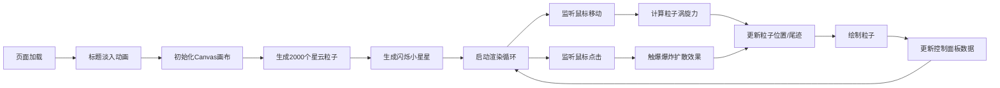

## 1. 产品概述

星云粒子画廊是一个沉浸式的交互式粒子艺术体验应用。用户通过鼠标在深邃的星空画布上移动和点击，实时生成并操控绚丽的星云粒子系统，创造动态的艺术图案。

- 核心目的：提供一个视觉化的交互式粒子艺术创作平台
- 目标用户：艺术爱好者、创意设计师、普通用户
- 市场价值：探索Web端实时图形渲染的艺术表现力，提供轻松愉悦的视觉体验

## 2. 核心功能

### 2.1 用户角色

无需登录，所有用户均可直接使用全部功能。

### 2.2 功能模块

1. **星云背景系统**：静态星云粒子背景 + 闪烁小星星
2. **鼠标交互系统**：涡旋吸引效果 + 螺旋光晕 + 发光尾迹
3. **爆炸效果系统**：点击爆炸扩散 + 颜色渐变 + 余晖淡出
4. **控制面板**：粒子数量显示 + FPS显示 + 鼠标坐标显示
5. **加载动画**：标题淡入动画

### 2.3 页面详情

| 页面名称 | 模块名称 | 功能描述 |
|-----------|-------------|---------------------|
| 主画布页 | 星云背景 | 初始化2000个半透明粒子，紫→青蓝→粉渐变，形成静态星云；随机小星星缓慢闪烁 |
| 主画布页 | 涡旋吸引 | 鼠标移动时，半径内粒子被吸引绕鼠标旋转形成螺旋光晕，移动越快效果越明显，拖出尾迹 |
| 主画布页 | 爆炸扩散 | 鼠标点击时，粒子从点击点向外喷射，颜色变为亮黄→橙红渐变，1.5秒余晖淡出后恢复 |
| 主画布页 | 控制面板 | 右下角磨砂玻璃效果面板，显示粒子数、FPS、鼠标坐标，数字平滑过渡 |
| 主画布页 | 加载动画 | 页面加载时"星云粒子画廊"标题渐变淡入，衬线体白色半透明 |

## 3. 核心流程

## 4. 用户界面设计

### 4.1 设计风格

- **主色调**：深邃星空黑 (#0a0a1a) 作为背景
- **粒子渐变色**：紫色 (#9333ea) → 青蓝色 (#06b6d4) → 粉色 (#ec4899)
- **爆炸色**：亮黄 (#fbbf24) → 橙红 (#f97316) → 红色 (#ef4444)
- **控制面板**：半透明磨砂玻璃效果 (backdrop-filter: blur)
- **字体**：衬线体 (Georgia, 'Times New Roman', serif)
- **布局**：全屏画布，右下角浮动控制面板

### 4.2 页面设计概述

| 页面名称 | 模块名称 | UI元素 |
|-----------|-------------|-------------|
| 主画布页 | 全屏画布 | 占据95%视口，黑色星空背景 |
| 主画布页 | 控制面板 | 右下角，半透明磨砂玻璃，白色文字，数字平滑过渡动画 |
| 主画布页 | 加载标题 | 居中显示，优雅衬线体，白色半透明，渐变淡入 |

### 4.3 响应性

- 桌面端优先，Canvas自适应窗口大小
- 控制面板固定在右下角，不随滚动移动
- 支持窗口resize事件，粒子系统自动适配新尺寸

### 4.4 性能要求

- 稳定保持55FPS以上
- 粒子数量可动态调整
- 使用requestAnimationFrame进行渲染
- 粒子运动计算优化，避免卡顿
