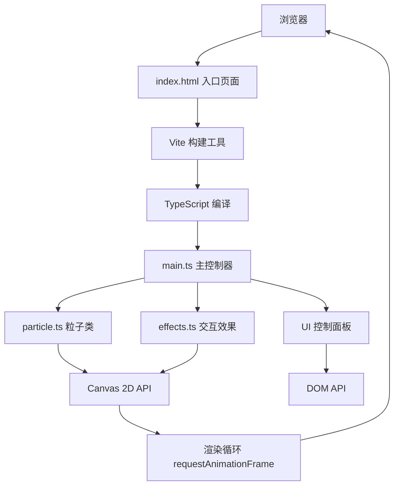

## 1. 架构设计



## 2. 技术描述

- **前端框架**：纯 TypeScript + HTML5 Canvas 2D API（无React/Vue框架，符合用户指定要求）
- **构建工具**：Vite 5.x
- **类型系统**：TypeScript 5.x，严格模式
- **模块系统**：ES Modules
- **包管理器**：npm
- **性能优化**：
  - 使用 requestAnimationFrame 进行渲染
  - 粒子运动向量计算优化
  - 尾迹使用线性渐变实现
  - 鼠标交互区域检测优化

## 3. 项目结构

```
.
├── index.html              # 入口HTML页面
├── package.json            # 项目依赖和脚本
├── tsconfig.json           # TypeScript配置
├── vite.config.js          # Vite构建配置
└── src/
    ├── main.ts             # 主入口，协调各个模块
    ├── particle.ts         # 粒子类定义
    └── effects.ts          # 交互效果处理
```

## 4. 核心数据结构

### 4.1 Particle 粒子接口

```typescript
interface IParticle {
  x: number;
  y: number;
  vx: number;
  vy: number;
  size: number;
  color: { r: number; g: number; b: number };
  alpha: number;
  baseColor: { r: number; g: number; b: number };
  trail: Array<{ x: number; y: number }>;
  explosionPhase: number;
  originalX: number;
  originalY: number;
}
```

### 4.2 Star 小星星接口

```typescript
interface IStar {
  x: number;
  y: number;
  size: number;
  baseAlpha: number;
  twinkleSpeed: number;
  twinklePhase: number;
}
```

### 4.3 MouseState 鼠标状态

```typescript
interface IMouseState {
  x: number;
  y: number;
  prevX: number;
  prevY: number;
  speed: number;
  isDown: boolean;
  clickX: number;
  clickY: number;
  explosionTime: number;
}
```

## 5. 核心算法

### 5.1 颜色渐变算法

从紫色 → 青蓝色 → 粉色的三色渐变：
```
t ∈ [0, 1]
if t < 0.5: interpolate(紫色, 青蓝色, t*2)
else: interpolate(青蓝色, 粉色, (t-0.5)*2)
```

### 5.2 涡旋力算法

```
dx = x - mouseX
dy = y - mouseY
distance = sqrt(dx² + dy²)
if distance < vortexRadius:
  // 吸引力
  attractForce = (1 - distance/vortexRadius) * attractStrength
  vx -= dx/distance * attractForce
  vy -= dy/distance * attractForce
  
  // 切向力（旋转）
  tangentForce = (1 - distance/vortexRadius) * tangentStrength * mouseSpeed
  vx += -dy/distance * tangentForce
  vy += dx/distance * tangentForce
```

### 5.3 爆炸扩散算法

```
if explosionTime > 0:
  explosionProgress = 1 - explosionTime / explosionDuration
  // 初始爆炸推力
  if explosionProgress < 0.3:
    dx = x - clickX
    dy = y - clickY
    dist = max(sqrt(dx² + dy²), 1)
    force = explosionStrength * (1 - explosionProgress/0.3)
    vx += dx/dist * force
    vy += dy/dist * force
  
  // 颜色渐变
  colorT = explosionProgress
  color = interpolate(爆炸色, 原色, colorT)
  
  // 恢复力
  vx += (originalX - x) * restoreForce
  vy += (originalY - y) * restoreForce
```

## 6. 性能优化策略

1. **粒子池化**：初始化时创建固定数量粒子，避免频繁GC
2. **尾迹长度限制**：每个粒子尾迹最多保存10个位置点
3. **距离计算优化**：使用距离平方比较，避免开方运算
4. **帧率控制**：通过时间差计算运动，确保不同帧率下表现一致
5. **批量绘制**：使用 path 批量绘制粒子，减少 draw call
6. **半透明优化**：合理使用 globalCompositeOperation

## 7. 交互事件绑定

| 事件 | 目标元素 | 处理逻辑 |
|------|---------|---------|
| mousemove | window | 更新鼠标位置和速度，触发涡旋效果 |
| mousedown/click | window | 记录点击位置，触发爆炸效果 |
| resize | window | 更新Canvas尺寸，重新分布粒子 |
| contextmenu | window | 阻止右键菜单 |
