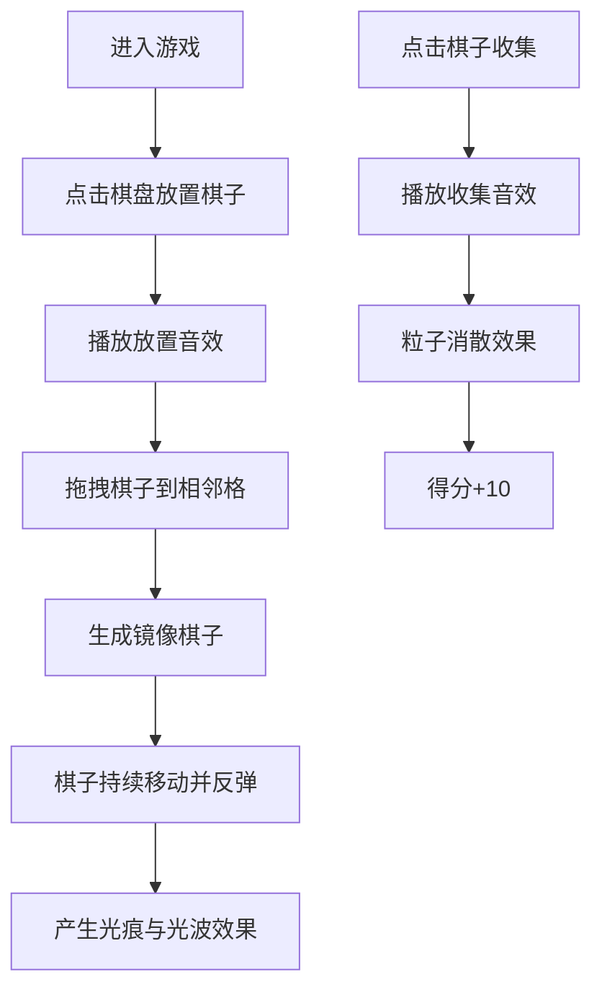

## 1. 产品概述

"幻镜·回声棋"是一款基于Canvas的浏览器休闲益智游戏，玩家通过在动态镜像棋盘上放置和移动光点棋子，产生镜像反射效果，收集镜像碎片获取高分。

- 核心玩法：点击放置棋子、拖拽移动产生镜像、收集棋子得分
- 目标用户：休闲游戏玩家，喜欢视觉效果和益智类游戏的用户
- 产品价值：提供具有深度视觉体验和策略性的休闲游戏体验

## 2. 核心功能

### 2.1 用户角色
| 角色 | 注册方式 | 核心权限 |
|------|----------|----------|
| 玩家 | 无需注册 | 体验完整游戏功能 |

### 2.2 功能模块
1. **游戏主界面**：棋盘渲染、得分显示、棋子数量统计
2. **棋子系统**：放置、拖拽移动、镜像生成、运动轨迹、碰撞检测
3. **视觉效果**：彩色光痕、光波扩散、粒子消散效果
4. **音效系统**：放置、反弹、收集音效合成
5. **计分系统**：得分统计、棋子数量管理

### 2.3 页面详情
| 页面名称 | 模块名称 | 功能描述 |
|----------|----------|----------|
| 游戏主界面 | 棋盘渲染 | 8x8菱形网格、渐变背景、光晕边框 |
| 游戏主界面 | 棋子交互 | 点击放置、拖拽移动、点击收集 |
| 游戏主界面 | 状态显示 | 右上角得分、左下角棋子数量 |
| 游戏主界面 | 视觉效果 | 光痕、光波、粒子动画 |

## 3. 核心流程

## 4. 用户界面设计

### 4.1 设计风格
- **主色调**：深紫(#1a0030)到墨绿(#001a14)的径向渐变背景
- **强调色**：棋子颜色（#ff6b6b 红、#ffd93d 黄、#6bcb77 绿、#4d96ff 蓝）
- **边框光晕**：#7b68ee 到 #00f5d4 的渐变
- **字体**：现代无衬线字体，清晰易读
- **整体风格**：深邃星空主题，霓虹发光效果，赛博朋克美学

### 4.2 页面设计概述
| 页面名称 | 模块名称 | UI元素 |
|----------|----------|----------|
| 游戏主界面 | 棋盘区域 | 居中方形棋盘，8x8菱形网格，半透明银灰线条，交叉点微光 |
| 游戏主界面 | 得分面板 | 右上角白色24px字体，文字阴影 |
| 游戏主界面 | 棋子计数 | 左下角白色16px字体 |
| 游戏主界面 | 棋子效果 | 发光边缘，动态模糊，彩色光痕拖尾 |

### 4.3 响应式
- 桌面端优先，棋盘边长占视口高度70%，最小500px
- 视口变化时棋盘始终居中并按比例缩放
- 支持鼠标点击和拖拽操作

### 4.4 视觉效果规范
- **棋子**：直径12px，边缘发光动态模糊3px
- **光痕**：线宽2px，1.5秒内透明度从1.0降至0.2
- **光波**：每0.5秒产生，半径5px到40px，1秒渐隐
- **粒子**：收集时20个粒子，0.8秒旋转消散
