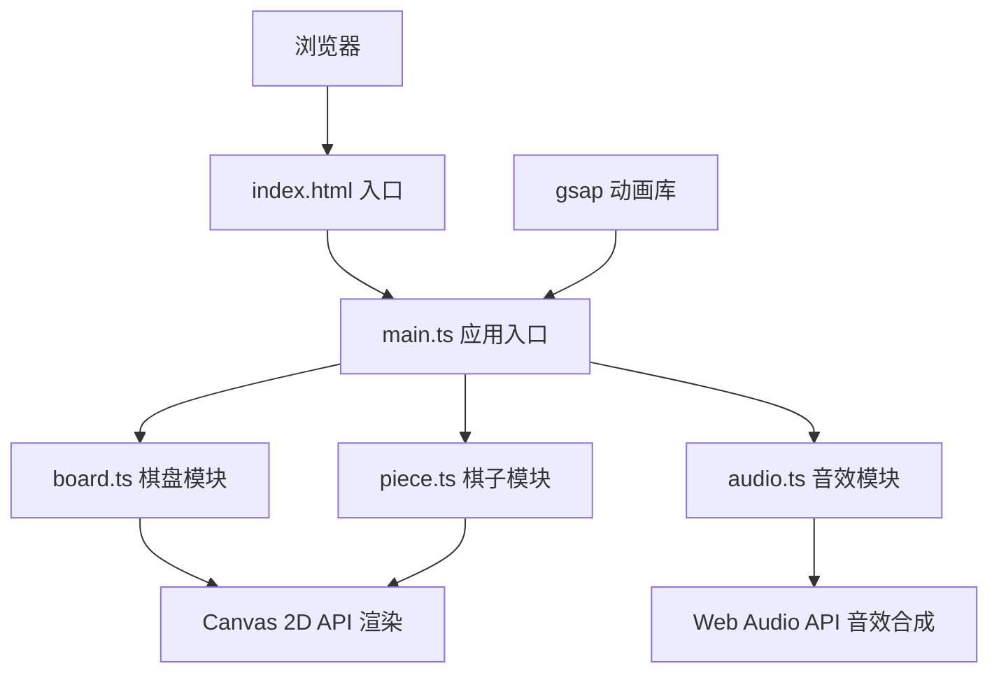

## 1. 架构设计



## 2. 技术描述

- **前端技术栈**：TypeScript 5 + Vite 5 + Canvas 2D + Web Audio API + gsap
- **构建工具**：Vite 5
- **动画库**：gsap 3
- **渲染引擎**：原生 Canvas 2D API
- **音频引擎**：原生 Web Audio API
- **无后端服务**，纯前端运行

## 3. 项目文件结构

| 文件路径 | 说明 |
|----------|------|
| `package.json` | 项目依赖配置（typescript、vite、gsap） |
| `vite.config.js` | Vite 构建配置 |
| `tsconfig.json` | TypeScript 配置（严格模式） |
| `index.html` | 入口页面 |
| `src/main.ts` | 应用入口，初始化棋盘、绑定事件与动画循环 |
| `src/board.ts` | 棋盘模块，绘制、镜像对称逻辑、碰撞检测 |
| `src/piece.ts` | 棋子模块，位置、运动、光痕渲染、销毁 |
| `src/audio.ts` | 音效模块，Web Audio API 生成各种音效 |

## 4. 核心数据模型

### 4.1 棋子数据结构
```typescript
interface Piece {
  id: number;
  x: number;
  y: number;
  gridX: number;
  gridY: number;
  color: string;
  isMirror: boolean;
  velocityX: number;
  velocityY: number;
  moving: boolean;
  trail: TrailPoint[];
  lastWaveTime: number;
}
```

### 4.2 光痕数据结构
```typescript
interface TrailPoint {
  x: number;
  y: number;
  timestamp: number;
  alpha: number;
}
```

### 4.3 光波数据结构
```typescript
interface Wave {
  x: number;
  y: number;
  color: string;
  startTime: number;
  duration: number;
}
```

### 4.4 粒子数据结构
```typescript
interface Particle {
  x: number;
  y: number;
  vx: number;
  vy: number;
  color: string;
  startTime: number;
  duration: number;
  rotation: number;
}
```

## 5. 性能约束

- **帧率目标**：稳定60fps
- **棋子上限**：最多50颗（含镜像）
- **光痕/粒子上限**：总数不超过300个
- **自动清理**：超过上限时清除最早生成的光痕

## 6. 核心算法

### 6.1 菱形网格坐标转换
- 屏幕坐标 ↔ 菱形网格坐标转换
- 8x8网格，每个菱形边长40px

### 6.2 镜像反射算法
- 水平对称轴反射：y坐标取反
- 垂直对称轴反射：x坐标取反
- 镜像棋子颜色为原棋子补色

### 6.3 碰撞检测
- 棋子与棋盘边缘碰撞检测
- 棋子之间碰撞检测
- 反弹方向计算

### 6.4 颜色补色计算
- RGB转HSL，色相偏移180度得到补色
