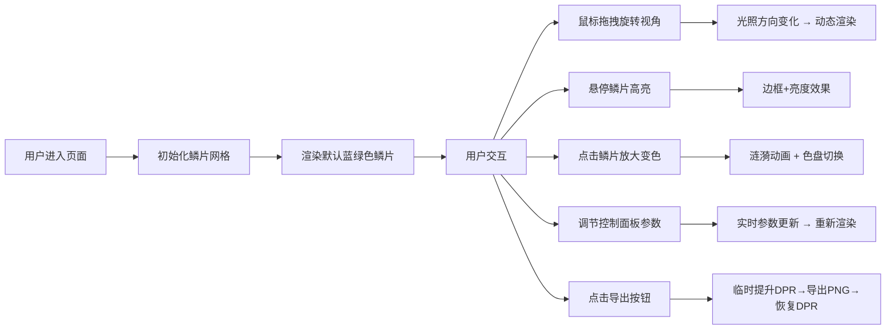

# 鳞变·光幻集 - 产品需求文档（PRD）

## 1. 产品概述

鳞变·光幻集是一款面向数字艺术家和创意爱好者的交互式奇幻生物鳞片图案生成器。用户可在浏览器中通过实时调整光照、色盘、旋转等参数，创作独一无二的生物鳞片数字标本艺术作品。

- **目标用户**：数字艺术家、设计师、创意爱好者、生物概念设计师
- **核心价值**：提供沉浸式、可交互的奇幻生物鳞片创作体验，让用户无需专业绘图软件即可快速生成独特的数字艺术图案

## 2. 核心功能

### 2.1 用户角色

| 角色 | 注册方式 | 核心权限 |
|------|----------|----------|
| 游客用户 | 无需注册 | 浏览、交互操作、导出图片 |

### 2.2 功能模块

1. **主画布区**：六边形鳞片网格渲染、3D视角旋转、光照动态效果
2. **单鳞片交互**：点击放大变色、悬停高亮、涟漪扩散动画
3. **控制面板**：光源高度调节、鳞片旋转角度、色盘切换、重置功能、图片导出

### 2.3 页面详情

| 页面名称 | 模块名称 | 功能描述 |
|----------|----------|----------|
| 主应用 | 六边形鳞片网格 | 8行10列鳞片布局，随机直径40-60px，间距2px，蓝绿色渐变底色，每片±15度色相偏移 |
| 主应用 | 视角旋转交互 | 鼠标拖拽绕Y轴旋转，光照方向同步变化，颜色动态渐变 |
| 主应用 | 鳞片点击交互 | 点击放大1.5倍+金色光晕，0.3秒ease-out；周围1格涟漪动画（1.2倍缩放，0.5秒）；颜色在5套色盘间切换 |
| 主应用 | 鳞片悬停交互 | 银白色边框高亮(#e0e0ff)，整体亮度提升10% |
| 控制面板 | 光源高度滑块 | 范围0-100，默认50，控制光源Y轴角度 |
| 控制面板 | 鳞片旋转滑块 | 范围0-360度，默认0，所有鳞片统一旋转 |
| 控制面板 | 色盘下拉菜单 | 冰霜蓝、烈焰橙、暗夜紫、翡翠绿、星光金，5套奇幻色盘 |
| 控制面板 | 重置按钮 | 恢复所有鳞片至初始状态 |
| 控制面板 | 导出按钮 | 导出1024x1024 PNG图片，临时DPR=2，按钮颜色随当前色盘主色变化，hover放大1.1倍 |

## 3. 核心流程

## 4. 用户界面设计

### 4.1 设计风格

- **主色调**：深色科幻主题，页面背景从#0d1b2a（顶部）渐变至#1b2838（底部）
- **辅助色**：5套奇幻色盘（冰霜蓝、烈焰橙、暗夜紫、翡翠绿、星光金）
- **文本色**：浅灰#c8d6e5，字号14px
- **按钮风格**：圆角设计，导出按钮颜色随色盘主色变化，hover放大1.1倍
- **字体**：现代无衬线字体，具有科幻感
- **布局风格**：画布居中+右下角浮动控制面板（圆角16px，半透明rgba(20,20,30,0.8)，宽220px）
- **动效风格**：所有交互平滑过渡transition: all 0.2s ease，发光效果、涟漪扩散
- **描边与圆角**：画布圆角20px，2px半透明描边rgba(255,255,255,0.15)
- **滑块样式**：轨道高4px，thumb直径16px，颜色随当前色盘主色
- **下拉菜单**：深灰背景，悬停高亮

### 4.2 页面设计概览

| 页面名称 | 模块名称 | UI元素 |
|----------|----------|--------|
| 主应用 | 画布容器 | 圆角20px，2px半透明描边，占视口80%宽×75%高，最小600×500px，深色渐变背景 |
| 主应用 | 六边形鳞片 | 随机尺寸，蓝绿渐变底色，随机色相偏移，点击/悬停动画 |
| 主应用 | 控制面板 | 半透明浮层rgba(20,20,30,0.8)，圆角16px，宽220px，控件间距12px，距画布边缘20px |
| 主应用 | 控制面板控件 | 光源高度滑块、鳞片旋转滑块、色盘下拉、重置按钮、导出按钮 |

### 4.3 响应式设计

- 桌面端优先设计
- 画布自适应视口（80%宽，75%高，最小600×500px）
- 窗口缩放时重新计算鳞片位置和间距，鳞片大小比例不变
- 支持鼠标和触摸设备输入

### 4.4 性能要求

- 目标帧率：60FPS
- 鼠标拖拽旋转延迟：≤16ms
- 控制面板参数变化响应时间：≤50ms
