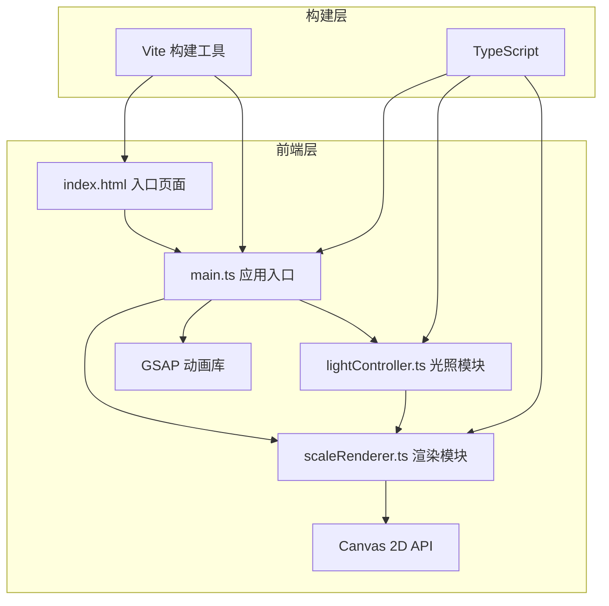

# 鳞变·光幻集 - 技术架构文档

## 1. 架构设计



## 2. 技术说明

- **前端框架**: 原生 TypeScript（无框架）+ Vite 构建
- **构建工具**: Vite 5.x
- **语言**: TypeScript 5.x（严格模式）
- **动画库**: gsap 3.x
- **渲染技术**: HTML5 Canvas 2D API
- **样式方案**: 原生 CSS（内联于 index.html）

### 文件结构与调用关系

```
项目根目录/
├── package.json          # 项目配置与依赖
├── vite.config.js        # Vite构建配置
├── tsconfig.json         # TypeScript配置
├── index.html            # 入口页面（包含画布容器和控制面板DOM）
└── src/
    ├── main.ts           # 应用入口
    │   ├── 初始化鳞片网格数据
    │   ├── 绑定鼠标/触摸事件（拖拽、悬停、点击）
    │   ├── 将鼠标坐标传递给 lightController
    │   ├── 将颜色偏移、光照参数传递给 scaleRenderer
    │   └── 控制面板事件处理
    ├── scaleRenderer.ts  # 核心渲染模块
    │   ├── 六边形鳞片绘制逻辑
    │   ├── 网格布局计算（8行×10列）
    │   ├── 接收lightController的颜色偏移量
    │   ├── 接收main.ts的交互状态（hover、selected、ripple）
    │   └── 输出到Canvas
    └── lightController.ts # 光照控制模块
        ├── 多方向点光源模拟
        ├── 接收鼠标坐标作为光源方向
        ├── 计算鳞片颜色与光泽变化
        └── 返回颜色偏移量给scaleRenderer
```

### 数据流向

```
用户输入
  ├─ 鼠标拖拽 → main.ts → 旋转角度更新 → scaleRenderer → Canvas重绘
  ├─ 鼠标坐标 → main.ts → lightController → 计算光照偏移 → scaleRenderer → Canvas重绘
  ├─ 悬停/点击 → main.ts → 鳞片状态更新 → scaleRenderer → Canvas重绘
  └─ 控制面板 → main.ts → 参数更新（光源高度/旋转/色盘）→ lightController + scaleRenderer → Canvas重绘
```

## 3. 核心数据结构定义

```typescript
// 色盘定义
interface ColorPalette {
  name: string;
  primary: string;      // 主色（用于控件着色）
  gradientStart: string; // 渐变起始色
  gradientEnd: string;   // 渐变终止色
  glow: string;          // 光晕色
}

// 单个鳞片数据
interface Scale {
  id: string;
  row: number;
  col: number;
  centerX: number;       // 画布坐标X
  centerY: number;       // 画布坐标Y
  diameter: number;      // 外接圆直径（40-60px随机）
  hueOffset: number;     // 初始色相偏移（±15度）
  paletteIndex: number;  // 当前色盘索引（-1表示默认）
  isSelected: boolean;   // 是否被点击选中
  isHovered: boolean;    // 是否悬停
  scale: number;         // 当前缩放比例（动画用）
  rippleProgress: number; // 涟漪动画进度 0-1
}

// 渲染参数
interface RenderParams {
  viewRotationY: number;    // Y轴旋转角度（弧度）
  lightHeight: number;      // 光源高度 0-100
  scaleRotation: number;    // 鳞片自身旋转角度（度）
  activePaletteIndex: number; // 当前激活色盘（控制面板选择，用于点击时切换）
}

// 光照计算结果
interface LightResult {
  hueShift: number;         // 色相偏移
  brightnessShift: number;  // 亮度偏移
  specularIntensity: number; // 高光强度
}
```

## 4. 性能优化策略

1. **渲染循环**: 使用 requestAnimationFrame 实现稳定60FPS
2. **脏矩形优化**: 仅在参数变化时重绘，静态时暂停渲染循环
3. **离屏计算**: 光照计算采用数学公式直接计算，避免查表
4. **画布DPR管理**: 平时使用设备DPR，导出时临时切换至2x DPR
5. **事件节流**: 鼠标移动使用 requestAnimationFrame 合并更新
6. **缓存六边形路径**: 预计算六边形顶点坐标，避免每帧重复计算
