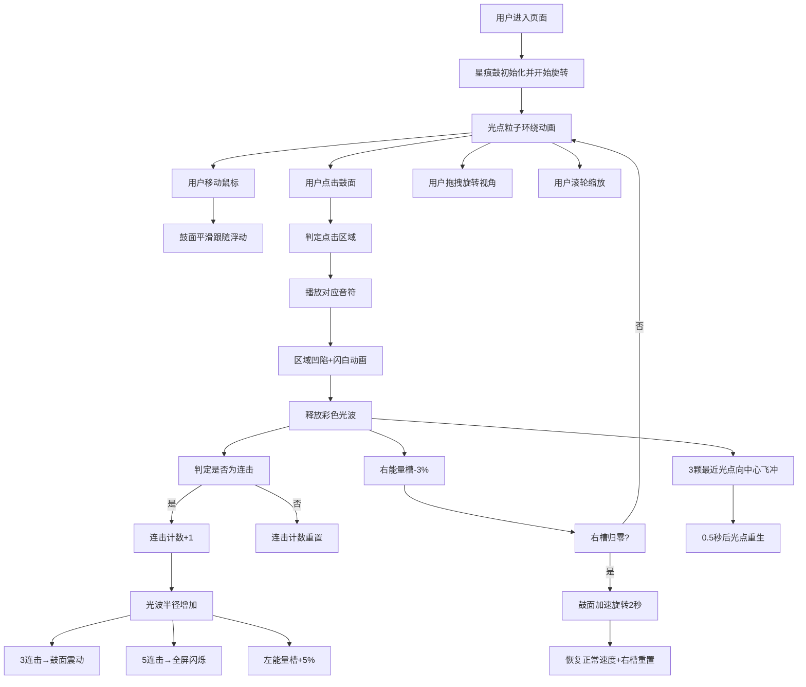

## 1. 产品概述

"星痕·音律鼓"是一款沉浸式网页音乐节奏游戏，用户通过点击悬浮的虚拟鼓面触发绚丽的视觉效果与美妙音符，获得敲击发光鼓面的沉浸式节奏体验。

- **核心价值**：为用户提供在浏览器中即可体验的视觉与听觉双重沉浸感，通过精确的节奏反馈和华丽的视觉效果创造独特的音乐互动体验。
- **目标用户**：音乐爱好者、节奏游戏玩家、寻求减压放松的普通用户。

## 2. 核心功能

### 2.1 功能模块

1. **星痕鼓面**：六圈同心圆环组成的48个扇形敲击区，每区独立颜色与音高，可旋转、可响应敲击。
2. **音效系统**：Web Audio API合成C4到G6半音阶，48个区域对应48个音符。
3. **连击系统**：连续点击相邻区域触发连击，带来增强的视觉与音效反馈。
4. **能量槽系统**：左右能量槽分别响应连击和敲击，触发特殊效果。
5. **光点粒子**：36颗环绕光点，敲击时产生飞冲效果。
6. **视角交互**：支持拖拽旋转视角和滚轮缩放。

### 2.2 功能详情

| 功能模块 | 子功能 | 功能描述 |
|---------|--------|---------|
| 星痕鼓面 | 鼓面渲染 | 六圈同心圆环，每圈8个扇形，共48区，六色渐变，金色分隔线 |
| 星痕鼓面 | 旋转动画 | 默认0.02rad/s缓慢旋转，流光效果从圆心辐射 |
| 星痕鼓面 | 鼠标跟随 | 鼠标移动时鼓面轻微浮动（≤5px） |
| 星痕鼓面 | 敲击反馈 | 凹陷动画（3px深度，0.2秒回弹），闪白0.1秒 |
| 光波效果 | 扩散动画 | 从点击位置向外扩散，半径0→150px，透明度1→0，0.8秒 |
| 连击系统 | 连击判定 | 相邻区域（共享边或顶点）连续点击触发连击 |
| 连击系统 | 光波增强 | 每连击+30px半径，最大300px |
| 连击系统 | 鼓面震动 | 3连击后鼓面震动（1.5px振幅，4Hz，0.5秒） |
| 连击系统 | 全屏闪烁 | 5连击以上全屏白色闪烁（0.4→0.05透明度，0.3秒） |
| 光点粒子 | 环绕动画 | 36颗光点环形分布，独立随机角速度旋转 |
| 光点粒子 | 飞冲效果 | 敲击时最近3颗向中心飞冲，0.3秒消失，0.5秒重生 |
| 能量槽 | 左槽 | 每次连击+5%填充，渐变#00cec9→#0984e3 |
| 能量槽 | 右槽 | 每次敲击-3%，渐变#fd79a8→#e17055，归零触发加速旋转 |
| 视角交互 | 拖拽旋转 | 鼠标左键拖拽绕Y轴0-360度旋转 |
| 视角交互 | 滚轮缩放 | 0.5x-1.5x缩放，0.3秒平滑过渡 |

## 3. 核心流程

## 4. 用户界面设计

### 4.1 设计风格
- **主题色调**：深空主题，背景径向渐变 #0c0c1d → #1a1a2e
- **鼓面颜色**（从圆心向外）：#ff6b6b、#feca57、#48dbfb、#ff9ff3、#54a0ff、#5f27cd
- **分隔线**：1px金色细线
- **光点颜色**：#ffe66d、#7bed9f、#70a1ff、#ff6b81 随机
- **字体**：无衬线现代字体，轻盈科技感
- **整体氛围**：神秘深空、霓虹光影、科幻未来感

### 4.2 页面布局

| 区域 | 元素 | 设计说明 |
|------|------|---------|
| 中央 | 星痕鼓面 | 直径视口高度45%（最小300px），居中悬浮 |
| 外围 | 光点粒子 | 36颗，环形分布，直径4-8px |
| 下方 | 能量槽 | 左右两个，150×20px，间距50px，水平排列 |
| 全屏 | 背景 | 径向渐变深空色，营造宇宙氛围 |

### 4.3 响应式设计
- **桌面端**（≥768px）：鼓面直径为视口高度45%，能量槽水平排列在鼓面下方
- **移动端**（<768px）：鼓面直径缩小至视口宽度60%，能量槽垂直排列在鼓面两侧
- **触摸优化**：支持触摸事件，增大点击热区

### 4.4 动画与交互
- **敲击反馈**：凹陷+闪白+光波，三重反馈确保低延迟感
- **平滑过渡**：所有状态变化均采用缓动函数，视觉流畅
- **性能保障**：requestAnimationFrame循环，目标60fps
- **即时反馈**：敲击响应延迟≤50ms
